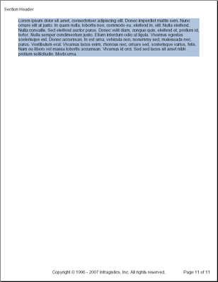
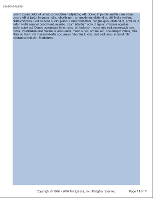

# ストレッチャ
`Stretcher` 要素は、ページの終わりまでコンテンツを引き伸ばすことのみを目的とした非表示のレイアウト要素です。通常レイアウト要素は、その要素がカプセル化するコンテンツを収めるためにサイズを変更します。レイアウト要素に背景色または画像を含む場合、これは好ましくない効果となる場合があります。レイアウト要素から `AddStretcher` メソッドを呼び出すと、コンテンツがページの終わりまでなくても、その要素がページの終わりまで引き伸ばされます。以下の 2 つの画像は、背景色を `LightSteelBlue` に設定された要素が Stretcher 要素がある場合とない場合でどのように見えるのかを示しています。

Stretcher 要素なしの場合|Stretcher 要素ありの場合
--- | ---
 | 
