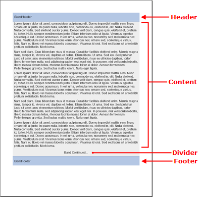

# バンド

Band 要素は、大小任意のレポートのシナリオを処理できる基本機能と高度な機能の両方を持つ標準のコンテンツ セクションです。Band 要素に追加できるレイアウト 要素の完全なリストについては、「レイアウト 要素比較表」を参照してください。

Band 要素は、繰り返し可能なヘッダー、フッター、デバイダを持つことができる点で固有です。これらのヘッダーとフッターはページではなくバンドを修飾します。したがって、ヘッダーとフッターはバンドのコンテンツの上下に表示されます。いくつかの追加設定を設定するだけでなく、任意の数のパターン コンテンツを挿入することも可能です。

以下のコンテンツ レイアウト セクションは、Band 要素固有です。

- **Header**: Header 要素は、新しいページで始まるコンテンツ領域の上部を修飾します。この機能を利用するためには、[`IBand`](Infragistics.Web.Documents.Reports~Infragistics.Documents.Reports.Report.Band.IBand.html) オブジェクトの [`Header`](Infragistics.Web.Documents.Reports~Infragistics.Documents.Reports.Report.Band.IBand~Header.html) プロパティを新しい [`IBandHeader`](Infragistics.Web.Documents.Reports~Infragistics.Documents.Reports.Report.Band.IBandHeader.html) オブジェクトに設定します。もちろん、ヘッダーが不要な場合には、このプロパティを設定する必要はありません。
- **Divider**: [`Divider`](Infragistics.Web.Documents.Reports~Infragistics.Documents.Reports.Report.Band.IBand~Divider.html) 要素は、最後のページを除く全ページのフッターの前の、コンテンツ領域の下部に表示されます。これにより Divider 要素はセクションが次ページに続くことを識別するために最適な要素となっています。この機能を利用するためには、IBand オブジェクトの Divider プロパティを新しい [`IBandDivider`](Infragistics.Web.Documents.Reports~Infragistics.Documents.Reports.Report.Band.IBandDivider.html) オブジェクトに設定します。Header と同様に、Divider を使用したくない場合にはこのプロパティを設定する必要はありません。
- **Footer**: Footer 要素はコンテンツ領域の下部を修飾します。Band がページの下部までいかないうちに終了すると、フッターはページではなく、バンドの終わりに表示します。ただし、バンドがページ全体を占めるようにしたい場合には（最後のページだけでなく各ページに適用）、Band オブジェクトの [`Stretch`](Infragistics.Web.Documents.Reports~Infragistics.Documents.Reports.Report.Band.IBand~Stretch.html) プロパティを True に設定してください。



## バンドがひとつの PDF ファイルを作成

以下の手順はヘッダー、デバイダ、フッターが付いた単一のバンドを含む PDF ファイルを作成するプロセスを説明します。

### 達成すること

この詳細なガイドのコードによって、このトピックの上部にあるスクリーンショットと非常に似た PDF レポートを作成することができます。後はレポートをパブリッシュするだけです。レポートのパブリッシュについての詳細は、[「レポートをパブリッシュ」](/documentengine-publish-a-report)を参照してください。

### 次の手順を実行します

1.  **レポートを作成しセクションを追加します。**

    作成する各レポートは Report オブジェクトとして開始します。いったんインスタンス化されたら、AddSection メソッドによって必要なだけセクションを Report オブジェクトに追加できます。メインの Report にひとつだけセクションを追加することができます。セクションが作成されたら、その他すべてのタイプのコンテンツを追加できます。以下のコードはレポートを作成し、セクションを追加して、そのセクションのためのいくつかのページ固有のプロパティを設定します。

    **Visual Basic の場合:**

```vb
    '
    ' Create the report and add a section.
    '
    Dim report As Infragistics.Documents.Reports.Report.Report = _
      New Infragistics.Documents.Reports.Report.Report()

    Dim section1 As Infragistics.Documents.Reports.Report.Section.ISection = _
      report.AddSection()

    section1.PagePaddings = _
      New Infragistics.Documents.Reports.Report.Paddings(50)
```

    **C# の場合:**

```csharp
    //
    // Create the report and add a section.
    //
    Infragistics.Documents.Reports.Report.Report report = 
      new Infragistics.Documents.Reports.Report.Report();

    Infragistics.Documents.Reports.Report.Section.ISection section1 =
      report.AddSection();

    section1.PagePaddings = 
      new Infragistics.Documents.Reports.Report.Paddings(50);
```

2.  **バンドをセクションに追加します。**

    メインのセクションへのバンドまたは任意のコンテンツ セクションの追加は、メソッドを呼び出すことによって実行されます。この場合、Section オブジェクトの AddBand メソッドを呼び出します。AddBand はセクションから作成された新しい IBand オブジェクトへの参照を返します。したがって、新しい IBand オブジェクトにその参照を割り当てる必要があります。以下のコードは新しい IBand オブジェクトを作成し、その Background をグレーに設定します。

    **Visual Basic の場合:**

```vb
    '
    ' Add the band to the section. 
    '
    Dim band As Infragistics.Documents.Reports.Report.Band.IBand = _
      section1.AddBand()

    band.Background = _
      New Infragistics.Documents.Reports.Report.Background _
      (Infragistics.Documents.Reports.Graphics.Colors.LightGray)
```

    **C# の場合:**

```csharp
    //
    // Add the band to the section. 
    //
    Infragistics.Documents.Reports.Report.Band.IBand band = 
      section1.AddBand();

    band.Background = 
      new Infragistics.Documents.Reports.Report.Background
      (Infragistics.Documents.Reports.Graphics.Colors.LightGray);
```

3.  **ヘッダーをバンドに追加します。**

    メソッドの呼び出しに関連したセクションにバンドを追加することと、ヘッダーをハンドに追加することは若干異なります。バンドのヘッダー、デバイダ、フッターはすでに存在しているので、これらへの参照を取得するだけです。新しいヘッダーを作成して、Band オブジェクトの Header プロパティに設定します。この参照を取得したら、プロパティを修正できます。以下のコードはバンドのヘッダーを取得して、いくつかのレイアウトおよび視覚的プロパティを設定し、コンテンツをヘッダーに追加します。

    **Visual Basic の場合:**

```vb
    '
    ' Add a header to the band.
    '

    ' Retrieve a reference to the band's header
    ' and assign it to the bandHeader object.
    Dim bandHeader As Infragistics.Documents.Reports.Report.Band.IBandHeader = _
      band.Header

    ' Cause the header to repeat on every page.
    bandHeader.Repeat = True

    ' The height of the header will be 5% of
    ' the page's height. 
    bandHeader.Height = _
      New Infragistics.Documents.Reports.Report.FixedHeight(30)

    ' The header's background color will be light blue.
    bandHeader.Background = _
      New Infragistics.Documents.Reports.Report.Background _
      (Infragistics.Documents.Reports.Graphics.Colors.SteelBlue)

    ' Set the horizontal and vertical alignment of the header.
    bandHeader.Alignment = _
      New Infragistics.Documents.Reports.Report.ContentAlignment _
      ( _
        Infragistics.Documents.Reports.Report.Alignment.Left, _
        Infragistics.Documents.Reports.Report.Alignment.Middle _
      )

    ' The bottom border of the band will be a 
    ' solid, dark blue line.
    bandHeader.Borders.Bottom = _
      New Infragistics.Documents.Reports.Report.Border _
      (Infragistics.Documents.Reports.Graphics.Pens.DarkBlue)

    ' Add 5 pixels of padding around the left and right edges.
    bandHeader.Paddings.Horizontal = 5

    ' Add textual content to the header.
    Dim bandHeaderText As Infragistics.Documents.Reports.Report.Text.IText = _
      bandHeader.AddText()
    bandHeaderText.AddContent("IBandHeader")
```

    **C# の場合:**

```csharp
    //
    // Add a header to the band.
    //
                            
    // Retrieve a reference to the band's header
    // and assign it to the bandHeader object.
    Infragistics.Documents.Reports.Report.Band.IBandHeader bandHeader = 
      band.Header;

    // Cause the header to repeat on every page.
    bandHeader.Repeat = true;
                            
    // The height of the header will be 5% of
    // the page's height. 
    bandHeader.Height = 
      new Infragistics.Documents.Reports.Report.FixedHeight(30);
                            
    // The header's background color will be light blue.
    bandHeader.Background = 
      new Infragistics.Documents.Reports.Report.Background
      (Infragistics.Documents.Reports.Graphics.Colors.SteelBlue);
                            
    // Set the horizontal and vertical alignment of the header.
    bandHeader.Alignment = 
      new Infragistics.Documents.Reports.Report.ContentAlignment
      (
        Infragistics.Documents.Reports.Report.Alignment.Left, 
        Infragistics.Documents.Reports.Report.Alignment.Middle
      );
                            
    // The bottom border of the band will be a 
    // solid, dark blue line.
    bandHeader.Borders.Bottom = 
      new Infragistics.Documents.Reports.Report.Border
      (Infragistics.Documents.Reports.Graphics.Pens.DarkBlue);
                            
    // Add 5 pixels of padding around the left and right edges.
    bandHeader.Paddings.Horizontal = 5;
                            
    // Add textual content to the header.
    Infragistics.Documents.Reports.Report.Text.IText bandHeaderText = 
      bandHeader.AddText();
    bandHeaderText.AddContent("IBandHeader");
```

4.  **バンドのデバイダを追加します。**

    デバイダは、複数の目的のために使用できます。デバイダはフッターの前のページの終わりに表示するため、デバイダを使用してバンドが次ページに続くことを示す、または一種のページ番号システムとして使用して、実際のバンドが何ページあるのかを識別することができます（ページのメイン フッターに含まれる任意のページ番号デバイスに加えて）。バンドのヘッダーから参照を取得しなければならなかったのと全く同じように、デバイダに同じことを実行する必要があります。以下のコードは、標準のプロパティを修正しコンテンツを追加するだけでなく、この作業を実行します。

    **Visual Basic の場合:**

```vb
    '
    ' Add the band's divider. 
    '

    ' Retrieve a reference to the band's Divider.
    Dim bandDivider As Infragistics.Documents.Reports.Report.Band.IBandDivider = _
      band.Divider

    ' Set the height to 5% of the page's height.
    bandDivider.Height = _
      New Infragistics.Documents.Reports.Report.FixedHeight(30)

    ' Align the content in the middle of the divider.
    bandDivider.Alignment = _
      New Infragistics.Documents.Reports.Report.ContentAlignment _
      (Infragistics.Documents.Reports.Report.Alignment.Middle)

    ' Add text to the divider and center it on the page.
    Dim bandDividerText As Infragistics.Documents.Reports.Report.Text.IText = _
      bandDivider.AddText()
    bandDividerText.AddContent("Band Continued...")
    bandDividerText.Alignment = _
      New Infragistics.Documents.Reports.Report.TextAlignment _
      (Infragistics.Documents.Reports.Report.Alignment.Center)
```

    **C# の場合:**

```csharp
    //
    // Add the band's divider. 
    //

    // Retrieve a reference to the band's Divider.
    Infragistics.Documents.Reports.Report.Band.IBandDivider bandDivider = 
      band.Divider;
                            
    // Set the height to 5% of the page's height.
    bandDivider.Height = 
      new Infragistics.Documents.Reports.Report.FixedHeight(30);

    // Align the content in the middle of the divider.
    bandDivider.Alignment = 
      new Infragistics.Documents.Reports.Report.ContentAlignment
      (Infragistics.Documents.Reports.Report.Alignment.Middle);

    // Add text to the divider and center it on the page.
    Infragistics.Documents.Reports.Report.Text.IText bandDividerText = 
      bandDivider.AddText();
    bandDividerText.AddContent("Band Continued...");
    bandDividerText.Alignment = 
      new Infragistics.Documents.Reports.Report.TextAlignment
      (Infragistics.Documents.Reports.Report.Alignment.Center);
```

5.  **バンドのフッターを追加します。**

    バンドのフッターは、ページの下部にある点を除き、ヘッダーと同じように動作します。ヘッダーと同じように、フッターは全ページに表示するか、最終ページのみに表示するかのいずれかを選択できます。

    **Visual Basic の場合:**

```vb
    '
    ' Add the band's footer.
    '

    ' Retrieve a reference to the band's footer.
    Dim bandFooter As Infragistics.Documents.Reports.Report.Band.IBandFooter = _
      band.Footer

    ' The band will NOT repeat on every page; 
    ' it will only be seen on the last page.
    bandFooter.Repeat = False

    ' The footer's background color will be light blue.
    bandFooter.Background = _
      New Infragistics.Documents.Reports.Report.Background _
      (Infragistics.Documents.Reports.Graphics.Colors.LightSteelBlue)

    ' The footer's height will be 5% of the page's height.
    bandFooter.Height = _
      New Infragistics.Documents.Reports.Report.FixedHeight(30)

    ' Align the footer's content horizontally and vertically.
    bandFooter.Alignment = _
      New Infragistics.Documents.Reports.Report.ContentAlignment _
      ( _
        Infragistics.Documents.Reports.Report.Alignment.Left, _
        Infragistics.Documents.Reports.Report.Alignment.Middle _
      )

    ' The top border of the footer will be a
    ' solid, dark blue line. 
    bandFooter.Borders.Top = _
      New Infragistics.Documents.Reports.Report.Border _
      (Infragistics.Documents.Reports.Graphics.Pens.DarkBlue)

    ' Add 5 pixels of padding on the left and right.
    bandFooter.Paddings.Horizontal = 5

    ' Add textual content to the footer.
    Dim bandFooterText As Infragistics.Documents.Reports.Report.Text.IText = _
      bandFooter.AddText()
    bandFooterText.AddContent("IBandFooter")
```

    **C# の場合:**

```csharp
    //
    // Add the band's footer.
    //

    // Retrieve a reference to the band's footer.
    Infragistics.Documents.Reports.Report.Band.IBandFooter bandFooter = 
      band.Footer;

    // The band will NOT repeat on every page; 
    // it will only be seen on the last page.
    bandFooter.Repeat = false;

    // The footer's background color will be light blue.
    bandFooter.Background = 
      new Infragistics.Documents.Reports.Report.Background
      (Infragistics.Documents.Reports.Graphics.Colors.LightSteelBlue);
                            
    // The footer's height will be 5% of the page's height.
    bandFooter.Height = 
      new Infragistics.Documents.Reports.Report.FixedHeight(30);
                            
    // Align the footer's content horizontally and vertically.
    bandFooter.Alignment = 
      new Infragistics.Documents.Reports.Report.ContentAlignment
      (
        Infragistics.Documents.Reports.Report.Alignment.Left, 
        Infragistics.Documents.Reports.Report.Alignment.Middle
      );

    // The top border of the footer will be a 
    // solid, dark blue line.
    bandFooter.Borders.Top = 
      new Infragistics.Documents.Reports.Report.Border
      (Infragistics.Documents.Reports.Graphics.Pens.DarkBlue);

    // Add 5 pixels of padding on the left and right.
    bandFooter.Paddings.Horizontal = 5;

    // Add textual content to the footer.
    Infragistics.Documents.Reports.Report.Text.IText bandFooterText = 
      bandFooter.AddText();
    bandFooterText.AddContent("IBandFooter");
```

6.  **コンテンツをバンドに追加します。**

    これでヘッダー、デバイダ、フッターが設定されたので、バンドの実際のコンテンツを追加する必要があります。バンドに追加しなければならないのがシンプルなテキストだけの場合、Band オブジェクトの AddText メソッドを使用するだけで十分です。この例では、以下のサンプル テキストを使用します。

    > Lorem ipsum dolor sit amet, consectetuer adipiscing elit.Donec
    > imperdiet mattis sem.Nunc ornare elit at justo.In quam nulla,
    > lobortis non, commodo eu, eleifend in, elit.Nulla eleifend.Nulla
    > convallis.Sed eleifend auctor purus.Donec velit diam, congue
    > quis, eleifend et, pretium id, tortor.Nulla semper condimentum
    > justo.Etiam interdum odio ut ligula.Vivamus egestas scelerisque
    > est. Donec accumsan.In est urna, vehicula non, nonummy sed,
    > malesuada nec, purus.Vestibulum erat.Vivamus lacus enim, rhoncus
    > nec, ornare sed, scelerisque varius, felis.Nam eu libero vel
    > massa lobortis accumsan.Vivamus id orci.Sed sed lacus sit amet
    > nibh pretium sollicitudin.Morbi urna.

    新しい文字列を作成して、コンテンツを上記のテキストに設定します。This will
    これで、FOR ループを伴ったより複雑なシナリオに関係したときにコードをより簡単に読むことができるようになります。
    新しい IText オブジェクトを作成しますが、まだ設定しないでください。
    FOR ループで IText オブジェクトを設定します。このようにループによって、繰り返しのたびに新しいオブジェクトを作成するのではなく同じオブジェクトを再利用し続けます。
    FOR ループは同じテキストの段落を 20 回作成して、バンドに完全なボディを提供します。

    **Visual Basic の場合:**

```vb
    '
    ' Add content to the band.
    '
    Dim string1 As String = "Lorem ipsum..."

    Dim bandText As Infragistics.Documents.Reports.Report.Text.IText

    For i As Integer = 0 To 19
      bandText = band.AddText()
      bandText.AddContent(string1)
      bandText.Paddings.All = 5
    Next i
```

    **C# の場合:**

```csharp
    //
    // Add content to the band.
    //
    string string1 = "Lorem ipsum...";

    Infragistics.Documents.Reports.Report.Text.IText bandText;

    for (int i = 0; i < 20; i++)
    {
      bandText = band.AddText();
      bandText.AddContent(string1);
      bandText.Paddings.All = 5;
    }
```
