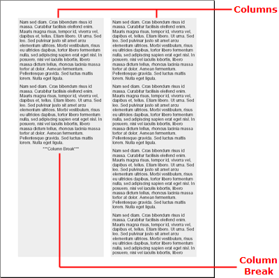

---
title: "フロー"
slug: documentengine-flow
---

# フロー

Flow 要素はレポートで列を定義するために非常に役に立ちます。列の定義を支援する Flow 要素固有のオブジェクトは 2 つあります。



## IFlowColumn インターフェイス
[IFlowColumn](Infragistics.Web.Documents.Reports~Infragistics.Documents.Reports.Report.Flow.IFlowColumn.html) インターフェイスはフローで列を定義します。希望する数だけ列を追加することができます。列は、作成される順序で追加されます。各列はそれ自体個別のセクションを表すものではありません。Flow 要素のコンテンツがセクションでどのようにフローするのかを表すだけです。したがって、個別のコンテンツを個々の列に追加できません。ただし、[AddColumnBreak](Infragistics.Web.Documents.Reports~Infragistics.Documents.Reports.Report.Flow.IFlow~AddColumnBreak.html) メソッドを使用してどの列にどのコンテンツを表示するのかをある程度制御できます。

## AddColumnBreak メソッド
[IFlow](Infragistics.Web.Documents.Reports~Infragistics.Documents.Reports.Report.Flow.IFlow.html) オブジェクトでこのメソッドを呼び出すと、フロー内の特定の位置に列の区切りを挿入します。このメソッドを使用すると、フローに追加したさまざまなコンテンツのタイプを分割できます。テキスト、次に列の区切り、次に画像、別の列の区切り、そしてさらにテキストを追加できます。このパターンによって、画像がテキストのない中央の列に常に配置されることが保証されます。


## Flow 要素の作成
この詳細なガイドでは、列が 2 つある Flow 要素の作成を説明します。Flow 要素には、テキストの段落が 5 つ含まれており、それぞれが FOR ループに追加されています。2 番目の段落の後ろに列の区切りが追加されます (IF ステートメントによって実行されます)。この FOR ループと IF ステートメントのロジックは、コレクション内にいくつかの同じような項目がある場合に固有のレポートに適用できますが、特定の項目の後に列の区切りを追加する必要があります。

## 次の手順を実行します
1.  **レポートとメインのセクションを作成します。**

    あらゆるレポートは、Report オブジェクトをインスタンス化することによって開始します。Report 要素を取得したら、Section 要素を追加できます。Section 要素には Flow 要素が含まれます。

    **Visual Basic の場合:**

```vb
    Imports Infragistics.Documents.Reports.Report
    .
    .
    .
    ' Create a new report.
    Dim report As Infrgistics.Documents.Reports.Report.Report = New Report()

    ' Create the main Section and add 50 pixels
    ' of padding on each edge.
    Dim section1 As Infragistics.Documents.Reports.Report.Section.ISection = report.AddSection()
    section1.PagePaddings.All = 50
```

    **C# の場合:**

```csharp
    using Infragistics.Documents.Reports.Report;
    .
    .
    .
    // Create a new report.
    Infragistics.Documents.Reports.Report.Report report = new Report();

    // Create the main Section and add 50 pixels
    // of padding on each edge.
    Infragistics.Documents.Reports.Report.Section.ISection section1 = report.AddSection();
    section1.PagePaddings.All = 50;
```

2.  **Flow 要素と列を作成します。**

    Section オブジェクトの AddFlow メソッドを呼び出すことによって、Flow 要素をインスタンス化します。AddFlow メソッドは新しい Flow オブジェクトを返します。Flow オブジェクトの AddColumn メソッドを呼び出すことによって、Column 要素に対して同じことを実行します。これによって、新しい列が Flow 要素に追加されます。次に 2 列の合計に対して列をもう 1 列作成します。

    **Visual Basic の場合:**

```vb
    ' Add a Flow element to the main section
    Dim flow As Infragistics.Documents.Reports.Report.Flow.IFlow = section1.AddFlow()

    ' Create a column in the Flow element.
    Dim column As Infragistics.Documents.Reports.Report.Flow.IFlowColumn = flow.AddColumn()
    ' The column's width will be 50% of
    ' the page's width
    column.Width = New RelativeWidth(50)
    ' Add space to the right edge to simulate
    ' a gutter.
    column.Margins.Right = 10
    ' Color the background of the column gray.
    column.Background = New Background(New Color(238, 238, 238))
            
    ' Add another column to the Flow element.
    column = flow.AddColumn()
    ' The column's width will be 50% of
    ' the page's width
    column.Width = New RelativeWidth(50)
    ' Add space to the left edge to simulate
    ' a gutter.
    column.Margins.Left = 10
    ' Color the background of the column gray.
    column.Background = New Background(New Color(238, 238, 238))
```

	**C# の場合:**

```csharp
    // Add a Flow element to the main section
    Infragistics.Documents.Reports.Report.Flow.IFlow flow = section1.AddFlow();
                            
    // Create a column in the Flow element.
    Infragistics.Documents.Reports.Report.Flow.IFlowColumn column = flow.AddColumn();
    // The column's width will be 50% of the page's width.
    column.Width = new RelativeWidth(50);
    // Add space to the right edge to simulate a gutter.
    column.Margins.Right = 10;
    // Color the background of the column gray.
    column.Background = new Background(new Color(238, 238, 238));

    // Add another column to the Flow element.
    column = flow.AddColumn();
    // The column's width will be 50% of the page's width.
    column.Width = new RelativeWidth(50);
    // Add space to the left edge to simulate a gutter.
    column.Margins.Left = 10;
    // Color the background of the column gray.
    column.Background = new Background(new Color(238, 238, 238));
```

3.  **コンテンツを Flow 要素に追加します。**

    これで 2 列になったので、テキストを列に追加します。FOR ループによって 5 つのテキストの段落を追加します。FOR ループでは、IF ステートメントを使用して 2 番目の段落の後ろに列の区切りを挿入します。

    以下のテキストを使用して、`string1` 変数を設定します。

    > Lorem ipsum dolor sit amet, consectetuer adipiscing elit.Donec
    > imperdiet mattis sem.Nunc ornare elit at justo.In quam nulla,
    > lobortis non, commodo eu, eleifend in, elit.Nulla eleifend.Nulla
    > convallis.Sed eleifend auctor purus.Donec velit diam, congue
    > quis, eleifend et, pretium id, tortor.Nulla semper condimentum
    > justo.Etiam interdum odio ut ligula.Vivamus egestas scelerisque
    > est. Donec accumsan.In est urna, vehicula non, nonummy sed,
    > malesuada nec, purus.Vestibulum erat.Vivamus lacus enim, rhoncus
    > nec, ornare sed, scelerisque varius, felis.Nam eu libero vel
    > massa lobortis accumsan.Vivamus id orci.Sed sed lacus sit amet
    > nibh pretium sollicitudin.Morbi urna.

    **Visual Basic の場合:**

```vb
    Dim string1 As String = "Lorem ipsum..."

    ' Create a Text element.
    Dim [text] As Infragistics.Documents.Reports.Report.Text.IText

    ' Create a FOR loop that iterates five times.
    For i As Integer = 0 To 4
            ' On the third iteration, add a column break.
            If i = 2 Then
                    Dim columnBreak As Infragistics.Documents.Reports.Report.Text.IText = flow.AddText()
                    columnBreak.Alignment = _
                      New TextAlignment(Alignment.Center, Alignment.Middle)
                    columnBreak.AddContent("***Column Break***")
                    flow.AddColumnBreak()

                    [text] = flow.AddText()
                    [text].Paddings = New Paddings(5)
                    [text].AddContent(string1)
            Else
                    [text] = flow.AddText()
                    [text].Paddings = New Paddings(5)
                    [text].AddContent(string1)
            End If
    Next i

    ' Stretch the Flow element (not the content)
    ' to the bottom of the page.
    flow.AddStretcher()
```

	**C# の場合:**

```csharp
    string string1 = "Lorem ipsum...";

    // Create a Text element.
    Infragistics.Documents.Reports.Report.Text.IText text;

    // Create a FOR loop that iterates five times.
    for (int i = 0; i < 5; i++)
    {
            // On the third iteration, add a column break.
            if (i == 2)
            {
                    Infragistics.Documents.Reports.Report.Text.IText columnBreak = 
                      flow.AddText();
                    columnBreak.Alignment = 
                      new TextAlignment(Alignment.Center, Alignment.Middle);
                    columnBreak.AddContent("***Column Break***");
                    flow.AddColumnBreak();

                    text = flow.AddText();
                    text.Paddings = new Paddings(5);
                    text.AddContent(string1);
            }
            else
            {
                    text = flow.AddText();
                    text.Paddings = new Paddings(5);
                    text.AddContent(string1);
            }
    }

    // Stretch the Flow element (not the content)
    // to the bottom of the page.
    flow.AddStretcher();
```
