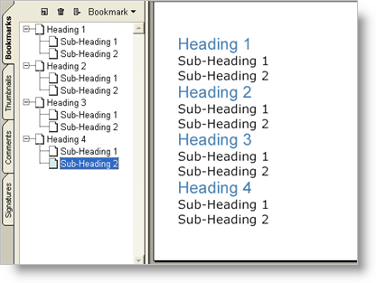

---
title: "ブックマーク"
slug: documentengine-bookmarks
---

# ブックマーク

Bookmarks は、Adobe® Acrobat® Reader の機能で、印刷したメディアでは何の意味もありません。ところが Acrobat Reader でレポートを表示する時にレポートの閲覧者には非常に便利です。Report 要素はブックマークの生成支援のために [`TextHeading`](Infragistics.Web.Documents.Reports~Infragistics.Documents.Reports.Report.TextHeading.html) 列挙体を使用します。Text 要素は [`Heading`](Infragistics.Web.Documents.Reports~Infragistics.Documents.Reports.Report.Text.IText~Heading.html) プロパティを公開し、これによって TextHeading 列挙体に基づいて見出しを選択することができます。これらの見出しは、階層として Report 要素によって認識されます。Report 要素は、Heading プロパティを設定したレポート内のすべての Text 要素を収集し、それらに基づいてブックマークのリストを作成します。H1 見出しは最上位のブックマークで、H2 見出しは対応する H1 見出しに含まれます。このロジックは H9 まで見出しの階層全体に適用されます。このロジックは非常に似ているので、詳細は[「目次」](/documentengine-table-of-contents)を参照してください。

- [TextHeading](Infragistics.Web.Documents.Reports~Infragistics.Documents.Reports.Report.TextHeading.html): Web API リファレンス ガイドの TextHeading メンバーへのリンク。
- [Heading](Infragistics.Web.Documents.Reports~Infragistics.Documents.Reports.Report.Text.IText~Heading.html): Web API リファレンス ガイドの Heading メンバーへのリンク。
- [目次](/documentengine-table-of-contents): ドキュメント エンジンで使用可能な目次ナビゲーション ヘルパーについて説明します。





以下のコードを「目次」トピックのコードに追加すると、上記のスクリーンショットに似た見出しに一致するブックマークが作成されます。

**Visual Basic の場合:**

```vb
' Assuming 'report' is your main Report element.
' Passing true as AddLevel's parameter displays
' the bookmark's second level, if it exists.
report.Bookmarks.AddLevel(True)
report.Bookmarks.AddLevel()
```

**C# の場合:**

```csharp
// Assuming 'report' is your main Report element.
// Passing true as AddLevel's parameter displays
// the bookmark's second level, if it exists.
report.Bookmarks.AddLevel(true);
report.Bookmarks.AddLevel();
```
