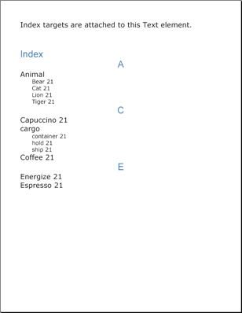

# インデックス

Index 要素はレポート内の特定の語を見つけ出すための方法を読む人に提供します。インデックスはレポート内で見つけた語句をレポートの最後に集めてアルファベット順に並べた語句の集合です。各語句には各語句に関連した番号が付いています。この番号は、読む人がその語句を見つけることができるレポートのページです。その語が複数のページで見つかった場合には、それらのページを表す複数の番号がその語に関連付けられます。



[`IText`](Infragistics.Web.Documents.Reports~Infragistics.Documents.Reports.Report.Text.IText~AddTarget.html) インターフェイスから [`AddTarget`](Infragistics.Web.Documents.Reports~Infragistics.Documents.Reports.Report.Text.IText.html) メソッドを呼び出すことによって語をインデックスに追加できます。このメソッドには 2 つのオーバーロードがあります。ひとつはターゲット名として文字列を認め、もうひとつはターゲットおよびキャプションの名前として 2 つの文字列を認めます。Text 要素に必要な数だけターゲットを追加できます。インデックスが複数のページにあるひとつの語を認識するには、その語が属する各 Text 要素にターゲットとしてその語を追加する必要があります。Index 要素はこれらのターゲットを使用して、インデックスを作成します。したがって、AddTarget メソッドによってその語を明示的にインデックスに追加しない限り、ひとつの語が複数の場所にある場合には認識しません。

Index 要素は、階層を使用して作成されるという点で TOC 要素に非常に似ています。インデックスが提供する階層の数は、完全にユーザーとレポートの複雑さ次第で決定します。[`IIndex`](Infragistics.Web.Documents.Reports~Infragistics.Documents.Reports.Report.Index.IIndex~AddLevel.html) インターフェイスから [`AddLevel`](Infragistics.Web.Documents.Reports~Infragistics.Documents.Reports.Report.Index.IIndex.html) を呼び出すことによって階層をインデックスに追加します。最も一般的なインデックスは、2 階層で構成されます。この構成によって、複合語句を同じカテゴリにグループ化できます。たとえば、cargo container、cargo hold、cargo ship などの 3 つの複合語を索引に追加する必要があるとします。通常と全く同じように追加して、`AddTarget` を 3 回呼び出すことによって、各語に個別のターゲット名を提供します。唯一の違いはターゲットのキャプションにあります。コロン（:）を使用することによって、キャプションで索引の階層を分けます。この規則を使用すると、「cargo hold」のキャプションは「cargo:hold」になります。これによって、インデックスで「cargo」という語の下に「hold」という語が配置され、上記のスクリーンショットで示すように 2 番目の階層を使用します。語句をグループ化する方法は、完全にユーザー次第です。

------

以下のコードは、インデックスを格納するために、`Text` 要素を作成し、いくつかのターゲットを追加します。これで 2 階層のインデックスが作成されます。

1.  **索引で使用するために 2 つの Style オブジェクトを作成します。**

    **Visual Basic の場合:**

```vb
    Imports Infragistics.Documents.Reports.Report
    .
    .
    .
    Dim mainStyle1 As New _
      Infragistics.Documents.Reports.Report.Text.Style( _
      New Font("Verdana", 18), Brushes.Black)
    Dim mainStyle2 As New _
      Infragistics.Documents.Reports.Report.Text.Style( _
      New Font("Arial", 24), Brushes.SteelBlue)
```

    **C# の場合:**

```csharp
    using Infragistics.Documents.Reports.Report;
    .
    .
    .
    Infragistics.Documents.Reports.Report.Text.Style mainStyle1 = 
      new Infragistics.Documents.Reports.Report.Text.Style( 
      new Font("Verdana", 18), Brushes.Black);
    Infragistics.Documents.Reports.Report.Text.Style mainStyle2 = 
      new Infragistics.Documents.Reports.Report.Text.Style( 
      new Font("Arial", 24), Brushes.SteelBlue);
```

2.  **インデックスに配置するために新しい Section を作成します。**

    **Visual Basic の場合:**

```vb
    Dim indexSection As Infragistics.Documents.Reports.Report.Section.ISection = _  report.AddSection()
    indexSection.PageMargins = New Margins(50)
```

    **C# の場合:**

```csharp
    Infragistics.Documents.Reports.Report.Section.ISection indexSection =   report.AddSection();
    indexSection.PageMargins = new Margins(50);
```

3.  **Text 要素を作成してターゲットをこの要素に追加します。**

    **Visual Basic の場合:**

```vb
    Dim indexText As Infragistics.Documents.Reports.Report.Text.IText = _  indexSection.AddText()
    indexText.Style = mainStyle1

    indexText.AddContent("Index targets are attached to this Text element.")

    indexText.AddTarget("Bear", "Animal:Bear")
    indexText.AddTarget("Tiger", "Animal:Tiger")
    indexText.AddTarget("Cat", "Animal:Cat")
    indexText.AddTarget("Lion", "Animal:Lion")
    indexText.AddTarget("cargo hold", "cargo:hold")
    indexText.AddTarget("cargo container", "cargo:container")
    indexText.AddTarget("cargo ship", "cargo:ship")
    indexText.AddTarget("Coffee", "Coffee")
    indexText.AddTarget("Espresso", "Espresso")
    indexText.AddTarget("Capuccino", "Capuccino")
    indexText.AddTarget("Energize", "Energize")
```

    **C# の場合:**

```csharp
    Infragistics.Documents.Reports.Report.Text.IText indexText =   indexSection.AddText();
    indexText.Style = mainStyle1;

    indexText.AddContent("Index targets are attached to this Text element.");

    indexText.AddTarget("Bear", "Animal:Bear");
    indexText.AddTarget("Tiger", "Animal:Tiger");
    indexText.AddTarget("Cat", "Animal:Cat");
    indexText.AddTarget("Lion", "Animal:Lion");
    indexText.AddTarget("cargo hold", "cargo:hold");
    indexText.AddTarget("cargo container", "cargo:container");
    indexText.AddTarget("cargo ship", "cargo:ship");
    indexText.AddTarget("Coffee", "Coffee");
    indexText.AddTarget("Espresso", "Espresso");
    indexText.AddTarget("Capuccino", "Capuccino");
    indexText.AddTarget("Energize", "Energize");
```

4.  **Text 要素とまもなく作成される予定の Index 要素間にスペースを追加するためにギャップを作成します。**

    **Visual Basic の場合:**

```vb
    Dim indexGap As Infragistics.Documents.Reports.Report.IGap = indexSection.AddGap()
    indexGap.Height = New FixedHeight(50)
```

    **C# の場合:**

```csharp
    Infragistics.Documents.Reports.Report.IGap indexGap = indexSection.AddGap();
    indexGap.Height = new FixedHeight(50);
```

5.  **インデックスの見出しを作成します。**

    **Visual Basic の場合:**

```vb
    Dim indexHeading As Infragistics.Documents.Reports.Report.Text.IText = _  indexSection.AddText()
    indexHeading.Style = mainStyle2
    indexHeading.AddContent("Index")
```

    **C# の場合:**

```csharp
    Infragistics.Documents.Reports.Report.Text.IText indexHeading =   indexSection.AddText();
    indexHeading.Style = mainStyle2;
    indexHeading.AddContent("Index");
```

6.  **Index 要素を定義して、2 階層追加します。**

    **Visual Basic の場合:**

```vb
    Dim index As Infragistics.Documents.Reports.Report.Index.IIndex = _  indexSection.AddIndex()
    index.Alphabet.Style = mainStyle2

    Dim indexLevel As Infragistics.Documents.Reports.Report.Index.IIndexLevel = _  index.AddLevel()
    indexLevel.Style = mainStyle1

    indexLevel = index.AddLevel()
    indexLevel.Style = mainStyle1
    indexLevel.Indents.Left = 30
    indexLevel.Style = _
      New Infragistics.Documents.Reports.Report.Text.Style( _
      New Font("Verdana", 14), Brushes.Black)
```

    **C# の場合:**

```csharp
    Infragistics.Documents.Reports.Report.Index.IIndex index =   indexSection.AddIndex();
    index.Alphabet.Style = mainStyle2;
                            
    Infragistics.Documents.Reports.Report.Index.IIndexLevel indexLevel =   index.AddLevel();
    indexLevel.Style = mainStyle1;

    indexLevel = index.AddLevel();
    indexLevel.Style = mainStyle1;
    indexLevel.Indents.Left = 30;
    indexLevel.Style = 
      new Infragistics.Documents.Reports.Report.Text.Style( 
      new Font("Verdana", 14), Brushes.Black);
```

