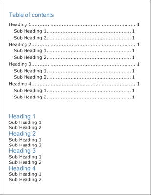

---
title: "目次"
slug: documentengine-table-of-contents
---

# 目次
目次（TOC）の作成はほとんどの人が考えているよりもはるかにシンプルです。Infragistics Document Engine™ でレポートをすでに書いている場合には、目次の作成の工程の半分はすでに完了していると言えるかもしれません。TOC 要素は、レポートの構造に基づいて目次を作成します。したがって、TOC 要素を活用するためには、レポートを適切に作成することが重要となります。

Text 要素は、[Heading](Infragistics.Web.Documents.Reports~Infragistics.Documents.Reports.Report.Text.IText~Heading.html) プロパティを公開します。このプロパティは [TextHeading](Infragistics.Web.Documents.Reports~Infragistics.Documents.Reports.Report.TextHeading.html) 列挙体に設定することができます。この列挙体の値は、H1、H2、H3 というようになります。Text 要素の見出しを設定するときに、目次の生成方法を TOC 要素に通知します。[ITOC](Infragistics.Web.Documents.Reports~Infragistics.Documents.Reports.Report.TOC.ITOC.html) インターフェイスには、[AddLevel](Infragistics.Web.Documents.Reports~Infragistics.Documents.Reports.Report.TOC.ITOC~AddLevel.html) メソッドが含まれており、このメソッドを異なる見出しとともに使用することができます。目次に追加する最初のレベルは、見出しの最初のレベルつまり H1 に対応します。目次にもうひとつのレベルを追加すると H2 に対応し、最後の見出し H9 まで続きます。したがって、見出しのラベルを適切に設定すれば、目次を生成するためにさほどの追加作業を行う必要はありません。

[ILevel](Infragistics.Web.Documents.Reports~Infragistics.Documents.Reports.Report.TOC.ILevel.html) インターフェイスは、目次を処理する時に一般的ないくつかのプロパティを公開します。

*   **Indents** -- 垂直、水平、上、下、左、右のインデントおよびすべてインデントを設定することによって、TOC レベルのインデントを制御できます。これは、見出しのレベルごとに異なるインデントを指定できるようにすることによって読みやすさを向上するために役立ちます。
*   **Style** -- Style オブジェクトをこのプロパティに設定することは、見出し、リーダー、ページ番号がどのように表示されるのかを決定します。
*   **Leader** -- 引き出し線は、ほとんどの目次で点線で表示されます。この線は、ページのもう一方の側まで線を引くことによって、読む人が見出しとページ番号を結び付けやすくします。[LeaderFormat](Infragistics.Web.Documents.Reports~Infragistics.Documents.Reports.Report.LeaderFormat.html) 列挙体によって、この線を破線、点線、実線、またはスペースに設定することができます。



以下のコードは、4 つの見出しと各見出しの下の 2 つの小見出しで構成される目次を生成します。見出しは H1 で、小見出しは H2 です。

1.  **見出しと小見出しのスタイルに対して 2 つの Style オブジェクトを宣言します。**

    **C# の場合:**

```csharp
    using Infragistics.Documents.Reports.Report;
    .
    .
    .
    Infragistics.Documents.Reports.Report.Text.Style mainStyle1 = 
      new Infragistics.Documents.Reports.Report.Text.Style( 
      new Font("Verdana", 18), Brushes.Black);
    Infragistics.Documents.Reports.Report.Text.Style mainStyle2 = 
      new Infragistics.Documents.Reports.Report.Text.Style( 
      new Font("Arial", 24), Brushes.SteelBlue);
```

2.  **目次を配置するために新しいセクションを作成します。**

	**C# の場合:**

```csharp
    // Create a new section and set the page size and margins.
    Infragistics.Documents.Reports.Report.Section.ISection tocSection = report.AddSection();
    tocSection.PageSize = PageSizes.Letter;
    tocSection.PageMargins.All = 35;
```

3.  **TOC を作成して、2 つのレベルを定義します。**

	**C# の場合:**

```csharp
    // Create a title for the TOC.
    Infragistics.Documents.Reports.Report.Text.IText tocText = tocSection.AddText();
    tocText.Style = mainStyle2;
    tocText.Margins.Top = 10;
    tocText.Margins.Bottom = 15;
    tocText.AddContent("Table of contents");

    // Create a new TOC.
    Infragistics.Documents.Reports.Report.TOC.ITOC toc = tocSection.AddTOC();

    // Add a first level to the TOC
    // (corresponding to H1)
    Infragistics.Documents.Reports.Report.TOC.ILevel tocLevel = toc.AddLevel();
    tocLevel.Indents.Right = 20;
    tocLevel.Indents.Bottom = 5;
    tocLevel.Style = mainStyle1;
    tocLevel.Leader = LeaderFormat.Dots;

    // Add a second level to the TOC
    // (corresponding to H2)
    tocLevel = toc.AddLevel();
    tocLevel.Indents.Left = 20;
    tocLevel.Indents.Right = 40;
    tocLevel.Indents.Bottom = 5;
    tocLevel.Style = mainStyle1;
    tocLevel.Leader = LeaderFormat.Dots;
```

4.  **目次をコンテンツと分離するために、Gap 要素を追加します。**

	**C# の場合:**
	
```csharp
    Infragistics.Documents.Reports.Report.IGap tocGap = tocSection.AddGap();
    tocGap.Height = new FixedHeight(50);
```

5.  **いくつかの見出しと小見出しを追加して生成された目次を確認します。**

	**C# の場合:**

```csharp
    // Create headings to demonstrate TOC.

    Infragistics.Documents.Reports.Report.Text.IText sampleHeading;
    Infragistics.Documents.Reports.Report.Text.IText sampleSubHeading;

    for (int i = 1; i < 5; i++)
    {
            sampleHeading = tocSection.AddText();
            sampleHeading.Heading = TextHeading.H1;
            sampleHeading.Style = mainStyle2;
            sampleHeading.AddContent("Heading " + i);

            for (int j = 1; j < 3; j++)
            {
                    sampleSubHeading = tocSection.AddText();
                    sampleSubHeading.Heading = TextHeading.H2;
                    sampleSubHeading.Style = mainStyle1;
                    sampleSubHeading.AddContent("Sub-Heading " + j);
            }
    }
```
