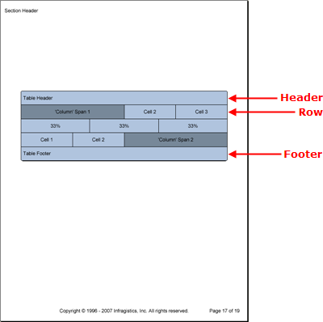

# 表

                

Table 要素は、Grid 要素などのように、行と列よりも行とセルに依存するグリッドを作成することができるグリッド タイプの要素です。Table 要素には、Grid 要素のようにセルの幅を決定する特定の列がありません。

Table 要素によって、必要に応じてあらゆるセルの幅をカスタマイズことができ、データの提示方法を完全に制御することができます。このグリッド デザインの 2 つの欠点は、列と行のスパンニングを処理しなければならないことです。特定のセルの幅を倍にすることによって列のスパンニングを「偽造」しなければなりません。行のスパンニングはできません。

[パターン コンテンツ](/documentengine-pattern-content) ファミリーのメンバーとして、さまざまな表レベルでパターンを適用することにより、さまざまな Table 要素のスタイルを修正できます。

*   **表パターン** -- 表全体をスタイルし、セル パターン以外のその他すべてのパターンへのアクセスを提供します ([TablePattern](Infragistics.Web.Documents.Reports~Infragistics.Documents.Reports.Report.Table.TablePattern.html) クラスはスタイルを [ITable](Infragistics.Web.Documents.Reports~Infragistics.Documents.Reports.Report.Table.ITable.html) インターフェイスに適用します)。
*   **ヘッダー パターン** -- 表のヘッダー要素をスタイルします ([TableHeaderPattern](Infragistics.Web.Documents.Reports~Infragistics.Documents.Reports.Report.Table.TableHeaderPattern.html) クラスはスタイルを [ITableHeader](Infragistics.Web.Documents.Reports~Infragistics.Documents.Reports.Report.Table.ITableHeader.html) インターフェイスに適用します)。
*   **区別線パターン** -- 表の区分線要素をスタイルします ([TableDividerPattern](Infragistics.Web.Documents.Reports~Infragistics.Documents.Reports.Report.Table.TableDividerPattern.html) クラスはスタイルを [ITableDivider](Infragistics.Web.Documents.Reports~Infragistics.Documents.Reports.Report.Table.ITableDivider.html) インターフェイスに適用します)。
*   **フッター パターン** -- 表のフッター要素をスタイルします ([TableFooterPattern](Infragistics.Web.Documents.Reports~Infragistics.Documents.Reports.Report.Table.TableFooterPattern.html) クラスはスタイルを [ITableFooter](Infragistics.Web.Documents.Reports~Infragistics.Documents.Reports.Report.Table.ITableFooter.html) インターフェイスに適用します)。
*   **行パターン** -- 表の各行をスタイルします ([TableRowPattern](Infragistics.Web.Documents.Reports~Infragistics.Documents.Reports.Report.Table.TableRowPattern.html) クラスはスタイルを [ITableRow](Infragistics.Web.Documents.Reports~Infragistics.Documents.Reports.Report.Table.ITableRow.html) インターフェイスに適用します)。
*   **セル パターン** -- 各セルを個別に詳細にスタイルします ([TableCellPattern](Infragistics.Web.Documents.Reports~Infragistics.Documents.Reports.Report.Table.TableCellPattern.html) クラスはスタイルを [ITableCell](Infragistics.Web.Documents.Reports~Infragistics.Documents.Reports.Report.Table.ITableCell.html) インターフェイスに適用します)。

Table 要素は Header、Footer、および Divider 要素も含みます。これらの要素は 1 行のみで構成されます。これらの要素も Band 要素の Header、Footer、および Divider 要素と同じように動作します。ヘッダーは、[Repeat](Infragistics.Web.Documents.Reports~Infragistics.Documents.Reports.Report.Table.ITableHeader~Repeat.html) プロパティによって異なりますが、全ページまたは先頭ページのみの表の上部に表示します。ヘッダーも同様ですが最終ページに適用されます。デバイダは、表が次ページに続く全ページの最後に表示します。



以下のコードは、ヘッダーとフッターの付いた 3 行の表を作成します。1 行目と 3 行目は、特定のセルの幅を操作することによって、標準的なセルの幅を倍にするために列のスパンニングをシミュレートします。中間の行は、各セルの幅を表の幅の 3 分の 1 に変更することによって、完全にカスタムの行を作成する Table 要素の機能を示しています。

1.  **表とセルのパターンを作成します。**

    **C# の場合:**

```csharp
    using Infragistics.Documents.Reports.Report;
    .
    .
    .
    // Create a new pattern for the table as a whole.
    Infragistics.Documents.Reports.Report.Table.TablePattern tablePattern = 
      new Infragistics.Documents.Reports.Report.Table.TablePattern();
    tablePattern.Background = new Background(Brushes.LightSteelBlue);
    tablePattern.Borders = new Borders(new Pen(new Color(0, 0, 0)), 5);

    // Create a new pattern for the cells.
    Infragistics.Documents.Reports.Report.Table.CellPattern tableCellPattern = 
      new Infragistics.Documents.Reports.Report.Table.TableCellPattern();
    tableCellPattern.Borders = new Borders(new Pen(new Color(0, 0, 0)));
    tableCellPattern.Background = new Background(Brushes.LightSteelBlue);
    tableCellPattern.Paddings = new Paddings(5, 10);
```

2.  **表を作成し、表パターンを適用します。**

    **C# の場合:**

```csharp
    // Create the table and apply the table pattern.
    Infragistics.Documents.Reports.Report.Table.ITable table = section1.AddTable();
    table.Width = new RelativeWidth(100);
    table.ApplyPattern(tablePattern);
```

3.  **ヘッダーとフッターを作成します。**

    **C# の場合:**

```csharp
    // Create the table header.
    Infragistics.Documents.Reports.Report.Table.ITableHeader tableHeader = 
      table.Header;
    Infragistics.Documents.Reports.Report.Table.ITableCell tableHeaderCell = 
      tableHeader.AddCell();
    tableCellPattern.Apply(tableHeaderCell);
    tableHeaderCell.AddQuickText("Table Header");

    // Create the table footer.
    Infragistics.Documents.Reports.Report.Table.ITableFooter tableFooter = 
      table.Footer;
    Infragistics.Documents.Reports.Report.Table.ITableCell tableFooterCell = 
      tableFooter.AddCell();
    tableCellPattern.Apply(tableFooterCell);
    tableFooterCell.AddQuickText("Table Footer");
```

4.  **1 行目を作成します。**

    **C# の場合:**

```csharp
    Infragistics.Documents.Reports.Report.Table.ITableRow tableRow;
    Infragistics.Documents.Reports.Report.Table.ITableCell tableCell;
    tableRow = table.AddRow();

    tableCell = tableRow.AddCell();
    tableCell.Width = new RelativeWidth(100);
    tableCellPattern.Apply(tableCell);
    tableCell.Background = new Background(Brushes.LightSlateGray);
    IText tableCellText = tableCell.AddText();
    tableCellText.Alignment = 
      new TextAlignment(Alignment.Center, Alignment.Middle);
    tableCellText.AddContent("'Column' Span 1");

    tableCell = tableRow.AddCell();
    tableCell.Width = new RelativeWidth(50);
    tableCellPattern.Apply(tableCell);
    tableCellText = tableCell.AddText();
    tableCellText.Alignment = 
      new TextAlignment(Alignment.Center, Alignment.Middle);
    tableCellText.AddContent("Cell 2");

    tableCell = tableRow.AddCell();
    tableCell.Width = new RelativeWidth(50);
    tableCellPattern.Apply(tableCell);
    tableCellText = tableCell.AddText();
    tableCellText.Alignment = 
      new TextAlignment(Alignment.Center, Alignment.Middle);
    tableCellText.AddContent("Cell 3");
```

5.  **2 行目を作成します。**

    **C# の場合:**

```csharp
    tableRow = table.AddRow();

    tableCell = tableRow.AddCell();
    tableCell.Width = new RelativeWidth(33);
    tableCellPattern.Apply(tableCell);
    tableCellText = tableCell.AddText();
    tableCellText.Alignment = 
      new TextAlignment(Alignment.Center, Alignment.Middle);
    tableCellText.AddContent("33%");

    tableCell = tableRow.AddCell();
    tableCell.Width = new RelativeWidth(33);
    tableCellPattern.Apply(tableCell);
    tableCellText = tableCell.AddText();
    tableCellText.Alignment = 
      new TextAlignment(Alignment.Center, Alignment.Middle);
    tableCellText.AddContent("33%");

    tableCell = tableRow.AddCell();
    tableCell.Width = new RelativeWidth(33);
    tableCellPattern.Apply(tableCell);
    tableCellText = tableCell.AddText();
    tableCellText.Alignment = 
      new TextAlignment(Alignment.Center, Alignment.Middle);
    tableCellText.AddContent("33%");
```

6.  **3 行目を作成します。**

    **C# の場合:**

```csharp
    tableRow = table.AddRow();

    tableCell = tableRow.AddCell();
    tableCell.Width = new RelativeWidth(50);
    ableCellPattern.Apply(tableCell);
    tableCellText = tableCell.AddText();
    tableCellText.Alignment = 
      new TextAlignment(Alignment.Center, Alignment.Middle);
    tableCellText.AddContent("Cell 1");

    tableCell = tableRow.AddCell();
    tableCell.Width = new RelativeWidth(50);
    tableCellPattern.Apply(tableCell);
    tableCellText = tableCell.AddText();
    tableCellText.Alignment = 
      new TextAlignment(Alignment.Center, Alignment.Middle);
    tableCellText.AddContent("Cell 2");

    tableCell = tableRow.AddCell();
    tableCell.Width = new RelativeWidth(100);
    tableCellPattern.Apply(tableCell);
    tableCell.Background = new Background(Brushes.LightSlateGray);
    tableCellText = tableCell.AddText();
    tableCellText.Alignment = 
      new TextAlignment(Alignment.Center, Alignment.Middle);
    tableCellText.AddContent("'Column' Span 2");
```
