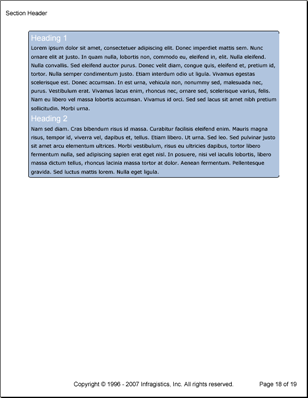

# テキスト

                

Text 要素は高度にカスタマイズした段落コンテンツをレポートに追加します。Text 要素には、どのような場合であってもコンテンツを目立たせるいくつかのテキスト固有のプロパティを含みます。これらのプロパティのいくつかは、[「レポート グラフィックス」](/documentengine-report-graphics)のセクションで見つけることができますが、以下のようなテキスト固有のプロパティがいくつかあります。

*   **First Letter** -- 段落の先頭文字がドロップ キャップかどうかを決定します。
*   **Heading** -- テキストに複数の異なるスタイルの見出しを提供します。
*   **Indents** -- テキストのインデントの値を決定します。
*   **Interval** -- テキスト各行間に余分のスペースを追加することができます。
*   **Line Numbering** -- 閲覧者が特定の文を指定しやすいようにテキストの各行に番号を付けることができます。
*   **Style** -- 異なるテキスト要素に同じフォントと色を繰り返し設定する時に便利です。

Text 要素もすべての種類のテキスト コンテンツを挿入する支援をするいくつかのメソッドを公開しています。これらのメソッドのいくつかを以下にリストします。

*   **AddContent** -- 多数のオーバーロードで最も一般的に使用されるメソッドです。単に 1 回のオーバーロードでひとつの文字列を入力する、または別のオーバーロードでスタイル 要素を適用することが可能です。ユーザーのニーズに合わせるためにいくつかの使用可能な組み合わせがあります。
*   **AddDateTime** -- いくつかの標準的なフォーマットで現在の日時を追加することができます。
*   **AddLeader** -- 引き出し線をテキストに追加することができます。
*   **AddLineBreak** -- 改行を追加して、コンテンツが連続した行の上にひとかたまりにならないようにします。
*   **AddPageNumber** -- 十進数、文字、またはローマ数字で現在のページのベージ番号を追加します。
*   **AddRichContent** -- HTML と同様のタグを使用して限られたリッチ コンテンツを追加します。



以下のコードは単一の Text 要素を作成します。ひとつのパターンが Text 要素全体に適用され、2 つのスタイルが個々のコンテンツ 要素に適用されます。

1.  **スタイルを作成します。**

    **C# の場合:**

```csharp
    using Infragistics.Documents.Reports.Report;
    using Infragistics.Documents.Reports.Report.Text;
    using Infragistics.Documents.Reports.Graphics;
    .
    .
    .
    Style style1 = new Style(new Font("Arial", 16), Brushes.White);
    Style style2 = new Style(new Font("Verdana", 10), Brushes.Black);
```

2.  **テキストのパターンを作成します。**

    **C# の場合:**

```csharp
    TextPattern textPattern = new TextPattern();
    textPattern.Margins = new Margins(5, 10);
    textPattern.Paddings = new Paddings(5);
    textPattern.Interval = 5;
    textPattern.Borders = new Borders(new Pen(new Color(0, 0, 0)), 5);
    textPattern.Background = new Background(Brushes.LightSteelBlue);
```

3.  **Text 要素を作成してコンテンツを追加します。**

	以下のテキストを使用して、`string1` 変数を設定します。

	> Lorem ipsum dolor sit amet, consectetuer adipiscing elit.Donec imperdiet mattis sem.Nunc ornare elit at justo.In quam nulla, lobortis non, commodo eu, eleifend in, elit.Nulla eleifend.Nulla convallis.Sed eleifend auctor purus.Donec velit diam, congue quis, eleifend et, pretium id, tortor.Nulla semper condimentum justo.Etiam interdum odio ut ligula.Vivamus egestas scelerisque est. Donec accumsan.In est urna, vehicula non, nonummy sed, malesuada nec, purus.Vestibulum erat.Vivamus lacus enim, rhoncus nec, ornare sed, scelerisque varius, felis.Nam eu libero vel massa lobortis accumsan.Vivamus id orci.Sed sed lacus sit amet nibh pretium sollicitudin.Morbi urna.

	**C# の場合:**

```csharp
    IText sectionText = section1.AddText();
    sectionText.ApplyPattern(textPattern);

    string string1 = "Lorem ipsum...";

    sectionText.AddContent("Heading 1", style1);
    sectionText.AddLineBreak();
    sectionText.AddContent(string1, style2);
    sectionText.AddLineBreak();
    sectionText.AddContent("Heading 2", style1);
    sectionText.AddLineBreak();
    sectionText.AddContent(string1, style2);
```
