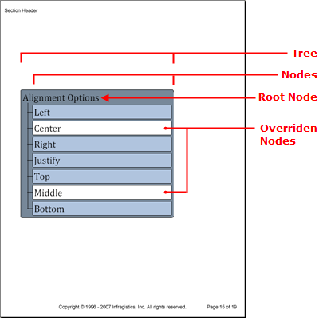

---
title: "ツリー"
slug: documentengine-trees
---

# ツリー
Tree 要素は、親ノード、特にルート ノードが子ノードと階層の下位にあるすべてのノードをどのように所有するかを示すことによって、階層関係を表示するために役に立ちます。Tree 要素のオブジェクト モデルは、ツリーのルート ノードを識別するために [Root](Infragistics.Web.Documents.Reports~Infragistics.Documents.Reports.Report.Tree.ITree~Root.html) プロパティを設定したメインのツリー オブジェクトで構成されています。ルート ノード（タイプ [INode](Infragistics.Web.Documents.Reports~Infragistics.Documents.Reports.Report.Tree.INode.html) の）への参照を取得したら、INode インターフェイスから [AddNode](Infragistics.Web.Documents.Reports~Infragistics.Documents.Reports.Report.Tree.INode~AddNode.html) メソッドを呼び出して、追加ノードをツリーに追加することができます。希望の数だけノードを追加できますが、ルート ノードはひとつしかありません。

すべての[パターン コンテンツ](/documentengine-pattern-content)と同じように、パターンを以下のツリー 要素に追加することによって、スタイル変更を実装できます。

*   ツリー全体（[TreePattern](Infragistics.Web.Documents.Reports~Infragistics.Documents.Reports.Report.Tree.TreePattern.html) クラスはスタイルを [ITree](Infragistics.Web.Documents.Reports~Infragistics.Documents.Reports.Report.Tree.ITree.html) インターフェイスに適用）
*   コンテンツではなくツリーのノード ([TreeNodePattern](Infragistics.Web.Documents.Reports~Infragistics.Documents.Reports.Report.Tree.TreeNodePattern.html) クラスはスタイルを [INode](Infragistics.Web.Documents.Reports~Infragistics.Documents.Reports.Report.Tree.INode.html) インターフェイスを適用します)。
*   ツリー ノードのキャプション（[TreeCaptionPattern](Infragistics.Web.Documents.Reports~Infragistics.Documents.Reports.Report.Tree.TreeCaptionPattern.html) クラスはスタイルを [ICaption](Infragistics.Web.Documents.Reports~Infragistics.Documents.Reports.Report.Tree.ICaption.html) インターフェイスに適用）

上記のリストから分かるように、各パターンはツリーのより詳細な階層に適用されます。それでも十分でない場合には、各ノードで特定のプロパティを設定せうることにより、各パターンをオーバーライドすることができます。



以下のコードはルート ノードがひとつ、子ノードが 7 つのツリーを作成します。最初にツリー、ノード、キャプションのパターンを作成し、ツリーを作成して、次にノードを追加します。

1.  **ツリー、ノード、キャプションのパターンを作成します。**

    **C# の場合:**

```csharp
    using Infragistics.Documents.Reports.Report;
    .
    .
    .
    // Create a new pattern for the tree as a whole.
    Infragistics.Documents.Reports.Report.Tree.TreePattern treePattern = new TreePattern();
    treePattern.Background = new Background(Brushes.LightSlateGray);
    treePattern.Paddings = new Paddings(5);
    treePattern.Borders = new Borders(new Pen(new Color(0, 0, 0)), 5);

    // Create a new pattern for tree nodes.
    Infragistics.Documents.Reports.Report.Tree.TreeNodePattern treeNodePattern = 
      new TreeNodePattern();
    treeNodePattern.Lines = new Lines(new Pen(new Color(0, 0, 0)));
    treeNodePattern.Interval = 5;
    treeNodePattern.Indent = 25;

    // Create a new pattern for captions.
    Infragistics.Documents.Reports.Report.Tree.TreeCaptionPattern treeCaptionPattern = 
      new TreeCaptionPattern();
    treeCaptionPattern.Background = new Background(Brushes.LightSteelBlue);
    treeCaptionPattern.Borders = new Borders(new Pen(new Color(0, 0, 0)), 3);
    treeCaptionPattern.Paddings = new Paddings(3);
```

2.  **ツリーを作成し、ツリー パターンを適用して、次にルート ノードのキャプションを追加します。**

    **C# の場合:**

```csharp
    // Create the tree and get a reference to the
    // tree's root node.
    Infragistics.Documents.Reports.Report.Tree.ITree tree = section1.AddTree();
    tree.ApplyPattern(treePattern);
    tree.Width = new RelativeWidth(75);
                            
    Infragistics.Documents.Reports.Report.Tree.INode rootNode = tree.Root;
    treeNodePattern.Apply(rootNode);

    Infragistics.Documents.Reports.Report.QuickText.IQuickText nodeText;
                            
    // Add a caption to the root node.
    Infragistics.Documents.Reports.Report.Tree.ICaption rootCaption = rootNode.Caption;
    nodeText = rootCaption.AddQuickText("Alignment Options");
    nodeText.Font = new Infragistics.Documents.Reports.Graphics.Font("Verdana", 24);
```

3.  **子ノードを作成します。**

    以下のコードは、[Alignment](Infragistics.Web.Documents.Reports~Infragistics.Documents.Reports.Report.Alignment.html) [Alignment](Infragistics.Web.Documents.Reports~Infragistics.Documents.Reports.Report.Alignment.html) [Alignment](Infragistics.Web.Documents.Reports~Infragistics.Documents.Reports.Report.Alignment.html) [Alignment](Infragistics.Web.Documents.Reports~Infragistics.Documents.Reports.Report.Alignment.html) 列挙体でループして、ツリー ノードを格納するための文字列を取得します。ループが文字列「Center」または「Middle」に遭遇すると、これらのノードのパターンをオーバーライドして背景色を白に変更します。

    **C# の場合:**

```csharp
    INode childNode;
    ICaption childNodeCaption;

    foreach (string s in Enum.GetNames(typeof(Alignment)))
    {
            if (s == "Center" || s == "Middle")
            {
                    childNode = rootNode.AddNode();
                    childNodeCaption = childNode.Caption;
                    treeCaptionPattern.Apply(childNodeCaption);
                                            
                    // Override the Background of the TreeCaptionPattern
                    childNodeCaption.Background = new Background(Brushes.White);
                                            
                    nodeText = childNodeCaption.AddQuickText(s);
                    nodeText.Font = 
                      new Infragistics.Documents.Reports.Graphics.Font("Verdana", 24);
            }
            else
            {
                    childNode = rootNode.AddNode();
                    childNodeCaption = childNode.Caption;
                    treeCaptionPattern.Apply(childNodeCaption);
                    nodeText = childNodeCaption.AddQuickText(s);
                    nodeText.Font = 
                      new Infragistics.Documents.Reports.Graphics.Font("Verdana", 24);
            }
    }
```
