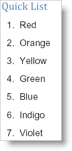

---
title: "クイック リスト"
slug: documentengine-quick-list
---

# クイック リスト

Quick List 要素を使用することは、シンプルな黒丸または番号付きのリストをレポートに追加するための最も簡単な方法です。Quick List には軽量であることを維持するために基本的な機能しかありません。より詳細にカスタマイズ可能なリスト 要素が必要な場合には、[「リスト」](/documentengine-lists)を参照してください。その他の[クイック コンテンツ](/documentengine-quick-content) 要素と同じように、ほとんどのレイアウト 要素で AddQuickList メソッドを呼び出すことによって Quick List を作成します。Quick Image および Quick Text 要素と異なり、リストを作成するためにもうひとつ必要な手順があります。項目を追加しなければなりません。ただし、項目をリストに追加することは全く難しいことではありません。[IQuickList](Infragistics.Web.Documents.Reports~Infragistics.Documents.Reports.Report.QuickList.IQuickList~AddItem.html) インターフェイスから [AddItem](Infragistics.Web.Documents.Reports~Infragistics.Documents.Reports.Report.QuickList.IQuickList.html) メソッドを呼び出して、文字列を提供します。リストに黒丸を付けるか番号を付けるかを識別する [Numbered](Infragistics.Web.Documents.Reports~Infragistics.Documents.Reports.Report.QuickList.IQuickList~Numbered.html) プロパティなどのその他のオプションを使用できます。もうひとつ役に立つプロパティは、各項目間にスペースを設定する [Interval](Infragistics.Web.Documents.Reports~Infragistics.Documents.Reports.Report.QuickList.IQuickList~Interval.html) プロパティです。

以下のコードは、7 項目からなるリストを作成します。リストには番号が付けられ、各項目間のスペースは 10 ピクセルに設定されます。このトピックは、Report 要素が定義済みで、この要素に少なくともひとつの Section 要素が追加されていることを前提としています。詳細は、[Report](/documentengine-report) および[Section](/documentengine-section) を参照してください。



**C# の場合:**

```csharp
// Add a quick list
section1.AddQuickText("Quick List");
Infragistics.Documents.Reports.Report.QuickList.IQuickList quickList =   section1.AddQuickList();
quickList.Numbered = true;
quickList.Interval = 10;

// Add items to the list
quickList.AddItem("Red");
quickList.AddItem("Orange");
quickList.AddItem("Yellow");
quickList.AddItem("Green");
quickList.AddItem("Blue");
quickList.AddItem("Indigo");
quickList.AddItem("Violet");
```
