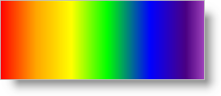

---
title: "色"
slug: documentengine-colors
---

# 色

[Color](Infragistics.Web.Documents.Reports~Infragistics.Documents.Reports.Graphics.Color.html) クラスによって、ほとんど苦労せずに任意の RGB カラーをレポート コンテンツに追加できます。Color クラスは複数のシナリオを説明するために複数のコンストラクターがあります。Color クラスの新しいインスタンスを初期化するよりもむしろ、使用可能な138 の事前に定義された色を含む [Colors](Infragistics.Web.Documents.Reports~Infragistics.Documents.Reports.Graphics.Colors.html) オブジェクトにアクセスすることも可能です。

色の使用は、[ColorBlend](/asp-net-mvc/document-engine/writing/graphics/brushes) クラスを使用して[ダイレクト グラデーション ブラシ](Infragistics.Web.Documents.Reports~Infragistics.Documents.Reports.Graphics.ColorBlend.html)のためにカスタムのカラー ブレンドを作成すると面白くなってきます。ColorBlend クラスは線の上の位置にマップされた色のコレクションです。これは別名 [ColorBlendEntry](Infragistics.Web.Documents.Reports~Infragistics.Documents.Reports.Graphics.ColorBlendEntry.html) として知られています。各 ColorBlendEntry には、Color に設定可能な [Color](Infragistics.Web.Documents.Reports~Infragistics.Documents.Reports.Graphics.ColorBlendEntry~Color.html) プロパティと、グラデーションのパスに沿って位置を表すフロートに設定可能な [Position](Infragistics.Web.Documents.Reports~Infragistics.Documents.Reports.Graphics.ColorBlendEntry~Position.html) プロパティがあります。Position プロパティは、0F から 1.0F のスケール上の値を受け付けます。



以下のコードは、Color クラスのさまざまなコンストラクターを通して複数の色をインスタンス化します。次にコードは `ColorBlend` オブジェクト、矩形、およびダイレクトの線形グラデーション ブラシを定義します。次にこれらのオブジェクトを使用して、Canvas に矩形を描画します。

1.  **赤、緑、青の 3 色を定義します。**

    **Visual Basic の場合:**

```vb
    Imports Infragistics.Documents.Reports.Report
    Imports Infragistics.Documents.Reports.Graphics
    .
    .
    .
    ' Create a new System color
    Dim red As New Color(System.Drawing.Color.Red)
    ' Create a color from RGB values
    Dim green As New Color(0, 255, 0)
    ' Create a predefined color from the Colors class
    Dim blue As Color = Colors.Blue
```

    **C# の場合:**

```csharp
    using Infragistics.Documents.Reports.Report;
    using Infragistics.Documents.Reports.Graphics;
    .
    .
    .
    // Create a new System color
    Color red = new Color(System.Drawing.Color.Red);
    // Create a color from RGB values
    Color green = new Color(0, 255, 0);
    // Create a predefined color from the Colors class
    Color blue = Colors.Blue;
```

2.  **カスタムのカラー ブレンドを作成します。**

    **Visual Basic の場合:**

```vb
    ' Create a new blend of colors
    Dim colorBlend As New ColorBlend()

    ' Add seven colors to the ColorBlend. Each ColorBlendEntry
    ' constructor accepts a color and a float representing the
    ' location on the line.
    colorBlend.Add(New ColorBlendEntry(red, 0.0F))
    colorBlend.Add(New ColorBlendEntry(Colors.Orange, 0.15F))
    colorBlend.Add(New ColorBlendEntry(Colors.Yellow, 0.3F))
    colorBlend.Add(New ColorBlendEntry(green, 0.45F))
    colorBlend.Add(New ColorBlendEntry(blue, 0.6F))
    colorBlend.Add(New ColorBlendEntry(Colors.Indigo, 0.75F))
    colorBlend.Add(New ColorBlendEntry(Colors.Violet, 0.9F))
```

    **C# の場合:**

```csharp
    // Create a new blend of colors
    ColorBlend colorBlend = new ColorBlend();

    // Add seven colors to the ColorBlend. Each ColorBlendEntry
    // constructor accepts a color and a float representing the
    // location on the line.
    colorBlend.Add(new ColorBlendEntry(red, 0F));
    colorBlend.Add(new ColorBlendEntry(Colors.Orange, .15F));
    colorBlend.Add(new ColorBlendEntry(Colors.Yellow, .3F));
    colorBlend.Add(new ColorBlendEntry(green, .45F));
    colorBlend.Add(new ColorBlendEntry(blue, .60F));
    colorBlend.Add(new ColorBlendEntry(Colors.Indigo, .75F));
    colorBlend.Add(new ColorBlendEntry(Colors.Violet, .9F));
```

3.  **矩形を定義します。**

    **Visual Basic の場合:**

```vb
    ' Create a rectangle that will bind the linear gradient.
    Dim rect As New Rectangle(New Point(0, 100), New Size(600, 200))
```

    **C# の場合:**

```csharp
    // Create a rectangle that will bind the linear gradient.
    Rectangle rect = new Rectangle(new Point(0,100), new Size(600, 200));
```

4.  **LinearGradientDirectBrush を定義します。**

    **Visual Basic の場合:**

```vb
    ' Create a direct linear gradient brush that uses the ColorBlend.
    Dim linearDirect As New LinearGradientDirectBrush( _
            colorBlend, rect, New Matrix())
```

    **C# の場合:**

```csharp
    // Create a direct linear gradient brush that uses the ColorBlend.
    LinearGradientDirectBrush linearDirect =
      new LinearGradientDirectBrush(colorBlend, rect, new Matrix());
```

5.  **キャンバスを作成し、矩形を描画します。**

    **Visual Basic の場合:**

```vb
    Dim canvas As ICanvas = section1.AddCanvas()

    ' Set a few properties on the canvas to help is stand out more.
    canvas.Height = New RelativeHeight(100)
    canvas.Width = New RelativeWidth(100)
    canvas.Borders = New Borders(New Pen(Colors.Black, 3), 5)
    canvas.Background = New Background(Brushes.GhostWhite)

    ' If the PaintMode is Fill, the canvas' brush is used; 
    ' if the PaintMode is Stroke, the pen is used. FillStroke
    ' is a combination of both. 
    canvas.Pen = New Pen(Colors.Black)
    ' Set the canvas' brush to the direct linear gradient
    ' created earlier.
    canvas.Brush = linearDirect

    ' Draw the rectangle.
    canvas.DrawRectangle(0, 100, 600, 200, PaintMode.Fill)
```

    **C# の場合:**

```csharp
    // Add a canvas to the section.
    ICanvas canvas = section1.AddCanvas();

    // Set a few properties on the canvas to help it stand out more.
    canvas.Height = new RelativeHeight(100);
    canvas.Width = new RelativeWidth(100);
    canvas.Borders = new Borders(new Pen(Colors.Black, 3), 5);
    canvas.Background = new Background(Brushes.GhostWhite);
                            
    // If the PaintMode is Fill, the canvas' brush is used; 
    // if the PaintMode is Stroke, the pen is used. FillStroke
    // is a combination of both. 
    canvas.Pen = new Pen(Colors.Black);
    // Set the canvas' brush to the direct linear gradient
    // created earlier.
    canvas.Brush = linearDirect;
                            
    // Draw the rectangle.
    canvas.DrawRectangle(0, 100, 600, 200, PaintMode.Fill);
```
