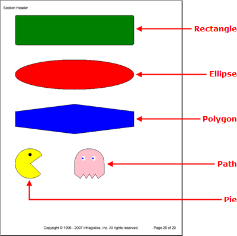

# 図形
Site 要素は、オブジェクトを回転するだけでなく、バインディングしている矩形の任意の場所にオブジェクトを配置できる魅力的な要素です。Site 要素が非常に役に立つ要素となっているもうひとつの特徴は [Shapes](Infragistics.Web.Documents.Reports~Infragistics.Documents.Reports.Report.Shapes.IShapes.html) ファクトリです。その名前が示すように、Shapes ファクトリによって膨大な種類の形状を作り出してそれらを Site 要素に追加することができます。

その形状固有のメソッドを呼び出すことによって、Shapes オブジェクトのそれぞれの形状に簡単にアクセスできます (たとえば、矩形を追加するためには、[AddRetangle](Infragistics.Web.Documents.Reports~Infragistics.Documents.Reports.Report.Shapes.IShapes~AddRectangle.html) メソッドを呼び出します)。このメソッドは、新たに作成された形状への参照を返すので、その参照を新しい形状オブジェクトに設定することができます。

以下は、Site 要素に追加できる形状のリストです。

*   **Arc** -- 円弧に開始角度と終了角度を提供し、円弧が残りの作業を実行します。左上隅の x 座標と ｙ 座標だけでなく、境界矩形の高さと幅を指定することができます。
*   **Ellipse** -- 楕円形は矩形とほとんど同じように作成されます。サイズと位置を決定するために ｘ 座標と y 座標だけでなく境界矩形の高さと幅を提供します。これで楕円形は矩形に基づいて作成され自動的に形成されます。
*   **Label** -- サイトに配置するためにフォントの境界四角形の左上隅の x 座標と y 座標を指定できます。[Font](Infragistics.Web.Documents.Reports~Infragistics.Documents.Reports.Report.Shapes.ILabel~Font.html) プロパティと [Text](Infragistics.Web.Documents.Reports~Infragistics.Documents.Reports.Report.Shapes.ILabel~Text.html) プロパティが設定されると、矩形のサイズが自動的に決定されます。
*   **Line**-- 線には、線の開始点を決定するための X1 および Y1 座標と、終点を決定するための X2 および Y2 座標があります。線の外観を修正するためにブラシを指定することも可能です。
*   **Path** -- パスには、完全にカスタムな形状を作成するために役立ついくつかのメソッドがあります。パスは特定の方向に紙の上でペンを移動させることであると考えることができます。
     *   **Move To** -- [MoveTo](Infragistics.Web.Documents.Reports~Infragistics.Documents.Reports.Report.Shapes.IPath~MoveTo.html) メソッドは、アクティブな点を指定した座標に移動します。このメソッドは実際には何も描画しません。ペンと紙に例えると、これは紙からペンを離して、ペンを新しい点に移動し、1 本の線を書くことなく紙にペンを戻すことになります。
     *   **Line To** -- [LineTo](Infragistics.Web.Documents.Reports~Infragistics.Documents.Reports.Report.Shapes.IPath~LineTo.html) メソッドは、開始座標から終了座標に線を描画します。
     *   **Curve To** -- [CurveTo](Infragistics.Web.Documents.Reports~Infragistics.Documents.Reports.Report.Shapes.IPath~CurveTo.html) メソッドは、開始座標から線を描画し、中間座標を使用して曲線を作成し、終了座標で終了します。
     *   **Close Path** -- [ClosePath](Infragistics.Web.Documents.Reports~Infragistics.Documents.Reports.Report.Shapes.IPath~ClosePath.html) メソッドでパスを手動で閉じることができます。

    呼び出す各メソッドは通常、現在呼び出されているメソッドの開始座標として、前のメソッドの終了座標を渡します。これは連続パスを作成し、最終的には形状を定義します。パスを塗りつぶすためにブラシを、パスを描画するためにペンを指定することもできます。

*   **Pie** -- パイは開始角度と終了角度を提供する必要がある点で円弧に似ています。パイと円弧の違いは、円弧は曲線を作成するだけなのに対して、パイはパイ全体またはパイ スライスを作成します。
*   **Polygon** -- [Polygon](Infragistics.Web.Documents.Reports~Infragistics.Documents.Reports.Report.Shapes.IPolygon.html) 形状で必要な数の辺を使用して、多角形を作成することができます。ポリゴンを定義するために、[Points](Infragistics.Web.Documents.Reports~Infragistics.Documents.Reports.Report.Shapes.IPolygon~Points.html) プロパティを [Point](Infragistics.Web.Documents.Reports~Infragistics.Documents.Reports.Graphics.Point.html) オブジェクトの配列に設定します。ポリゴンは点を提供する順序で描画されます。したがって、アウトラインをトレースする場合と同じように点を提供する時には注意して、連続して描画してください。
*   **Polyline** -- ポリラインは、辿る線の Point オブジェクトの配列も提供する点で多角形と非常に似ています。
*   **Rectangle** -- サイズと位置を決定するために ｘ 座標と y 座標だけでなく境界矩形の高さと幅を提供します。矩形を塗りつぶすためにブラシを、アウトラインを描画するためにペンを指定することもできます。[Radius](Infragistics.Web.Documents.Reports~Infragistics.Documents.Reports.Report.Shapes.IRectangle~Radius.html) プロパティによって、矩形の角を丸めることができます。



以下のコードは、矩形、楕円形、ポリゴン、パイ、パスを Site 要素に追加します。このトピックは、Report 要素を定義済みでこの要素に少なくともひとつの Section 要素を追加してあることを前提とします。詳細は、[Report](/documentengine-report) および [Section](/documentengine-section) を参照してください。

1.  **Site 要素をセクションに追加します。**

    **C# の場合:**

```csharp
    using Infragistics.Documents.Reports.Report;
    using Infragistics.Documents.Reports.Graphics;
    .
    .
    .
    // Add a new Site element to the section.
    Infragistics.Documents.Reports.Report.ISite shapesSite = section1.AddSite();
```

2.  **矩形を Site 要素に追加します。**

    **C# の場合:**

```csharp
    // Add a new Rectangle to the Site's shape factory.
    Infragistics.Documents.Reports.Report.Shapes.IRectangle rectangle =   shapesSite.Shapes.AddRectangle();
    // Fill the rectangle with the color green.
    rectangle.Brush = Brushes.Green;
    // The outline of the rectangle will be black.
    rectangle.Pen = Pens.Black;
    // Set the height and width of the rectangle.
    rectangle.Height = 100;
    rectangle.Width = 400;
    // Round the corners of the rectangle.               
    rectangle.Radius = 5;
    // Place the rectangle on the Site at the coordinates 0,0.
    // This will place the rectangle's upper-left point here.
    // The same goes for all other binding rectangles of shapes.
    rectangle.X = 0;
    rectangle.Y = 0;
```

3.  **楕円形を Site 要素に追加します。**

    **C# の場合:**

```csharp
    // Add a new Ellipse to the Site's shape factory.
    Infragistics.Documents.Reports.Report.Shapes.IEllipse ellipse =   shapesSite.Shapes.AddEllipse();
    // Fill the ellipse with the color red and color the 
    // borders black.
    ellipse.Brush = Brushes.Red;
    ellipse.Pen = Pens.Black;
    // Set the height and the width of the binding rectangle.
    ellipse.Height = 100;
    ellipse.Width = 400;
    // Place the ellipse's binding rectangle's upper-left
    // corner at the coordinates 0,150.
    ellipse.X = 0;
    ellipse.Y = 150;
```

4.  **6 辺のポリゴン（六角形）を Site 要素に追加します。**

    **C# の場合:**

```csharp
    // Add a new Polygon to the Site's shape factory.
    Infragistics.Documents.Reports.Report.Shapes.IPolygon polygon =   shapesSite.Shapes.AddPolygon();
    // Fill the polygon with the color blye and color the
    // borders black.
    polygon.Brush = Brushes.Blue;
    polygon.Pen = Pens.Black;
    // Create a six-sided polygon (hexagon) by supplying
    // six points. The polygon will be drawn from each
    // point consecutively, so make sure you draw the 
    // border in the correct order (draw an outline).
    polygon.Points = new Point[6]
    {
            new Point(0,325),
            new Point(200, 300),
            new Point(400, 325),
            new Point(400, 375),
            new Point(200, 400),
            new Point(0,375)
    };
```

5.  **パイ（パックマン）を Site 要素に追加します。**

    **C# の場合:**

```csharp
    // Add a new Pie to the Site's shape factory.
    Infragistics.Documents.Reports.Report.Shapes.IPie pie =   shapesSite.Shapes.AddPie();
    // Fill the pie with the color yellow and color the
    // border black.
    pie.Brush = Brushes.Yellow;
    pie.Pen = Pens.Black;
    // Begin the Pie at a 45 degree angle and end it at
    // a 325 degree angle.
    pie.StartAngle = 45;
    pie.EndAngle = 325;
    // Set the height and width of the pie.
    pie.Height = 100;
    pie.Width = 100;
    // Place the upper-left corner of the pie's binding
    // rectangle at coordinates 0,450.
    pie.X = 0;
    pie.Y = 450;

    // Give Pacman an eye.
    Infragistics.Documents.Reports.Report.Shapes.IEllipse ellipse2 =   shapesSite.Shapes.AddEllipse();
    ellipse2.Height = 10;
    ellipse2.Width = 10;
    ellipse2.Brush = Brushes.Black;
    ellipse2.X = 45;
    ellipse2.Y = 465;
```

6.  **パス（ピンキー）を Site 要素に追加します。**

    **C# の場合:**

```csharp
    // Add a path to the Site element.
    Infragistics.Documents.Reports.Report.Shapes.IPath path =   shapesSite.Shapes.AddPath();
    // The inside of the path will be pink while the
    // path itself is drawn black.
    path.Brush = Brushes.Pink;
    path.Pen = Pens.Black;
    // Start the path at these coordinates.
    path.MoveTo(200, 535);
    // draw a line to these coordinates.
    path.LineTo(200, 500);
    // Curve from the previous coordinates to 250, 450.
    path.CurveTo(200, 500, 200, 450, 250, 450);
    // Curve from the previous coordinates to 300, 500.
    path.CurveTo(250, 450, 300, 450, 300, 500);
    // Draw several lines.
    path.LineTo(300, 535);
    path.LineTo(280, 550);
    path.LineTo(270, 535);
    path.LineTo(260, 550);
    path.LineTo(250, 535);
    path.LineTo(240, 550);
    path.LineTo(230, 535);
    path.LineTo(220, 550);
    path.LineTo(200, 535);

    // Give pinky a left eye.
    Infragistics.Documents.Reports.Report.Shapes.IEllipse ellipse3 =   shapesSite.Shapes.AddEllipse();
    ellipse3.Brush = Brushes.White;
    ellipse3.Height = 15;
    ellipse3.Width = 10;
    ellipse3.X = 225;
    ellipse3.Y = 475;

    ellipse3 = shapesSite.Shapes.AddEllipse();
    ellipse3.Brush = Brushes.Blue;
    ellipse3.Height = 5;
    ellipse3.Width = 5;
    ellipse3.X = 225;
    ellipse3.Y = 480;

    // give pinky a right eye.
    Infragistics.Documents.Reports.Report.Shapes.IEllipse ellipse4 =   shapesSite.Shapes.AddEllipse();
    ellipse4.Brush = Brushes.White;
    ellipse4.Height = 15;
    ellipse4.Width = 10;
    ellipse4.X = 260;
    ellipse4.Y = 475;

    ellipse4 = shapesSite.Shapes.AddEllipse();
    ellipse4.Brush = Brushes.Blue;
    ellipse4.Height = 5;
    ellipse4.Width = 5;
    ellipse4.X = 260;
    ellipse4.Y = 480;
```
