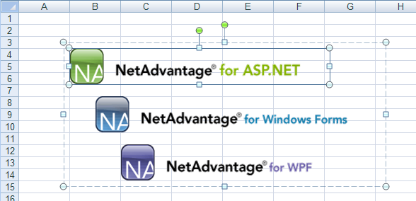

---
title: "形状をワークシートに追加"
slug: excelengine-adding-shapes-to-a-worksheet
---

# 形状をワークシートに追加


## 始める前に
Infragistics.Documents.Excel アセンブリの優れた点の 1 つとして、画像および形状をワークシートに追加する機能があります。Microsoft® Excel® と同様に、画像をワークシート上の必要な位置に配置し、同じワークシート上の他の形状とグループ化することもできます。形状を使用は、形状を作成し、ワークシート上でのその形状の位置を決定するアンカーを設定し、それをワークシートに追加するという簡単なプロセスです。

形状をワークシートに直接配置するだけでなく、ワークシート上の形状をグループ化することもできます。形状をグループ化すると、グループ全体を 1 つの形状として移動できるので、グループ内の形状同士を常に同じ位置関係に保つことができます。

## 達成すること
この詳細なガイドでは、画像をワークシートに追加し、ひとつの形状としてグループ化するために必要な手順を説明します。

## 次の手順を実行します
1.  **ワークシートを使用してワークブックを作成します。**
    1.  Visual Basic または C# プロジェクトを新しく作成します。
    2.  Button をフォームに追加します。
    3.  Button をダブルクリックして、その Click イベントのコード ビハインドを開きます。
    4.  ひとつのワークシートを使用してワークブックを作成します。

        **Visual Basic の場合:**

```vb
        Dim workbook As New Infragistics.Documents.Excel.Workbook()
        Dim worksheet As Infragistics.Documents.Excel.Worksheet = _
          workbook.Worksheets.Add("Sheet1")
```

        **C# の場合:**

```csharp
        Infragistics.Documents.Excel.Workbook workbook = new Infragistics.Documents.Excel.Workbook();
        Infragistics.Documents.Excel.Worksheet worksheet = workbook.Worksheets.Add( "Sheet1" );
```

2.  **画像の形状を作成してワークシートに配置します。**
    1.  画像を作成します。

        **Visual Basic の場合:**

```vb
        Dim aspImage As Image = Image.FromFile("C:NA_AspNet.gif")
        Dim winImage As Image = Image.FromFile("C:NA_Win_Forms.gif")
        Dim wpfImage As Image = Image.FromFile("C:NA_WPF.gif")
```

        **C# の場合:**

```csharp
        Image aspImage = Image.FromFile( "C:NA_AspNet.gif" );
        Image winImage = Image.FromFile( "C:NA_Win_Forms.gif" );
        Image wpfImage = Image.FromFile( "C:NA_WPF.gif" );
```

    2.  画像の形状を作成してワークシートに配置します。

        **Visual Basic の場合:**

```vb
        Dim aspImageShape As Infragistics.Documents.Excel.WorksheetImage = _
          New Infragistics.Documents.Excel.WorksheetImage(aspImage)
        Dim winImageShape As Infragistics.Documents.Excel.WorksheetImage = _
          New Infragistics.Documents.Excel.WorksheetImage(winImage)
        Dim wpfImageShape As Infragistics.Documents.Excel.WorksheetImage = _
          New Infragistics.Documents.Excel.WorksheetImage(wpfImage)
```

        **C# の場合:**

```csharp
        Infragistics.Documents.Excel.WorksheetImage aspImageShape =
          new Infragistics.Documents.Excel.WorksheetImage( aspImage );
        Infragistics.Documents.Excel.WorksheetImage winImageShape =
          new Infragistics.Documents.Excel.WorksheetImage( winImage );
        Infragistics.Documents.Excel.WorksheetImage wpfImageShape =
          new Infragistics.Documents.Excel.WorksheetImage( wpfImage );
```

3.  **画像の形状で位置アンカーを設定します。**

    形状をグループまたはワークシートに追加する前に、アンカーを設定する必要があります。ワークシート上のセルに応じて形状を配置します。

    **Visual Basic の場合:**

```vb
    aspImageShape.TopLeftCornerCell = worksheet.Rows.Item(3).Cells.Item(1)
    aspImageShape.BottomRightCornerCell = worksheet.Rows.Item(5).Cells.Item(6)
    ' The bottom-right corner of the shape should be close to the
    ' bottom-left corner of its anchor cell
    aspImageShape.BottomRightCornerPosition = New PointF(10, 100)

    winImageShape.TopLeftCornerCell = worksheet.Rows.Item(7).Cells.Item(1)
    ' The top-left corner of the shape should be in the top-middle
    ' of its anchor cell
    winImageShape.TopLeftCornerPosition = New PointF(50, 0)
    winImageShape.BottomRightCornerCell = worksheet.Rows.Item(9).Cells.Item(6)
    ' The bottom-right corner of the shape should be close to the
    ' bottom-middle of its anchor cell
    winImageShape.BottomRightCornerPosition = New PointF(60, 100)

    wpfImageShape.TopLeftCornerCell = worksheet.Rows.Item(11).Cells.Item(2)
    wpfImageShape.BottomRightCornerCell = worksheet.Rows.Item(13).Cells.Item(7)
    ' The bottom-right corner of the shape should be close to the
    ' bottom-left corner of its anchor cell
    wpfImageShape.BottomRightCornerPosition = New PointF(10, 100)
```

    **C# の場合:**

```csharp
    aspImageShape.TopLeftCornerCell = worksheet.Rows[3].Cells[1];
    aspImageShape.BottomRightCornerCell = worksheet.Rows[5].Cells[6];
    // The bottom-right corner of the shape should be close to the
    // bottom-left corner of its anchor cell
    aspImageShape.BottomRightCornerPosition = new PointF( 10, 100 );

    winImageShape.TopLeftCornerCell = worksheet.Rows[7].Cells[1];
    // The top-right corner of the shape should be in the top-middle
    // of its anchor cell
    winImageShape.TopLeftCornerPosition = new PointF( 50, 0 );
    winImageShape.BottomRightCornerCell = worksheet.Rows[9].Cells[6];
    // The bottom-right corner of the shape should be close to the 
    // bottom-middle of its anchor cell
    winImageShape.BottomRightCornerPosition = new PointF( 60, 100 );

    wpfImageShape.TopLeftCornerCell = worksheet.Rows[11].Cells[ 2 ];
    wpfImageShape.BottomRightCornerCell = worksheet.Rows[13].Cells[7];
    // The bottom-right corner of the shape should be close to the
    // bottom-left corner of its anchor cell
    wpfImageShape.BottomRightCornerPosition = new PointF( 10, 100 );
```

4.  **画像の形状をグループ化します。**
    1.  形状のグループを作成します。これも形状となります。

        **Visual Basic の場合:**

```vb
        Dim group As Infragistics.Documents.Excel.WorksheetShapeGroup = _
          New Infragistics.Documents.Excel.WorksheetShapeGroup()
```

        **C# の場合:**

```csharp
        Infragistics.Documents.Excel.WorksheetShapeGroup group =
          new Infragistics.Documents.Excel.WorksheetShapeGroup();
```

    2.  形状をグループに追加します。形状を形状グループに追加または削除するとき、独自のアンカーを自動的に設定します。それは、すべての形状を完全に収容できる最初の四角形です。このため、形状グループのアンカーを設定する必要はありません。

        **Visual Basic の場合:**

```vb
        group.Shapes.Add(aspImageShape)
        group.Shapes.Add(winImageShape)
        group.Shapes.Add(wpfImageShape)
```

        **C# の場合:**

```csharp
        group.Shapes.Add( aspImageShape );
        group.Shapes.Add( winImageShape );
        group.Shapes.Add( wpfImageShape );
```

    3.  グループ（画像の形状を含んでいる）をワークシートに追加します。

        **Visual Basic の場合:**

```vb
        worksheet.Shapes.Add(group)
```

        **C# の場合:**

```csharp
        worksheet.Shapes.Add( group );
```

5.  **ワークブックをシリアル化します。**
    1.  ワークブックをファイルに書き出します。

        **Visual Basic の場合:**

```vb
        workbook.Serialize("C:Shapes.xls")
```

        **C# の場合:**

```csharp
        workbook.Serialize( "C:Shapes.xls" );
```




 

 


