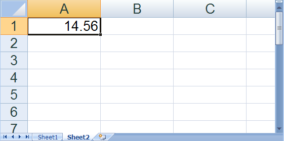

---
title: "ワークブックを作成"
slug: excelengine-create-a-workbook
---

# ワークブックを作成

Excel アセンブリの機能を活用する前に、[Workbook](Infragistics.Web.Documents.Excel~Infragistics.Documents.Excel.Workbook.html) オブジェクトを作成する必要があります。それを行うには、操作方法のトピック [Excel ファイルをブックに読み込む](/excelengine-read-an-excel-file-into-a-workbook)で説明したように既存の Microsoft® Excel® ファイルを読み込むか、ブランクのワークブックを作成します。ブランクのワークブックを作成する場合、それをファイルに書き込む前に、ワークシートを少なくとも 1 つ追加する必要があります。また、様々な表示および印刷のオプションをワークブックとワークシートに設定できます。

以下のコードは、ブランクのワークブックを作成、いくつかのプロパティを設定、ワークシートを追加の各方法を示します。

**Visual Basic の場合:**

```vb
' Create a new workbook
Dim workbook As New Infragistics.Documents.Excel.Workbook()

' Show only the vertical scroll bar
workbook.WindowOptions.ScrollBars = Infragistics.Documents.Excel.ScrollBars.Vertical

' Create two worksheets for the workbook
Dim worksheet1 As Infragistics.Documents.Excel.Worksheet = _
  workbook.Worksheets.Add("Sheet1")
Dim worksheet2 As Infragistics.Documents.Excel.Worksheet = _
  workbook.Worksheets.Add("Sheet2")

' Set the value of one of the cells
worksheet2.Rows.Item(0).Cells.Item(0).Value = 14.56

' Zoom in to double the normal viewing size on Sheet2
worksheet2.DisplayOptions.MagnificationInNormalView = 200

' Make Sheet2 the selected worksheet
workbook.WindowOptions.SelectedWorksheet = worksheet2
```

**C# の場合:**

```csharp
// Create a new workbook
Infragistics.Documents.Excel.Workbook workbook = new Infragistics.Documents.Excel.Workbook();

// Show only the vertical scroll bar
workbook.WindowOptions.ScrollBars = Infragistics.Documents.Excel.ScrollBars.Vertical;
                        
// Create two worksheets for the workbook
Infragistics.Documents.Excel.Worksheet worksheet1 = workbook.Worksheets.Add( "Sheet1" );
Infragistics.Documents.Excel.Worksheet worksheet2 = workbook.Worksheets.Add( "Sheet2" );

// Set the value of one of the cells
worksheet2.Rows[0].Cells[0].Value = 14.56;

// Zoom in to double the normal viewing size on Sheet2
worksheet2.DisplayOptions.MagnificationInNormalView = 200;

// Make Sheet2 the selected worksheet
workbook.WindowOptions.SelectedWorksheet = worksheet2;
```

