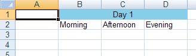

# セルの結合
セルの値またはフォーマットの設定以外に、2 つ以上のセルをひとつのセルとして表示するためにセルをマージすることができます。セルをマージする場合、長方形の領域内にセルがなければなりません。マージされた領域の一部である場合、領域内の各セルは同じ値とセル フォーマットを持つことになります。さらに、これらのセルはすべて、[`AssociatedMergedCellsRegion`](Infragistics.Web.Documents.Excel~Infragistics.Documents.Excel.WorksheetMergedCellsRegion.html) プロパティからアクセス可能な、同じ [`WorksheetMergedCellsRegion`](Infragistics.Web.Documents.Excel~Infragistics.Documents.Excel.WorksheetCell~AssociatedMergedCellsRegion.html) オブジェクトと関連付けられます。`WorksheetMergedCellsRegion` オブジェクトもセルと同じ値とセル フォーマットを持ちます。領域または領域内の任意のセルの値（またはセル フォーマット）を設定すると、すべてのセルおよび領域の値を変更します。セルをマージしない場合、マージされた領域がワークシートから削除されたために、以前マージされたセルすべてはマージされる以前に指定された共有のセル フォーマットを保持します。ただし、領域の左上のセルのみが共有値を保持します。

以下のコードは、いくつかのセルをマージして、マージされたセル領域の値とフォーマットを設定する方法を示します。

**Visual Basic の場合:**

```vb
Dim workbook As New Infragistics.Documents.Excel.Workbook()
Dim worksheet As Infragistics.Documents.Excel.Worksheet = _
  workbook.Worksheets.Add("Sheet1")

' Make some column headers
worksheet.Rows.Item(1).Cells.Item(1).Value = "Morning"
worksheet.Rows.Item(1).Cells.Item(2).Value = "Afternoon"
worksheet.Rows.Item(1).Cells.Item(3).Value = "Evening"

' Create a merged region that will be a header to the column headers
Dim mergedRegion1 As Infragistics.Documents.Excel.WorksheetMergedCellsRegion = _
  worksheet.MergedCellsRegions.Add(0, 1, 0, 3)

' Set the value of the merged region
mergedRegion1.Value = "Day 1"

' Give the merged region a solid background color
mergedRegion1.CellFormat.FillPattern = _
  Infragistics.Documents.Excel.FillPatternStyle.Solid
mergedRegion1.CellFormat.FillPatternForegroundColor = Color.SkyBlue

' Set the cell alignment of the middle cell in the merged region.
' Since a cell and its merged region shared a cell format, this will 
' ultimately set the format of the merged region
worksheet.Rows.Item(0).Cells.Item(2).CellFormat.Alignment = _
  Infragistics.Documents.Excel.HorizontalCellAlignment.Center
```

**C# の場合:**

```csharp
Infragistics.Documents.Excel.Workbook workbook = new Infragistics.Documents.Excel.Workbook();
Infragistics.Documents.Excel.Worksheet worksheet = workbook.Worksheets.Add( "Sheet1" );

// Make some column headers
worksheet.Rows[1].Cells[1].Value = "Morning";
worksheet.Rows[1].Cells[2].Value = "Afternoon";
worksheet.Rows[1].Cells[3].Value = "Evening";

// Create a merged region that will be a header to the column headers
Infragistics.Documents.Excel.WorksheetMergedCellsRegion mergedRegion1 = 
  worksheet.MergedCellsRegions.Add( 0, 1, 0, 3 );

// Set the value of the merged region
mergedRegion1.Value = "Day 1";

// Give the merged region a solid background color
mergedRegion1.CellFormat.FillPattern = 
  Infragistics.Documents.Excel.FillPatternStyle.Solid;
mergedRegion1.CellFormat.FillPatternForegroundColor = Color.SkyBlue;

// Set the cell alignment of the middle cell in the merged region.
// Since a cell and its merged region shared a cell format, this will 
// ultimately set the format of the merged region
worksheet.Rows[ 0 ].Cells[ 2 ].CellFormat.Alignment = 
  Infragistics.Documents.Excel.HorizontalCellAlignment.Center;
```



 

 


