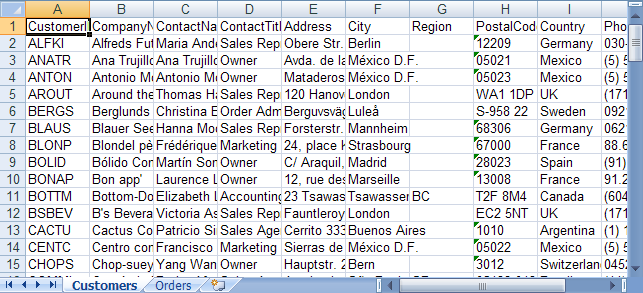

# DataSet からのデータをワークシートに格納

## 始める前に
Microsoft® Excel® ワークシートの主な使用の目的はデータの表示です。データを既存の DataSet からワークブックに簡単に転送することができ、これを Excel で表示できます。`DataSet` はひとつ以上の `DataTable` オブジェクトで構成されます。各 `DataTable` はワークシートにマップできます。

## 達成すること
この詳細なガイドでは、データベースのテーブルから `DataSet` を作成する方法を示します。次にデータをその `DataSet` からワークブックにコピーして、Worksheet オブジェクトを作成し、`DataSet` の各 `DataTable` のデータを表示する方法を示します。

## 次の手順を実行します
1.  **DataTable を作成し、既存のデータベースからのデータをこの DataTable に格納します。**
    1.  Visual Basic または C# プロジェクトのウェブサイトを新しく作成します。
    2.  Button をフォームに追加します。
    3.  Button をダブルクリックして、その Click イベントのコード ビハインドを開きます。
    4.  既存の Access データベースに接続し、データベース内のいくつかのテーブルからのデータを `DataSet` に移植します。

        **Visual Basic の場合:**

```vb
        Dim northWindDbConnection As New System.Data.SqlClient.SqlConnection( _
                "Data Source=.SQLEXPRESS;AttachDbFilename=""C:Program FilesMicrosoft SQL ServerMSSQL.1MSSQLDataNorthwind.mdf"";Integrated Security=True;Connect Timeout=30;User Instance=True")

        Dim dataSet As New DataSet()

        northWindDbConnection.Open()
        Try
                Dim customersSelectCommand As New System.Data.SqlClient.SqlCommand("SELECT * FROM Customers", northWindDbConnection)

                Dim customersReader As System.Data.SqlClient.SqlDataReader = customersSelectCommand.ExecuteReader()

                ' Load all data from the customers table in the database
                Dim customersTable As New DataTable("Customers")
                customersTable.Load(customersReader)
                ' Add the customers data table to the data set
                dataSet.Tables.Add(customersTable)

                Dim ordersSelectCommand As New System.Data.SqlClient.SqlCommand("SELECT * FROM Orders", northWindDbConnection)

                Dim ordersReader As System.Data.SqlClient.SqlDataReader = ordersSelectCommand.ExecuteReader()

                ' Load all data from the customers orders in the database
                Dim ordersTable As New DataTable("Orders")
                ordersTable.Load(ordersReader)
                ' Add the orders data table to the data set
                dataSet.Tables.Add(ordersTable)
        Finally
                northWindDbConnection.Close()
        End Try
```

        **C# の場合:**

```csharp
        System.Data.SqlClient.SqlConnection northWindDbConnection = new System.Data.SqlClient.SqlConnection(
          @"Data Source=.SQLEXPRESS;AttachDbFilename=""C:Program FilesMicrosoft SQL ServerMSSQL.1MSSQLDataNorthwind.mdf"";Integrated Security=True;Connect Timeout=30;User Instance=True");

        DataSet dataSet = new DataSet();

        northWindDbConnection.Open();
        try
        {
                System.Data.SqlClient.SqlCommand customersSelectCommand = new System.Data.SqlClient.SqlCommand(
                  "SELECT * FROM Customers", northWindDbConnection);

                System.Data.SqlClient.SqlDataReader customersReader = customersSelectCommand.ExecuteReader();

                // Load all data from the customers table in the database
                DataTable customersTable = new DataTable("Customers");
                customersTable.Load(customersReader);
                // Add the customers data table to the data set
                dataSet.Tables.Add(customersTable);

                System.Data.SqlClient.SqlCommand ordersSelectCommand = new System.Data.SqlClient.SqlCommand(
                  "SELECT * FROM Orders", northWindDbConnection);

                System.Data.SqlClient.SqlDataReader ordersReader = ordersSelectCommand.ExecuteReader();

                // Load all data from the customers orders in the database
                DataTable ordersTable = new DataTable("Orders");
                ordersTable.Load(ordersReader);
                // Add the orders data table to the data set
                dataSet.Tables.Add(ordersTable);
        }
        finally
        {
                northWindDbConnection.Close();
        }
```

2.  **データをワークブックにロードします。**
    1.  DataSet からのデータを保持するためにワークブックを作成します。

        **Visual Basic の場合:**

```vb
        Dim workbook As New Infragistics.Documents.Excel.Workbook()
```

        **C# の場合:**

```csharp
        Infragistics.Documents.Excel.Workbook workbook = new Infragistics.Documents.Excel.Workbook();
```

    2.  データ セットでデータ テーブルを反復し、それぞれにワークシートを作成します。また、データ テーブルからのデータをワークシートに移植します:

        **Visual Basic の場合:**

```vb
        For Each table As DataTable In dataSet.Tables
                ' Create the worksheet to represent this data table
                Dim worksheet As Infragistics.Documents.Excel.Worksheet = workbook.Worksheets.Add(table.TableName)
                ' Create column headers for each column
                For columnIndex As Integer = 0 To table.Columns.Count - 1
                        worksheet.Rows.Item(0).Cells.Item(columnIndex).Value = table.Columns.Item(columnIndex).ColumnName
                Next
                ' Starting at row index 1, copy all data rows in
                ' the data table to the worksheet
                Dim rowIndex As Integer = 1
                For Each dataRow As DataRow In table.Rows
                        Dim row As Infragistics.Documents.Excel.WorksheetRow = _
                          worksheet.Rows.Item(rowIndex)
                        rowIndex = rowIndex + 1
                        For columnIndex As Integer = 0 To dataRow.ItemArray.Length - 1
                                row.Cells.Item(columnIndex).Value = dataRow.ItemArray(columnIndex)
                        Next
                Next
        Next
```

        **C# の場合:**

```csharp
        foreach (DataTable table in dataSet.Tables)
        {
                // Create the worksheet to represent this data table
                Infragistics.Documents.Excel.Worksheet worksheet = workbook.Worksheets.Add(table.TableName);

                // Create column headers for each column
                for (int columnIndex = 0; columnIndex < table.Columns.Count; columnIndex++)
                {
                        worksheet.Rows[0].Cells[columnIndex].value = table.Columns[columnIndex].ColumnName;
                }

                // Starting at row index 1, copy all data rows in
                // the data table to the worksheet
                int rowIndex = 1;
                foreach (DataRow dataRow in table.Rows)
                {
                        Infragistics.Documents.Excel.WorksheetRow row = worksheet.Rows[rowIndex++];

                        for (int columnIndex = 0; columnIndex < dataRow.ItemArray.Length; columnIndex++)
                        {
                                row.Cells[columnIndex].value = dataRow.ItemArray[columnIndex];
                        }
                }
        }
```

3.  **ワークブックを保存します。**

    ワークブックをファイルに書き出します。

    **Visual Basic の場合:**

```vb
    workbook.Save("C:Data.xls")
```

    **C# の場合:**

```csharp
    workbook.Save( "C:Data.xls" );
```



 

 


