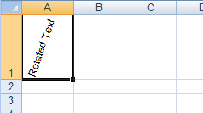
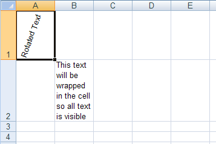
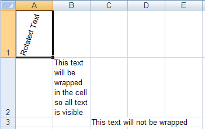
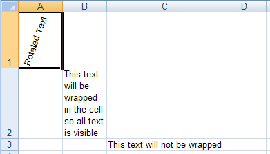
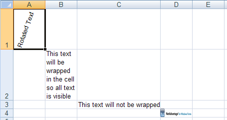
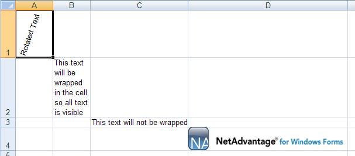

# 行と列のサイズを変更

## 始める前に
ワークシートでは、セルに大量のテキストが含まれている場合もありますし、セルに大きな画像を表示させたい場合もあります。デフォルトのセル サイズではセルのコンテンツが入りきらない場合は、行、列、またはワークシート全体にあるすべてのセルの高さと幅を簡単に増やすことができます。

ただし、状況によっては、行の高さが自動的に増えるので、すべてのコンテンツが表示されます。たとえば、セル内のテキストを回転または折り返し、そのセルを含む行の高さが既定値の場合、すべてのコンテンツが表示されるように行の高さが自動的に増加します。列の幅は自動的に管理されないので、セルのコンテンツに関係なく常に一定のままです。

個々の行と列のサイズを変更することに加えて、ワークシートの [`DefaultRowHeight`](Infragistics.Web.Documents.Excel~Infragistics.Documents.Excel.Worksheet~DefaultRowHeight.html) プロパティと [`DefaultColumnWidth`](Infragistics.Web.Documents.Excel~Infragistics.Documents.Excel.Worksheet~DefaultColumnWidth.html) プロパティを設定することによって、すべての行と列のサイズを変更できます。

## 達成すること
この詳細なガイドでは、行を自動サイズ設定する方法をいくつか示します。さらに、セルがそのコンテンツを完全に含むように行と列を手動でサイズ調整する方法も紹介します。

## 次の手順を実行します
1.  **ワークシートを使用してワークブックを作成します。**
    1.  Visual Basic または C# プロジェクトを新しく作成します。
    2.  Button をフォームに追加します。
    3.  Button をダブルクリックして、その Click イベントのコード ビハインドを開きます。
    4.  ひとつのワークシートを使用してワークブックを作成します。

        **Visual Basic の場合:**

```vb
        Dim workbook As New Infragistics.Documents.Excel.Workbook()
        Dim worksheet As Infragistics.Documents.Excel.Worksheet = _
          workbook.Worksheets.Add("Sheet1")
```

        **C# の場合:**

```csharp
        Infragistics.Documents.Excel.Workbook workbook = new Infragistics.Documents.Excel.Workbook();
        Infragistics.Documents.Excel.Worksheet worksheet = workbook.Worksheets.Add( "Sheet1" );
```

2.  **行の高さを自動的に変更します。**
    1.  行の高さがデフォルトのままのセル内のテキストを回転させます。行は、セルのコンテンツがちょうど収まるように自動サイズ設定されます。

        **Visual Basic の場合:**

```vb
        worksheet.Rows.Item(0).Cells.Item(0).Value = "Rotated Text"
        worksheet.Rows.Item(0).Cells.Item(0).CellFormat.Rotation = 70
```

        **C# の場合:**

```csharp
        worksheet.Rows[0].Cells[0].Value = "Rotated Text";
        worksheet.Rows[0].Cells[0].CellFormat.Rotation = 70;
```
	
	2.  行の高さがデフォルトのままのセル内のテキストを折り返します。行は、セルのコンテンツがちょうど収まるように自動サイズ設定されます。
	
	    **Visual Basic の場合:**
	
```vb
	    worksheet.Rows.Item(1).Cells.Item(1).Value = _
	      "This text will be wrapped in the cell so all text is visible"
	    worksheet.Rows.Item(1).Cells.Item(1).CellFormat.WrapText = _
	      Infragistics.Documents.Excel.ExcelDefaultableBoolean.True
```
	
	    **C# の場合:**
	
```csharp
	    worksheet.Rows[1].Cells[1].Value =
	      "This text will be wrapped in the cell so all text is visible";
	    worksheet.Rows[1].Cells[1].CellFormat.WrapText =
	      Infragistics.Documents.Excel.ExcelDefaultableBoolean.True;
```
	

3.  **テキストがセルの外側に出ないように列のサイズを変更します。**
    1.  テキストがセルの境界線の外側に出ないようにセルに十分なテキストを配置します。

        **Visual Basic の場合:**

```vb
        worksheet.Rows.Item(2).Cells.Item(2).Value = _
          "This text will not be wrapped"
```

        **C# の場合:**

```csharp
        worksheet.Rows[2].Cells[2].Value = "This text will not be wrapped";
```
	

	2.  すべてのテキストが表示されますが、値をセル D3 に設定すると、長いテキストは切り落とされます。セルの幅を増やすには、Worksheet の Columns コレクションからアクセス可能な WorksheetColumn の幅を増やします。
	
	    **Visual Basic の場合:**
	
```vb
	    worksheet.Columns.Item(2).Width = 6100
```
	
	    **C# の場合:**
	
```csharp
	    worksheet.Columns[2].Width = 6100;
```
		

4.  **セルに画像を配置して、画像が歪まないようにセルのサイズを変更します。**
    1.  画像を作成して、セル全体に収まるようにします。

        **Visual Basic の場合:**

```vb
        Dim image As Image = image.FromFile("C:NA_Win_Forms.gif")
        Dim imageShape As New Infragistics.Documents.Excel.WorksheetImage(image)

        imageShape.TopLeftCornerCell = worksheet.Rows.Item(3).Cells.Item(3)
        imageShape.BottomRightCornerCell = worksheet.Rows.Item(3).Cells.Item(3)
        imageShape.BottomRightCornerPosition = New PointF(100, 100)

        worksheet.Shapes.Add(imageShape)
```

        **C# の場合:**

```csharp
        Image image = Image.FromFile( "C:NA_Win_Forms.gif" );
        Infragistics.Documents.Excel.WorksheetImage imageShape =
          new Infragistics.Documents.Excel.WorksheetImage( image );

        imageShape.TopLeftCornerCell = worksheet.Rows[3].Cells[3];
        imageShape.BottomRightCornerCell = worksheet.Rows[3].Cells[3];
        imageShape.BottomRightCornerPosition = new PointF( 100, 100 );

        worksheet.Shapes.Add( imageShape );
```
	

	2.  画像が歪まないようにセルの行と列の幅と高さを増やします。
	
	    **Visual Basic の場合:**
	
```vb
	    worksheet.Rows.Item(3).Height = 600
	    worksheet.Columns.Item(3).Width = 10000
```
	
	    **C# の場合:**
	
```csharp
	        worksheet.Rows[3].Height = 600;
	        worksheet.Columns[3].Width = 10000;
```
	
		

5.  **ワークブックを保存します。**

    ワークブックをファイルに書き出します。

    **Visual Basic の場合:**

```vb
    workbook.Save("C:Resize.xls")
```

    **C# の場合:**

```csharp
    workbook.Save( "C:Resize.xls" );
```

 

 


