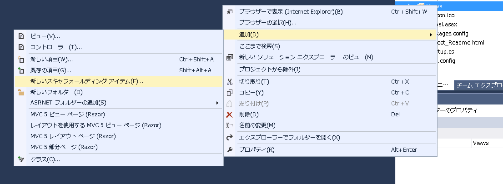
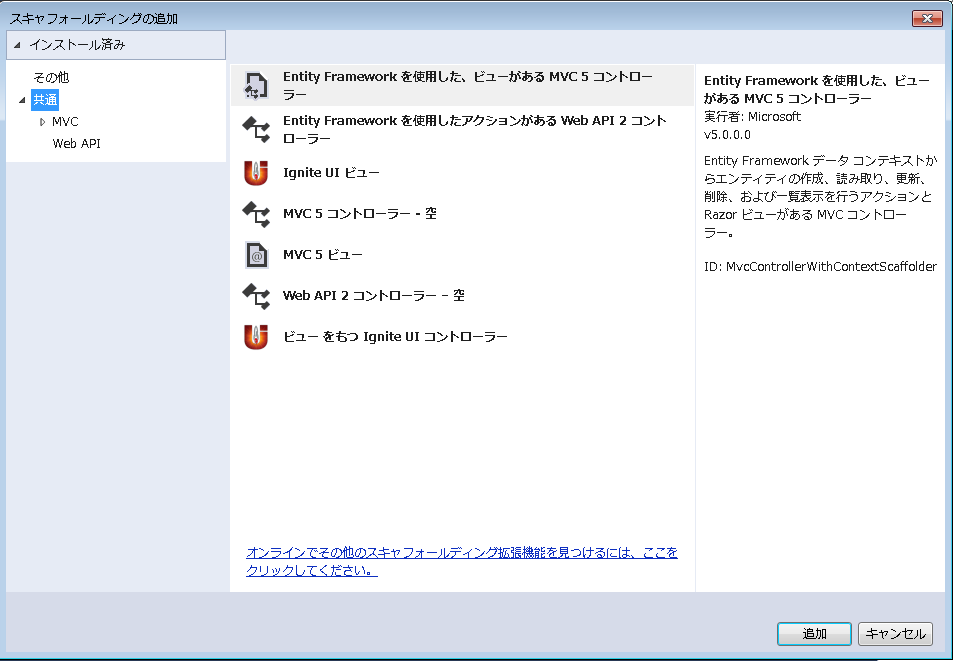
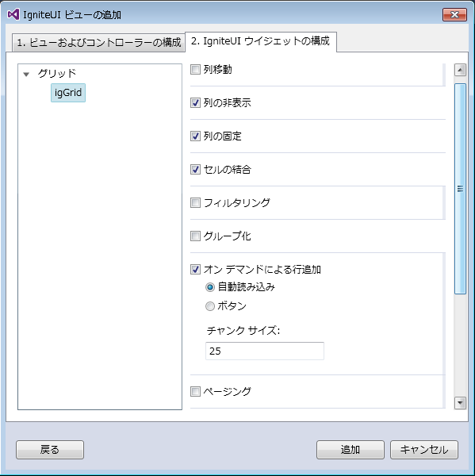

# \{environment:ProductNameMVC\} Scaffolder の Visual Studio 拡張機能

### 概要

2015.2 リリースでは、拡張機能 **\{environment:ProductNameMVC\}** Scaffolder が導入されました。

開発者はこの機能により、MVC ラッパーを使用したウィジェットの宣言や関連するコントローラのアクション メソッドを簡単に生成することができます。
また、手動によるセットアップ、参照、コーディングに必要な時間を大幅に短縮することができます。

現在、スキャフォールディング メカニズムには、**igGrid** コンポーネントが含まれていますが、間もなく公開されるリリースでは、さらに多くのコンポーネントが追加される予定です。

### 使用方法

スキャフォールディング メカニズムを利用するには、次の手順に従ってください。

1. Visual Studio で使用するプロジェクトまたは新しいプロジェクトを開きます。
2. *ソリューション エクスプローラー*で、プロジェクト ノードまたはソリューションのいずれかのフォルダーを右クリックします。
3. 「追加」メニュー項目をクリックし、「新しい Scaffolder 項目」オプションをクリックします。
この一連の手順を、以下のスクリーンショットに示します。

4. 次に、スキャフォールディング項目の選択を促されます。「\{environment:ProductName\} ビュー」または「ビューを持つ \{environment:ProductName\} コントローラー」のどちらかを選択します。
これらの選択オプションを、以下のスクリーンショットに示します。

この 2 つのオプションの違いは、ビューのみの追加とコントローラーを伴うビューの生成です。
5. Scaffolder の次のセットアップ手順は、わずか 2 つの簡単な手順で構成されています。
最初のタブで、ビュー名やテーマなどのスキャフォードされたコントロールの全般的なプロパティを設定します。
2 番目のタブでは、*ページング*、*列の非表示*など、コンポーネントで有効にするプロパティを選択します。
これは、以下のスクリーンショットに示されています。

6. 追加するコンポーネントの設定終了後、[追加] ボタンをクリックします。これにより、ウィジェットのラッパー定義を含むビューが、有効にしたすべての設定とともに自動的に追加されます。
\{environment:ProductName\} のウィジェット ラッパーを含む標準のビューで通常行う場合と同様に、ビューのカスタマイズの追加、プロパティやメソッドの追加または削除をすることができます。
