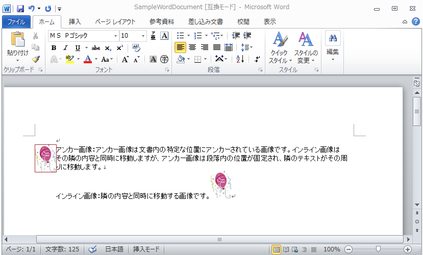

---
title: "画像を Word 文書に追加"
slug: word-add-images-to-word-document
---

# 画像を Word 文書に追加

Infragistics® Word ライブラリは、[WordDocumentWriter](Infragistics.Web.Documents.IO~Infragistics.Documents.Word.WordDocumentWriter.html) ストリーマー オブジェクトを使用して、新しい Word 文書に追加できる 2 種類の画像をサポートします。それらはアンカー固定画像とインライン画像（ピクチャーとも言う）です。

アンカー固定はドキュメント内の特定の位置に「アンカー固定された」画像で、隣接するテキストはその境界の周りに配置されます。これとは対照的に、「インライン」画像は段落内で隣接するコンテンツとともに移動します。

以下のスクリーンショットは、アンカー固定した画像およびインライン画像がある Word 文書を表示します。



> **注:** アンカー固定した画像およびインライン画像を追加するコードは、WordDocumentWriter オブジェクトの [StartParagraph](Infragistics.Web.Documents.IO~Infragistics.Documents.Word.WordDocumentWriter~StartParagraph.html) メソッドと [EndParagraph](Infragistics.Web.Documents.IO~Infragistics.Documents.Word.WordDocumentWriter~EndParagraph.html) メソッドの間に配置する必要があります。

## アンカー固定した画像の追加
アンカー固定した画像を現在の段落に追加するには、WordDocumentWriter クラスのインスタンスを使用して、AnchoredPicture のインスタンスを返す [CreateAnchoredPicture](Infragistics.Web.Documents.IO~Infragistics.Documents.Word.WordDocumentWriter~CreateAnchoredPicture.html) メソッドを呼び出します。この参照は、WordDocumentWriter オブジェクトの [AddAnchoredPicture](Infragistics.Web.Documents.IO~Infragistics.Documents.Word.WordDocumentWriter~AddAnchoredPicture.html) メソッドにパラメーターとして渡されます。

**C# の場合:**

```csharp
//  Create a new instance of the WordDocumentWriter class using the
//  static 'Create' method.
WordDocumentWriter docWriter = WordDocumentWriter.Create(@"C:TestWordDoc.docx");
// Get Image
Image img = Image.FromFile(@"....Ballon_New_Year.jpg");
// Create an Anchored Image
AnchoredPicture anchPic = docWriter.CreateAnchoredPicture(img);
docWriter.AddAnchoredPicture(anchPic);
```

**Visual Basic の場合:**

```vb
'  Create a new instance of the WordDocumentWriter class using the
'  static 'Create' method.
Dim docWriter As WordDocumentWriter = WordDocumentWriter.Create("C:\TestWordDoc.docx")
' Get Image
Dim img As Image = Image.FromFile("..\..\Ballon_New_Year.jpg")
' Create an Anchored Image
Dim anchPic As AnchoredPicture = docWriter.CreateAnchoredPicture(img)
docWriter.AddAnchoredPicture(anchPic)
```

## インライン画像の追加
インライン画像を段落に追加するには、WordDocumentWriter オブジェクトの [AddInlinePicture](Infragistics.Web.Documents.IO~Infragistics.Documents.Word.WordDocumentWriter~AddInlinePicture.html) メソッドを使用します。

**C# の場合:**

```csharp
//  Create a new instance of the WordDocumentWriter class using the
//  static 'Create' method.
WordDocumentWriter docWriter = WordDocumentWriter.Create(@"C:TestWordDoc.docx");
// Get Image
Image img = Image.FromFile(@"....Ballon_New_Year.jpg");
// Add an Inline picture
docWriter.AddInlinePicture(img);
```

**Visual Basic の場合:**

```vb
'  Create a new instance of the WordDocumentWriter class using the
'  static 'Create' method.
Dim docWriter As WordDocumentWriter = WordDocumentWriter.Create("C:\TestWordDoc.docx")
' Get Image
Dim img As Image = Image.FromFile("..\..\Ballon_New_Year.jpg")
' Add an Inline picture
docWriter.AddInlinePicture(img)
```

> **注:**  AddAnchoredPicture メソッドまたは AddInlinePicture メソッドが使用される前に、StartParagraph メソッドを使用して段落を開始する必要があります。そうしないと例外がスローされます。

アンカー固定した画像の周囲に表示されるアウトラインのプロパティを定義するには、PictureOultlineProperties クラスを使用できます。WordDocumentWriter オブジェクトの [CreatePictureOutlineProperties](Infragistics.Web.Documents.IO~Infragistics.Documents.Word.WordDocumentWriter~CreatePictureOutlineProperties.html) メソッドは、PictureOutlineProperties クラスへの参照を含むインスタンスを返します。この参照はさまざまなアウトライン プロパティを公開します。これらのプロパティはアンカー固定した画像のみに定義できます。

**C# の場合:**

```csharp
// Define the picture outline properties
PictureOutlineProperties picOutlineProps = docWriter.CreatePictureOutlineProperties();
picOutlineProps.Color = Color.Violet;
picOutlineProps.Style = PictureOutlineStyle.Single;
picOutlineProps.LineWidth = 1;
' Get Image
Image img = Image.FromFile(@"....Ballon_New_Year.jpg");
// Create an Anchored Image
AnchoredPicture anchPic = docWriter.CreateAnchoredPicture(img);
anchPic.AlternateTextDescription = "Word Image";
anchPic.Outline.Color = picOutlineProps.Color;
anchPic.Outline.Style = picOutlineProps.Style;
anchPic.Outline.LineWidth = picOutlineProps.LineWidth;
```

**Visual Basic の場合:**

```vb
' Define the picture outline properties
Dim picOutlineProps As PictureOutlineProperties = docWriter.CreatePictureOutlineProperties()
picOutlineProps.Color = Color.Violet
picOutlineProps.Style = PictureOutlineStyle.[Single]
picOutlineProps.LineWidth = 1
' Get Image
Dim img As Image = Image.FromFile("..\..\Ballon_New_Year.jpg")
' Create an Anchored Image
Dim anchPic As AnchoredPicture = docWriter.CreateAnchoredPicture(img)
' Assign the picture outline properties for anchored image
anchPic.AlternateTextDescription = "Word Image"
anchPic.Outline.Color = picOutlineProps.Color
anchPic.Outline.Style = picOutlineProps.Style
anchPic.Outline.LineWidth = picOutlineProps.LineWidth
```

## アンカー固定した画像とインライン画像をミックス
**C# の場合:**

```csharp
//  Create a new instance of the WordDocumentWriter class using the
//  static 'Create' method.
WordDocumentWriter docWriter = WordDocumentWriter.Create(@"C:TestWordDoc.docx");

docWriter.StartDocument();
docWriter.StartParagraph();
docWriter.AddTextRun("A paragraph is a series of sentences that are organized and coherent, and are all related to a single topic. Almost every piece of writing you do that is longer than a few sentences should be organized into paragraphs.");

// Define the picture outline properties
PictureOutlineProperties picOutlineProps = docWriter.CreatePictureOutlineProperties();
picOutlineProps.Color = Color.Violet;
picOutlineProps.Style = PictureOutlineStyle.Single;
picOutlineProps.LineWidth =1;
// Get Image
Image img = Image.FromFile(@"....Ballon_New_Year.jpg");

// Create an Anchored Image
AnchoredPicture anchPic = docWriter.CreateAnchoredPicture(img);
// Assign the picture outline properties for anchored image
anchPic.AlternateTextDescription = "Word Image";
anchPic.Outline.Color = picOutlineProps.Color;
anchPic.Outline.Style = picOutlineProps.Style;
anchPic.Outline.LineWidth = picOutlineProps.LineWidth;
docWriter.AddAnchoredPicture(anchPic);

// Add an Inline picture
docWriter.AddInlinePicture(img);

docWriter.EndParagraph();
docWriter.EndDocument();
docWriter.Close();
```

**Visual Basic の場合:**

```vb
'  Create a new instance of the WordDocumentWriter class using the
'  static 'Create' method.
Dim docWriter As WordDocumentWriter = WordDocumentWriter.Create("C:\TestWordDoc.docx")
docWriter.StartDocument()
docWriter.StartParagraph()
docWriter.AddTextRun("A paragraph is a series of sentences that are organized and coherent, and are all related to a single topic. Almost every piece of writing you do that is longer than a few sentences should be organized into paragraphs.")

' Define the picture outline properties
Dim picOutlineProps As PictureOutlineProperties = docWriter.CreatePictureOutlineProperties()
picOutlineProps.Color = Color.Violet
picOutlineProps.Style = PictureOutlineStyle.[Single]
picOutlineProps.LineWidth =1
' Get Image
Dim img As Image = Image.FromFile("..\..\Ballon_New_Year.jpg")

' Create an Anchored Image
Dim anchPic As AnchoredPicture = docWriter.CreateAnchoredPicture(img)
' Assign the picture outline properties for anchored image
anchPic.AlternateTextDescription = "Word Image"
anchPic.Outline.Color = picOutlineProps.Color
anchPic.Outline.Style = picOutlineProps.Style
anchPic.Outline.LineWidth = picOutlineProps.LineWidth
docWriter.AddAnchoredPicture(anchPic)

' Add an Inline picture
docWriter.AddInlinePicture(img)

docWriter.EndParagraph()
docWriter.EndDocument()
docWriter.Close()
```

## 関連トピック
-   [Word 文書の作成](/asp-net-mvc/word-library/using-infragistics-word-library/word-create-a-word-document)
-   [書式設定を Word 文書に適用](/asp-net-mvc/word-library/using-infragistics-word-library/word-apply-formatting-to-word-document)
-   [テーブルを Word 文書に追加](/asp-net-mvc/word-library/using-infragistics-word-library/word-add-table-to-word-document)
-   [ヘッダー、フッター、ページ番号](/asp-net-mvc/word-library/using-infragistics-word-library/word-headers-footers-and-page-numbers)
-   [Infragistics Word ライブラリの理解](/asp-net-mvc/word-library/understanding-infragistics-word-library/word-understanding-infragistics-word-library)

 

 


