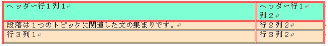
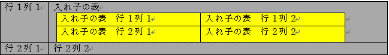

---
title: "テーブルを Word 文書に追加"
slug: word-add-table-to-word-document
---

# テーブルを Word 文書に追加

このドキュメントは、Word 文書に見出し行とネストされたテーブルがあるテーブルを追加する方法を示します。

トピックは以下のとおりです。

-   [概要](#Intro)
-   [要件](#Req)
-   [書式設定されたテーブル - 概要](#FormatTable)
-   [コード例](#Ex)
-   [関連トピック](#relatedTopics)

## <a id="Intro"></a> 概要
Infragistics® Word ライブラリによって、Word 文書にテーブルを挿入することができます。テーブルによって簡単にテキストの列や行を配置できます。

## <a id="Req"></a> 要件
Infragsitics3.Documents.IO アセンブリへの参照が必要とされます。

## <a id="FormatTable"></a> 書式設定されたテーブル - 概要
書式設定されたテーブル、テーブルの行、テーブルのセルは、以下のようなさまざまなクラスで処理されます。

-   [TableProperties](Infragistics.Web.Documents.IO~Infragistics.Documents.Word.TableProperties.html)
-   [TableRowProperties](Infragistics.Web.Documents.IO~Infragistics.Documents.Word.TableRowProperties.html)
-   [TableCellProperties](Infragistics.Web.Documents.IO~Infragistics.Documents.Word.TableCellProperties.html)
-   [TableBorderProperties](Infragistics.Web.Documents.IO~Infragistics.Documents.Word.TableBorderProperties.html)

## <a id="Ex"></a> コード例
### 実例 : ヘッダー行のあるテーブルを作成
以下のコードは、[WordDocumentWriter](Infragistics.Web.Documents.IO~Infragistics.Documents.Word.WordDocumentWriter.html) ストリーマー オブジェクトを使用して 2 列と 3 行のテーブルを作成します。最初の行は、TableRowProperties オブジェクトの [IsHeaderRow](Infragistics.Web.Documents.IO~Infragistics.Documents.Word.TableRowProperties~IsHeaderRow.html) プロパティを使用してヘッダー行として設定されます。

## プレビュー
以下は最終結果のプレビューです。



### 図 1: サンプル コードによって作成された Word 文書のヘッダーが付いたテーブル

## コード サンプル
**C# の場合:**

```csharp
using Infragistics.Documents.Word;

// Create a new instance of the WordDocumentWriter class using the
// static 'Create' method.
// This instance must be closed once content is written into Word.
WordDocumentWriter docWriter = WordDocumentWriter.Create(@"C:TestWordDoc.docx");
docWriter.StartDocument();

// Create border properties for Table
TableBorderProperties borderProps = docWriter.CreateTableBorderProperties();
borderProps.Color = Color.Red;
borderProps.Style = TableBorderStyle.Double;
// Create table properties
TableProperties tableProps = docWriter.CreateTableProperties();
tableProps.Alignment = ParagraphAlignment.Center;
tableProps.BorderProperties.Color = borderProps.Color;
tableProps.BorderProperties.Style = borderProps.Style;
// Create table row properties
TableRowProperties rowProps = docWriter.CreateTableRowProperties();
//Make the row a Header
rowProps.IsHeaderRow = true;
// Create table cell properties
TableCellProperties cellProps = docWriter.CreateTableCellProperties();
cellProps.BackColor = Color.DarkGray;
cellProps.TextDirection = TableCellTextDirection.LeftToRightTopToBottom;

// Begin a table with 2 columns, and apply the table properties
docWriter.StartTable(2, tableProps);
// Begin a Row and apply table row properties
// This row will be set as the Header row by the row properties
// HEADER ROW
docWriter.StartTableRow(rowProps);
// Cell Value for 1st row 1st column
// Start a Paragraph and add a text run to the cell
docWriter.StartTableCell(cellProps);
docWriter.StartParagraph();
docWriter.AddTextRun("Header Row1 Col1");
docWriter.EndParagraph();
docWriter.EndTableCell();
// Cell value for 1st row 2nd column
docWriter.StartTableCell(cellProps);
docWriter.StartParagraph();
docWriter.AddTextRun("Header Row1 Col2");
docWriter.EndParagraph();
docWriter.EndTableCell();
// End the Table Row
docWriter.EndTableRow();

// Reset the cell properties, so that the
// cell properties are different from the header cells.
cellProps.Reset();
cellProps.BackColor = Color.AliceBlue;

// DATA ROW
docWriter.StartTableRow();
// Cell Value for 2nd row 1st column
docWriter.StartTableCell(cellProps);
docWriter.StartParagraph();
docWriter.AddTextRun("A paragraph is a series of sentences that are organized and coherent, and are all related to a single topic. ");
docWriter.EndParagraph();
docWriter.EndTableCell();
// Cell Value for 2nd row 2nd column
docWriter.StartTableCell(cellProps);
docWriter.StartParagraph();
docWriter.AddTextRun("Row2 Col2");
docWriter.EndParagraph();
docWriter.EndTableCell();
docWriter.EndTableRow();
// DATA ROW
docWriter.StartTableRow();
// Cell Value for 3rd row 1st column
docWriter.StartTableCell(cellProps);
docWriter.StartParagraph();
docWriter.AddTextRun("Row3 Col1");
docWriter.EndParagraph();
docWriter.EndTableCell();
// Cell Value for 3rd row 2nd column
docWriter.StartTableCell(cellProps);
docWriter.StartParagraph();
docWriter.AddTextRun("Row3 Col2");
docWriter.EndParagraph();
docWriter.EndTableCell();
docWriter.EndTableRow();
docWriter.EndTable();
docWriter.EndDocument();
// Close the WordDocumentWriter instance.
docWriter.Close();
```
## 実例 : ネストされたテーブルを作成
ネストされたテーブルは、別のテーブル内に表示されるテーブルです。以下のコードは、2 つの列、2 つの行、および 2 つの列と行があるネストされたテーブルのある主テーブルを作成します。主テーブルの最初の行の第 2 列にネストされたテーブルが格納されます。

## プレビュー
以下は最終結果のプレビューです。



###### 図 2: サンプル コードによって作成された Word 文書のネストされたテーブル

## コード サンプル
**C# の場合:**

```csharp
// Create a new instance of the WordDocumentWriter
// class using the static 'Create' method.
// This instance must be closed once content is written into Word.
WordDocumentWriter docWriter = WordDocumentWriter.Create(@"C:TestWordDoc.docx");

TableCellProperties cellProps = docWriter.CreateTableCellProperties();
cellProps.BackColor = Color.LightGray;
docWriter.StartDocument();
// Begin a Table with 2 columns
docWriter.StartTable(2);
// Begin a table row
docWriter.StartTableRow();
// Begin Table cell for first row first column
docWriter.StartTableCell(cellProps);
docWriter.StartParagraph();
docWriter.AddTextRun("Row1 Col1");
docWriter.EndParagraph();
docWriter.EndTableCell();
// Begin Table cell for first row second column
docWriter.StartTableCell(cellProps);

#region // Nested Table
docWriter.StartParagraph();
docWriter.AddTextRun("Nested Table");
docWriter.AddNewLine();
docWriter.EndParagraph();
docWriter.StartTable(2);
docWriter.StartTableRow();
cellProps.Reset();
cellProps.BackColor = Color.Yellow;
docWriter.StartTableCell(cellProps);
docWriter.StartParagraph();
docWriter.AddTextRun("Nested Table Row1 Col1");
docWriter.EndParagraph();
docWriter.EndTableCell();
docWriter.StartTableCell(cellProps);
docWriter.StartParagraph();
docWriter.AddTextRun("Nested Table Row1 Col2");
docWriter.EndParagraph();
docWriter.EndTableCell();
docWriter.EndTableRow();
docWriter.StartTableRow();
docWriter.StartTableCell(cellProps);
docWriter.StartParagraph();
docWriter.AddTextRun("Nested Table Row2 Col1");
docWriter.EndParagraph();
docWriter.EndTableCell();
docWriter.StartTableCell(cellProps);
docWriter.StartParagraph();
docWriter.AddTextRun("Nested Table Row2 Col2");
docWriter.EndParagraph();
docWriter.EndTableCell();
docWriter.EndTableRow();
// For nested tables at least one paragraph must be added after adding the table within the cell.
// The EndTable method exposes an overload that adds an empty paragraph. 
docWriter.EndTable(true);
#endregion // Nested Table

docWriter.EndTableCell();
docWriter.EndTableRow();
docWriter.StartTableRow();
cellProps.Reset();
cellProps.BackColor = Color.LightGray;
docWriter.StartTableCell(cellProps);
docWriter.StartParagraph();
docWriter.AddTextRun("Row2 Col1");
docWriter.EndParagraph();
docWriter.EndTableCell();
docWriter.StartTableCell(cellProps);
docWriter.StartParagraph();
docWriter.AddTextRun("Row2 Col2");
docWriter.EndParagraph();
docWriter.EndTableCell();
docWriter.EndTableRow();
docWriter.EndTable();
docWriter.EndDocument();
// Close the WordDocumentWriter instance.
docWriter.Close();
```

## <a id="relatedTopics"></a> 関連トピック
-   [Word 文書の作成](/asp-net-mvc/word-library/using-infragistics-word-library/word-create-a-word-document)
-   [書式設定を Word 文書に適用](/asp-net-mvc/word-library/using-infragistics-word-library/word-apply-formatting-to-word-document)
-   [画像を Word 文書に追加](/asp-net-mvc/word-library/using-infragistics-word-library/word-add-images-to-word-document)
-   [ヘッダー、フッター、ページ番号](/asp-net-mvc/word-library/using-infragistics-word-library/word-headers-footers-and-page-numbers)
-   [Infragistics Word ライブラリの理解](/asp-net-mvc/word-library/understanding-infragistics-word-library/word-understanding-infragistics-word-library)

 

 


