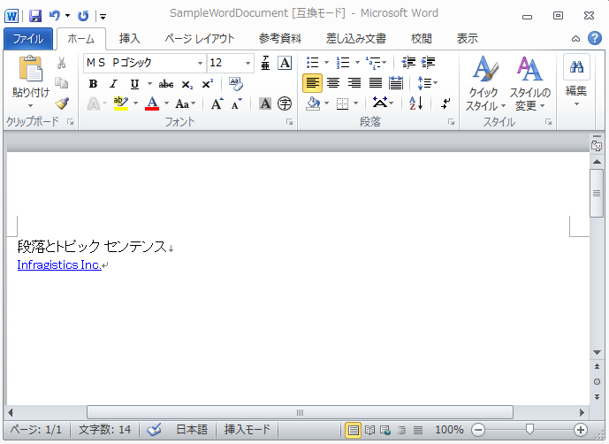

---
title: "Word 文書の作成"
slug: word-create-a-word-document
---

# Word 文書の作成

このトピックは、forward-only の [WordDocumentWriter](Infragistics.Web.Documents.IO~Infragistics.Documents.Word.WordDocumentWriter.html) ストリーマー オブジェクトを使用して、Word 文書を作成する方法を示します。`WordDocumentWriter` オブジェクトの静的な Create メソッドは、新しい Word 文書を作成します。

以下のスクリーンショットは、テキストとハイパーリンクで作成された Word 文書を表示します。



`Author`、`Title`、`Subject` などのドキュメントのさまざまなプロパティは、`WordDocumentWriter` オブジェクトの [DocumentProperties](Infragistics.Web.Documents.IO~Infragistics.Documents.Word.WordDocumentWriter~DocumentProperties.html) プロパティを使用して設定できます。Office ボタンをクリックして、[準備] > [プロパティ] セクションを指定することによって、Word 2007 でこれらの情報にアクセスできます。Word 2010 で同様に、[ファイル] タブをクリックすることによって、Backstage ビューの右側からドキュメント プロパティにアクセスできます。

Word 文書への書き出しを開始するには、[StartDocument](Infragistics.Web.Documents.IO~Infragistics.Documents.Word.WordDocumentWriter~StartDocument.html) メソッドを使用し、これは [EndDocument](Infragistics.Web.Documents.IO~Infragistics.Documents.Word.WordDocumentWriter~EndDocument.html) メソッドへの対応する呼び出しとバランスを取らなければなりません。

Paragraph は揃えて配置またはインデントが可能なテキスト ブロックを表示する機能を提供します。段落を始めるには [StartParagraph](Infragistics.Web.Documents.IO~Infragistics.Documents.Word.WordDocumentWriter~StartParagraph.html) メソッドを使用します。[AddTextRun](Infragistics.Web.Documents.IO~Infragistics.Documents.Word.WordDocumentWriter~AddTextRun.html) メソッドはコンテンツを段落に追加する方法を提供します。コンテンツが追加されたら、段落は [EndParagraph](Infragistics.Web.Documents.IO~Infragistics.Documents.Word.WordDocumentWriter~EndParagraph.html) メソッドを使用して閉じなければなりません。

> **注:** `Infragistics.Web.Documents.IO` アセンブリへの参照が以下のコードに必要とされます。

> **注:** Word 文書を作成するために `WordDocumentWriter` オブジェクトを使用する時には、Dispose メソッドまたは Close メソッドのいずれかを使用してストリーマー オブジェクトを破棄または閉じなければなりません。

**C# の場合:**

```csharp
using Infragistics.Documents.Word;

// Create a new instance of the WordDocumentWriter class
// using the static 'Create' method.
WordDocumentWriter docWriter = WordDocumentWriter.Create(@"C:TestWordDoc.docx");
// Use inches as the unit of measure
docWriter.Unit = UnitOfMeasurement.Inch;
// Set the document properties, such as title, author, etc.
docWriter.DocumentProperties.Title = "Sample Document";
docWriter.DocumentProperties.Author = string.Format("Infragistics.{0}", SystemInformation.UserName);
// Start the document...note that each call to
// StartDocument must be balanced with a corresponding call to EndDocument.
docWriter.StartDocument();
//  Start a paragraph
docWriter.StartParagraph();
//  Add a text run for the title
docWriter.AddTextRun("Paragraphs and Topic Sentences");
// Add a new line
docWriter.AddNewLine();
//  Add a Hyperlink
docWriter.AddHyperlink("http://www.infragistics.com", "Infragistics Inc.");
//  End the paragraph
docWriter.EndParagraph();
//  End Document
docWriter.EndDocument();
// Close the writer
docWriter.Close();
```

## 関連トピック
-   [書式設定を Word 文書に適用](/word-apply-formatting-to-word-document)
-   [テーブルを Word 文書に追加](/word-add-table-to-word-document)
-   [画像を Word 文書に追加](/word-add-images-to-word-document)
-   [ヘッダー、フッター、ページ番号](/word-headers-footers-and-page-numbers)
-   [Infragistics Word ライブラリの理解](/word-understanding-infragistics-word-library)

 

 


