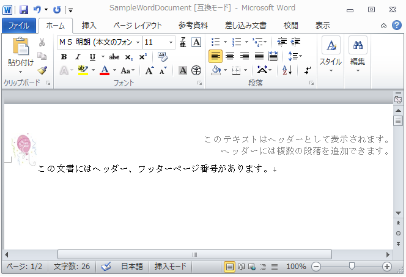
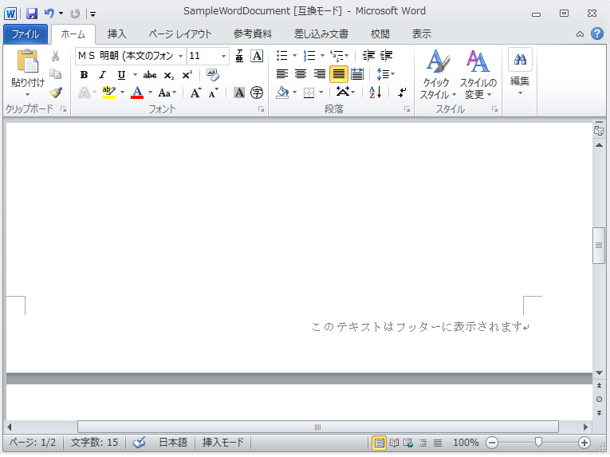

---
title: "ヘッダー、フッター、ページ番号"
slug: word-headers-footers-and-page-numbers
---

# ヘッダー、フッター、ページ番号
Infragistics® Word ライブラリを使用すると、ドキュメント タイトルのように簡単なヘッダーとフッター、および画像、複数段落、表、ハイパーリンクへのページ番号を作成できます。

以下のスクリーンショットは、`Header` にテキストと画像を付けて作成された Word 文書を表示します。



以下のスクリーンショットは、`Footer` にテキストとページ番号を付けて作成された Word 文書を表示します。



> **注:** `Infragistics.Web.Documents.IO` アセンブリへの参照が以下のコードに必要とされます。

## ヘッダーとフッター
ドキュメント セクションのヘッダーとフッターにコンテンツを書き出すには、ひとつ以上の [WordHeaderFooterWriter](Infragistics.Web.Documents.IO~Infragistics.Documents.Word.WordHeaderFooterWriter.html) インスタンスを保持する [SectionHeaderFooterWriterSet](Infragistics.Web.Documents.IO~Infragistics.Documents.Word.SectionHeaderFooterWriterSet.html) クラスを使用する必要があります。ヘッダーとフッターは、全ページまたは最初のページのみのいずれかに設定できます。テキスト、画像、複数段落、ハイパーリンクはすべてヘッダーおよびフッター セクションに追加できます。

**C# の場合:**

```csharp
using Infragistics.Documents.Word;

//  Specify the default parts for header and footer
SectionHeaderFooterParts parts = SectionHeaderFooterParts.HeaderAllPages | SectionHeaderFooterParts.FooterAllPages;
SectionHeaderFooterWriterSet writerSet = docWriter.AddSectionHeaderFooter(parts);
// Set text for Header
writerSet.HeaderWriterAllPages.Open();
writerSet.HeaderWriterAllPages.StartParagraph();
writerSet.HeaderWriterAllPages.AddTextRun("This text appears in the Header.");
writerSet.HeaderWriterAllPages.EndParagraph();
writerSet.HeaderWriterAllPages.Close();
// Set text for Footer
writerSet.FooterWriterAllPages.Open();
writerSet.FooterWriterAllPages.StartParagraph();
writerSet.FooterWriterAllPages.AddTextRun("This text appears in the footer.");
writerSet.FooterWriterAllPages.EndParagraph();
writerSet.FooterWriterAllPages.Close();
```

## ページ番号
ページ番号は、[AddPageNumberField](Infragistics.Web.Documents.IO~Infragistics.Documents.Word.WordHeaderFooterWriter~AddPageNumberField.html) メソッドを使用して、Word 文書のヘッダーまたはフッターのいずれかに正しい設定を追加することによって可能となります。このメソッドは、オプションの引数として `PageNumberFieldType` 列挙値とフォント オブジェクトを受け付けます。`PageNumberFieldType` 列挙体は、ページ番号に、`Decimal`、`RomanLowercase`、`TextCardinal`、`Ordinal` などのいくつかの書式を提供します。

**C# の場合:**

```csharp
using Infragistics.Documents.Word;

// Add Page numbers to the Footer
writerSet.FooterWriterAllPages.AddPageNumberField(PageNumberFieldFormat.Ordinal, font);
```
以下の完全なコードはヘッダー、フッター、ページ番号を Word 文書に追加します。

**C# の場合:**

```csharp
using Infragistics.Documents.Word;

// Create a new instance of the WordDocumentWriter class using the
// static 'Create' method.
//  This instance must be closed once content is written into Word.
WordDocumentWriter docWriter = WordDocumentWriter.Create(@"C:TestWordDoc.docx");
//  Use inches as the unit of measure
docWriter.Unit = UnitOfMeasurement.Inch;
//  Create a font, which we can use in content creation
Infragistics.Documents.Word.Font font = docWriter.CreateFont();
font.Bold = true;
// Paragraph Properties
ParagraphProperties paraformat = docWriter.CreateParagraphProperties();

//Start the document...note that each call to StartDocument must
//be balanced with a corresponding call to EndDocument.
docWriter.StartDocument();
//Start a paragraph
docWriter.StartParagraph();
docWriter.AddNewLine();
docWriter.AddTextRun("This document demonstrates headers, footers and page numbers.", font);
// End the paragraph
docWriter.EndParagraph();
// Create a page break
paraformat.PageBreakBefore = true;
docWriter.StartParagraph(paraformat);
docWriter.EndParagraph();
// Header and Footer
//  Specify the default parts for header and footer.
SectionHeaderFooterParts parts = SectionHeaderFooterParts.HeaderAllPages | SectionHeaderFooterParts.FooterAllPages;
SectionHeaderFooterWriterSet writerSet = docWriter.AddSectionHeaderFooter(parts);
// Get Image to display in the Header
Image img = Image.FromFile(@"....Ballon_New_Year.jpg");
// Create an Anchored Image
AnchoredPicture anchPic = docWriter.CreateAnchoredPicture(img);
anchPic.Size = new SizeF(0.75f, 0.75f);
// Reset paragraph properties
paraformat.Reset();
paraformat.Alignment = ParagraphAlignment.Right;
// Header
writerSet.HeaderWriterAllPages.Open();
// The header text alignment is set to right
// by passing in the ParagraphProperties instance
writerSet.HeaderWriterAllPages.StartParagraph(paraformat);
// Add Image to the header
writerSet.HeaderWriterAllPages.AddAnchoredPicture(anchPic);
// Add text to the Header
writerSet.HeaderWriterAllPages.AddTextRun("This text appears in the Header.");
writerSet.HeaderWriterAllPages.EndParagraph();
writerSet.HeaderWriterAllPages.StartParagraph(paraformat);
// Add text to the Header
writerSet.HeaderWriterAllPages.AddTextRun("Multiple paragraphs can be added to the Header.");
writerSet.HeaderWriterAllPages.EndParagraph();
writerSet.HeaderWriterAllPages.Close();
//Footer
writerSet.FooterWriterAllPages.Open();
// The footer text alignment is set to right
// by passing in the ParagraphProperties instance
writerSet.FooterWriterAllPages.StartParagraph(paraformat);
writerSet.FooterWriterAllPages.AddTextRun("This text appears in the footer. ");
// Add Page numbers to the Footer
writerSet.FooterWriterAllPages.AddPageNumberField(PageNumberFieldFormat.Ordinal, font);
writerSet.FooterWriterAllPages.EndParagraph();
writerSet.FooterWriterAllPages.Close();

// End the Document
docWriter.EndDocument();
// Close the writer
docWriter.Close();
```

## 関連トピック
-   [Word 文書の作成](/asp-net-mvc/word-library/using-infragistics-word-library/word-create-a-word-document)
-   [書式設定を Word 文書に適用](/asp-net-mvc/word-library/using-infragistics-word-library/word-apply-formatting-to-word-document)
-   [テーブルを Word 文書に追加](/asp-net-mvc/word-library/using-infragistics-word-library/word-add-table-to-word-document)
-   [画像を Word 文書に追加](/asp-net-mvc/word-library/using-infragistics-word-library/word-add-images-to-word-document)
-   [Infragistics Word ライブラリの理解](/asp-net-mvc/word-library/understanding-infragistics-word-library/word-understanding-infragistics-word-library)

 

 


