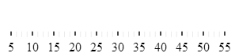

import ApiLink from 'docs-template/components/mdx/ApiLink.astro';

# igBulletGraph の HTML ページへの追加

## トピックの概要

#### 目的

このトピックではコード例を使用して、`igBulletGraph` コントロールを HTML ページに追加する方法を説明します。

#### 前提条件

このトピックを理解するために、以下のトピックを参照することをお勧めします。

- [*igBulletGraph* の概要](/igbulletgraph-overview): このトピックは、主要機能、最小要件およびユーザー機能性など、`igBulletGraph`™ コントロールの概念的な情報を提供します。


#### このトピックの内容

このトピックは、以下のセクションで構成されます。

-   [***igBulletGraph* を HTML ページに追加 - 概要**](#overview)
    -   [要件](#requirements)
    -   [手順](#steps)
-   [**igBulletGraph を HTML ページに追加 - 手順**](#procedure)
    -   [概要](#procedure-introduction)
    -   [プレビュー](#preview)
    -   [前提条件](#prerequisites)
    -   [手順](#procedure-steps)
    -   [全コード](#full-code)
-   [**関連コンテンツ**](#related-content)
    -   [トピック](#topics)
    -   [サンプル](#samples)


## igBulletGraph を HTML ページに追加 - 概要

`igBulletGraph` コントロールを Web ページに追加するには、HTML の要素、インスタンス化のベースとなる `div` が必要です。`igBulletGraph` の基本構成には、寸法、すなわち `width` と `height` の値が必要です。

#### 要件

以下の表で、`igBulletGraph` コントロールを使用するための要件を簡単に説明しています。


|  |  |  |
| --- | --- | --- |
| 必要なリソース | 説明 | 必要な作業 |
| jQuery および jQuery UI JavaScript リソース | environment:ProductName™ は、以下のフレームワークの最上部にビルドされます。 [jQuery](http://jquery.com/) [jQuery UI](http://jqueryui.com/) | ページの `` セクションで両方のライブラリにスクリプト参照を追加します。 |
| 全般的な *igBulletGraph* JavaScript リソース | *igBulletGraph* コントロールは、environment:ProductName ライブラリ内の複数のファイルで配布される機能に依存します。必要なリソースは以下の方法で読み込むことができます。 Infragistics® Loader (*igLoader*™) を使用します。ページ上に *igLoader* へのスクリプト参照を含めるのみです。 必要なリソースを手動で読み込みます。以下の表にリストされる依存関係を使用する必要があります。 environment:ProductName パッケージのすべてのデータ ビジュアライゼーション コントロールのロジックを含む、2 つの結合ファイル (*infragistics.core.js*、*infragistics.dv.js* および *infragistics.encoding.js* (オプション)) を読み込みます。 以下の表は、*igBulletGraph* コントロール関連の environment:ProductName ライブラリの依存関係を示します。*igLoader* または結合ファイルを使用しない選択をした場合、これらのリソースを明示的に参照する必要があります。 JS リソース | 説明 |
| *infragistics.util.js*, *infragistics.util.jquery.js* | environment:ProductName ユーティリティ |  |
| *infragistics.ext_core.js*, *infragistics.ext_collections.js*, *infragistics.ext_ui.js*, *infragistics.dv_jquerydom.js*, *infragistics.dv_core.js*, *infragistics.dv_geometry.js* | データ ビジュアライゼーション コンポーネント用の共有ライブラリ |  |
| *infragistics.ui.widget.js* | すべての environment:ProductName ウィジェットの基本 igWidget。 |  |
| *infragistics.bulletgraph.js* | *igBulletGraph* コントロール |  |
| *infragistics.ui.bulletgraph.js* | *igBulletGraph* ウィジェット |  |

            &lt;/td&gt;
            &lt;td&gt;以下のいずれかを追加します。 <ul> <li> \*igLoader\* への参照 </li> <li> すべての必要な JavaScript ファイルへの参照 (左側の表に一覧表示) </li> <li> 結合ファイルへの参照および任意でエンコーディングを含むファイルへの参照 </li> </ul>&lt;/td&gt;
&lt;/tr&gt;
    &lt;/tbody&gt;
&lt;/table&gt;

#### 手順

`igBulletGraph` を HTML ページへ追加するための一般的な手順を簡単に示すと、以下のようになります。

1. `igBulletGraph` コントロールを保存するターゲット要素の作成。
2. `igBulletGraph` のインスタンスの作成
3. 基本的な描画オプションの構成
4. スケールの構成
5. パフォーマンス バーの追加
6. 比較マーカーの構成
7. 比較範囲の追加


## igBulletGraph を HTML ページに追加 - 手順
#### 概要
この手順では、`igBulletGraph` のインスタンスを HTML ページに追加し、寸法およびスケールを設定して、パフォーマンス バー、比較マーカー、および 3 つの比較範囲をインスタンスに追加します。

この手順では、必要なリソースを HTML ページのヘッダーに追加することを前提としています。そのため、document ready イベントで `igBulletGraph` コントロールのインスタンスを作成し、DOM の読み込みエラーが発生しないようにします。

#### プレビュー

以下のスクリーンショットは結果のプレビューです。


### 前提条件

この手順を実行するには、必要な JavaScript ファイルおよび HTML ページで参照する CSS ファイルが必要です。

**HTML の場合:**

```html
<!DOCTYPE html>
<html>
<head>
	
	<link href="../../igniteui/css/themes/infragistics/infragistics.theme.css" rel="stylesheet" />
	<link href="../../igniteui/css/structure/modules/infragistics.ui.bulletgraph.css" rel="stylesheet"/>
	<script type="text/javascript" src="../../js/jquery.min.js"></script>
	<script type="text/javascript" src="../../js/jquery-ui.js"></script>
	
	<script src="../../igniteui/js/modules/infragistics.util.js" type="text/javascript"></script>
	<script src="../../igniteui/js/modules/infragistics.util.jquery.js" type="text/javascript"></script>
	<script src="../../igniteui/js/modules/infragistics.ext_core.js" type="text/javascript"></script>
	<script src="../../igniteui/js/modules/infragistics.ext_collections.js" type="text/javascript"></script>
	<script src="../../igniteui/js/modules/infragistics.ext_ui.js" type="text/javascript"></script>
	<script src="../../igniteui/js/modules/infragistics.dv_jquerydom.js" type="text/javascript"></script>
	<script src="../../igniteui/js/modules/infragistics.dv_core.js" type="text/javascript"></script>
	<script src="../../igniteui/js/modules/infragistics.dv_geometry.js" type="text/javascript"></script>
	<script src="../../igniteui/js/modules/infragistics.ui.widget.js" type="text/javascript"></script>
	<script src="../../igniteui/js/modules/infragistics.bulletgraph.js" type="text/javascript"></script>
	<script src="../../igniteui/js/modules/infragistics.ui.bulletgraph.js" type="text/javascript"></script>
</head>
<body>
</body>
</html>
```

### 手順

これらの手順に従って、`igBulletGraph` を HTML ページに追加します。

1. ***igBulletGraph* コントロールを保存するターゲット要素の作成。**

	`igBulletGraph` コントロールのインスタンスを作成する HTML 本文内に、 `<div>` 要素を作成します。
	
	**HTML の場合:**
	
```html
	<body>
	    
	      <div id="bulletGraph"></div>
	</body>
```

2. ***igBulletGraph* のインスタンスの作成**

	手順 1 で定義したターゲット要素のセレクターを使用して、`igBulletGraph` コントロールのインスタンスを作成します。

	**HTML の場合:**

```html
    <script type="text/jscript">
        $(function () {                        
                  $("#bulletGraph").igBulletGraph({
            });
            });
    </script>
```

3. **基本的な描画オプションの構成。**

	igBulletGraph のインスタンスを作成する場合、`width` および `height` の各オプションを構成します。
	
	**HTML の場合:**
	
```html
	$("#bulletGraph").igBulletGraph({
	    width: "300px",
	    height: "70px"
	});
```

4. **スケールを構成します。**

	スケールの値をカスタマイズするには、 <ApiLink type="igBulletGraph" member="minimumValue" section="options" label="minimumValue" /> および <ApiLink type="igBulletGraph" member="maximumValue" section="options" label="maximumValue" /> プロパティを設定する必要があります。この例では、スケールは 5 から開始され 55 で終了します。
	
	**HTML の場合:**
	
```html
	$("#bulletGraph").igBulletGraph({
	    width: "300px",
	    height: "70px",
	    minimumValue: "5",
	    maximumValue: "55"
	});
```

	変化したスケールを以下のスクリーンショットに示します。
	
	

5. **パフォーマンス バーを追加します。**

	`igBulletGraph` の主要なメジャーはそのパフォーマンス バーにより視覚化されます。値は <ApiLink type="igBulletGraph" member="value" section="options" label="value" /> プロパティ設定で制御します。この例では、value を 35 に設定します。
	
	**HTML の場合:**

```html
    $("#bulletGraph").igBulletGraph({
		…
        value:"35"
    });
```

6. **比較マーカーを構成します。**

	比較目盛マーカーのスケールへの配置は、<ApiLink type="igBulletGraph" member="targetValue" section="options" label="targetValue" /> プロパティの値で制御します。この例では、`targetValue` を 43 に設定します。
	
	**HTML の場合:**

```html
    $("#bulletGraph").igBulletGraph({
		…
        targetValue:"43"
    });
```

	以下のスクリーンショットは、これまでの手順で `igBulletGraph` コントロールの外観がどのようになるか示しています。
	
	

7. **比較範囲を追加します。**

	パフォーマンス バーで表示された値とある意味を持たせた範囲の値を比較するためには、比較範囲をスケール上に表示する必要があります。比較範囲は、内部に複数の個別の範囲を定義できる <ApiLink type="igBulletGraph" member="ranges" section="options" label="ranges" /> プロパティが制御します。各範囲には、独自の開始値と終了値 (<ApiLink type="igBulletGraph" member="startValue" section="options" label="startValue" /> および <ApiLink type="igBulletGraph" member="endValue" section="options" label="endValue" />) と色 (<ApiLink type="igBulletGraph" member="brush" section="options" label="brush" />) があります。 
	
	この例では、3 つの比較範囲を構成します。それぞれ異なる灰色のグラデーションで、スケール目盛の 0、15、30 から開始します。
	
	**HTML の場合:**

```html
	$("#bulletGraph").igBulletGraph({
		…
	    ranges: [{
	        name: 'range1',
	        startValue: 0,
	        endValue: 15,
	        brush: '#DCDCDC'
	    },
	    {
	        name: 'range2',
	        startValue: 15,
	        endValue: 30,
	        brush: '#A9A9A9'
	    },
	    {
	        name: 'range3',
	        startValue: 30,
	        endValue: 55,
	        brush: '#808080'
	    }
	    ]
	});
```
	
	グラフの最終的な外観を以下に示します。
	
	


### 全コード

以下は、この手順の完全なコードです。

**HTML の場合:**

```html
<!DOCTYPE html>
<html>
<head>
	
	<link href="../../igniteui/css/themes/infragistics/infragistics.theme.css" rel="stylesheet" />
	<link href="../../igniteui/css/structure/infragistics.css" rel="stylesheet"/>
	<script type="text/javascript" src="../../js/jquery.min.js"></script>
	<script type="text/javascript" src="../../js/jquery-ui.js"></script>
	
	<script src="../../igniteui/js/modules/infragistics.util.js" type="text/javascript"></script>
	<script src="../../igniteui/js/modules/infragistics.util.jquery.js" type="text/javascript"></script>
	<script src="../../igniteui/js/modules/infragistics.ext_core.js" type="text/javascript"></script>
	<script src="../../igniteui/js/modules/infragistics.ext_collections.js" type="text/javascript"></script>
	<script src="../../igniteui/js/modules/infragistics.ext_ui.js" type="text/javascript"></script>
	<script src="../../igniteui/js/modules/infragistics.dv_jquerydom.js" type="text/javascript"></script>
	<script src="../../igniteui/js/modules/infragistics.dv_core.js" type="text/javascript"></script>
	<script src="../../igniteui/js/modules/infragistics.dv_geometry.js" type="text/javascript"></script>
	<script src="../../igniteui/js/modules/infragistics.ui.widget.js" type="text/javascript"></script>
	<script src="../../igniteui/js/modules/infragistics.bulletgraph.js" type="text/javascript"></script>
	<script src="../../igniteui/js/modules/infragistics.ui.bulletgraph.js" type="text/javascript"></script>
        <script type="text/jscript">
        $(function () {             
            $("#bulletGraph").igBulletGraph({
                width: "300px",
                height: "70px",
                minimumValue: "5",
                maximumValue: "55",
                value:"35",
                targetValue:"43",
                ranges: [{
                    name: 'range1',
                    startValue: 0,
                    endValue: 15,
                    brush: '#DCDCDC'
                },
                {
                    name: 'range2',
                    startValue: 15,
                    endValue: 30,
                    brush: '#A9A9A9'
                },
                {
                    name: 'range3',
                    startValue: 30,
                    endValue: 55,
                    brush: '#808080'
                }
                ]
            });
        });
    </script>
</head>
<body>
    
      <div id="bulletGraph"></div>
</body>
</html>
```


## 関連コンテンツ

### トピック

このトピックの追加情報については、以下のトピックも合わせてご参照ください。

- [ASP.NET MVC アプリケーションへの *igBulletGraph* の追加](/igbulletgraph-adding-using-the-mvc-helper): このトピックではコード例を使用して、ASP.NET MVC ビューに ASP.NET MVC ヘルパーで igBulletGraph コントロールを追加する方法を説明します。

- [jQuery および MVC API リファレンス リンク (*igBulletGraph*)](/igbulletgraph-api-links): このトピックでは、`igBulletGraph` コントロールと ASP.NET MVC ヘルパーに関する API 参照ドキュメントへのリンクを提供します。


### サンプル

以下のサンプルでは、このトピックに関連する情報を提供しています。

- [基本構成](&#123;environment:SamplesUrl&#125;/bullet-graph/basic-configuration): このサンプルでは、`igBulletGraph` コントロールのシンプルな構成を紹介します。
