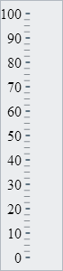
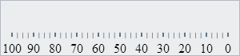
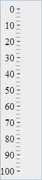
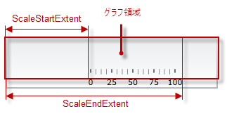
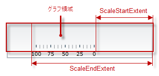
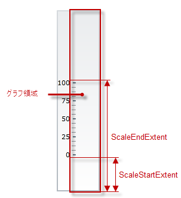
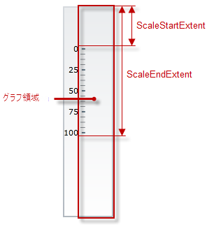

import ApiLink from 'docs-template/components/mdx/ApiLink.astro';

# 向きと方向の構成 (igBulletGraph)

## トピックの概要

#### 目的

このトピックは、垂直スケールと反転したスケール方向の両方またはいずれか一方により `igBulletGraph`™ コントロールを構成する方法を説明します。

### 前提条件

このトピックを理解するために、以下のトピックを参照することをお勧めします。

- [*igBulletGraph* の概要](/igbulletgraph-overview): このトピックは、主要機能、最小要件およびユーザー機能性など、igBulletGraph コントロールの概念的な情報を提供します。

- [*igBulletGraph* の追加](/igbulletgraph-adding): このトピック グループは、igBulletGraph コントロールを HTML ページと ASP.NET MVC アプリケーションに追加する方法を説明します。


### このトピックの内容

このトピックは、以下のセクションで構成されます。

-   [**概要**](#introduction)
    -   [スケールの向きと方向の構成の概要](#scale-orientation-summary)
    -   [スケールの向きと方向の構成の概要表](#scale-orientation-summary-chart)
-   [**スケールの向きの構成**](#scale-orientation)
    -   [プロパティ設定](#scale-orientation-property-settings)
    -   [例](#scale-orientation-example)
-   [**スケールの方向の構成 (スケールの反転)**](#scale-direction)
    -   [概要](#scale-direction-overview)
    -   [プロパティ設定](#scale-direction-property-settings)
    -   [例 - 水平方向での反転方向](#scale-direction-example-horizontal)
    -   [例 - 垂直方向での反転方向](#scale-direction-example-vertical)
-   [**関連コンテンツ**](#related-content)
    -   [トピック](#topics)
    -   [サンプル](#samples)


## <a id="introduction"></a> 概要

###  <a id="scale-orientation-summary"></a>スケールの向きと方向の構成の概要

`igBulletGraph` コントロールは、スケールの垂直方向および水平方向をサポートしています。既定では、スケールは水平方向です。垂直方向のスケールの値は上向きに増加し、番号ラベルがその左側に配置されます。

**

この設定は、コントロールの <ApiLink type="igBulletGraph" member="orientation" section="options" label="orientation" /> プロパティで定義されます。

スケールの向きは、パフォーマンス バーが伸長する方向で、スケールの値が増加します。方向は、標準 (水平方向で左から右、垂直方向で下から上) または反転 (水平方向で右から左、垂直方向で上から下) が可能です。

*水平方向での反転方向*|*垂直方向での反転方向*
-----------------------------------------------|---------------------------------------------
 | 


スケールの方向は、コントロールの <ApiLink type="igBulletGraph" member="isScaleInverted" section="options" label="isScaleInverted" /> プロパティで定義されます。デフォルトの方向は、標準です。

###  <a id="scale-orientation-summary-chart"></a>スケールの向きと方向の構成の概要表

以下の表で、`igBulletGraph` のコントロールの方向とスケールの反転で構成できる要素を簡単に説明し、構成に使用するプロパティにマップします。

構成可能な項目|詳細|プロパティ
---|---|---
スケールの向き|コントロール内のブレット グラフのスケールの向き (水平または垂直)。|<ApiLink type="igBulletGraph" member="orientation" section="options" label="orientation" />
スケールの方向|ブレット グラフの方向 (標準または反転)。|<ApiLink type="igBulletGraph" member="isScaleInverted" section="options" label="isScaleInverted" />


## <a id="scale-orientation"></a> スケールの向きの構成

ブレット グラフの向き (水平または垂直) は、コントロールの <ApiLink type="igBulletGraph" member="orientation" section="options" label="orientation" /> プロパティで指定します。

### <a id="scale-orientation-property-settings"></a>プロパティ設定

以下の表では、各プロパティ設定の構成です。

目的:|使用するプロパティ:|設定の選択肢:
--------------|--------------------|--------------
水平方向を指定する|<ApiLink type="igBulletGraph" member="orientation" section="options" label="orientation" />|*horizontal*
垂直方向を指定する|`orientation`|*vertical*


### <a id="scale-orientation-example"></a>例

以下のスクリーンショットは、以下の設定の結果 `igBulletGraph` の外観がどのようになるか示しています。

プロパティ|値
---|---
<ApiLink type="igBulletGraph" member="orientation" section="options" label="orientation" />|"vertical"


以下のコードはこの例を実装します。

**JavaScript の場合:**

```js
$('#igBulletGraph').igBulletGraph({
    width: ”70”,
    height: ”300”,
    orientation: "vertical"
});
```


## <a id="scale-direction"></a> スケールの方向の構成 (スケールの反転)

### <a id="scale-direction-overview"></a> 概要

水平方向では、スケールの標準 (デフォルト) 方向は「左から右」で、これはスケールが [**グラフ領域**](/igbulletgraph-overview#logical-areas) の左端から開始され、右端で終了することを意味します (<ApiLink type="igBulletGraph" member="scaleStartExtent" section="options" label="scaleStartExtent" /> はグラフ領域の左端の始まりを示し、<ApiLink type="igBulletGraph" member="scaleEndExtent" section="options" label="scaleEndExtent" /> は、グラフ領域の左端からスケールの終りまでの距離を示します)。



方向が反転すると、スケールはグラフ領域の右端から開始され、左端で終了します (`scaleStartExtent` はグラフ領域の右端の始まりを示し、`scaleEndExtent` はグラフ領域の右端の終りまでの距離を示します)。



垂直方向では、スケールの標準 (デフォルト) 方向は「下端から上端」で、これはスケールがグラフ領域の下端から開始され、上端で終了することを意味します (`scaleStartExtent` はグラフ領域の下端の始まりを示し、`scaleEndExtent` は、グラフ領域の下端からスケールの終りまでの距離を示します)。



方向が反転すると、スケールはグラフ領域の上端から開始され、下端で終了します (`scaleStartExtent` はグラフ領域の上端の始まりを示し、`scaleEndExtent` はグラフ領域の上端からスケールの終りまでの距離を示します)。



### <a id="scale-direction-property-settings"></a> プロパティ設定

以下の表は、任意の &lt;configuration/behaviors&gt; と各プロパティ設定のマップを示します。

目的:|使用するプロパティ:|設定の選択肢:
---|---|---
標準方向の構成|<ApiLink type="igBulletGraph" member="isScaleInverted" section="options" label="isScaleInverted" />|“false”
反転方向の構成|`isScaleInverted`|“true”


### <a id="scale-direction-example-horizontal"></a> 例 - 水平方向での反転方向

以下のスクリーンショットは、以下の設定の結果 igBulletGraph の外観がどのようになるか示しています。

プロパティ|値
---|---
<ApiLink type="igBulletGraph" member="isScaleInverted" section="options" label="isScaleInverted" />|“true”
<ApiLink type="igBulletGraph" member="orientation" section="options" label="orientation" />|"horizontal"


以下のコードはこの例を実装します。

**JavaScript の場合:**

```js
$('#igBulletGraph').igBulletGraph({
    width: “70”,
    height: “300”,
    isScaleInverted: "true"
});
```

### <a id="scale-direction-example-vertical"></a> 例 - 垂直方向での反転方向

以下のスクリーンショットは、以下の設定の結果 `igBulletGraph` の外観がどのようになるか示しています。

プロパティ|値
---|---
<ApiLink type="igBulletGraph" member="isScaleInverted" section="options" label="isScaleInverted" />|“true”
<ApiLink type="igBulletGraph" member="orientation" section="options" label="orientation" />|"vertical"


以下のコードはこの例を実装します。

**JavaScript の場合:**

```js
$('#igBulletGraph').igBulletGraph({
    width: '70',
    height: '400',
    orientation: "vertical", 
    isScaleInverted: "true"
});
```


## <a id="related-content"></a> 関連コンテンツ

### <a id="topics"></a>トピック
- [視覚要素の構成 (*igBulletGraph*)](/igbulletgraph-configuring-the-visual-elements): このトピック グループは、igBulletGraph コントロールの視覚要素 (スケール要素、パフォーマンス バー、比較マーカーおよび範囲など) を詳細に説明し、コード例を使用してコントロールの視覚要素を構成する方法を示します。


### <a id="samples"></a> サンプル

このトピックについては、以下のサンプルも参照してください。

- [垂直方向](&#123;environment:SamplesUrl&#125;/bullet-graph/vertical-orientation): このサンプルでは、igBulletGraph コントロールの方向を変更し、スケールを反転する方法を紹介します。


 

 


