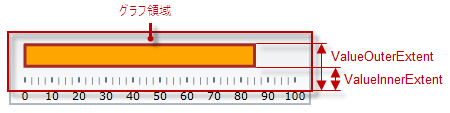

---
title: "パフォーマンス バーの構成 (igBulletGraph)"
slug: igbulletgraph-configuring-the-performance-bar
---

# パフォーマンス バーの構成 (igBulletGraph)

## トピックの概要

#### 目的

このトピックではコード例を使用して、`igBulletGraph`™ コントロールのパフォーマンス バーを構成する方法を説明します。説明には、バーが示す値、幅、位置、および書式設定が含まれます。

### 前提条件

このトピックを理解するために、以下のトピックを参照することをお勧めします。

- [*igBulletGraph* の概要](/igbulletgraph-overview): このトピックは、主要機能、最小要件およびユーザー機能性など、`igBulletGraph` コントロールの概念的な情報を提供します。

- [*igBulletGraph* の追加](/igbulletgraph-adding): このトピック グループは、`igBulletGraph` コントロールを HTML ページと ASP.NET MVC アプリケーションに追加する方法を説明します。


### このトピックの内容

このトピックは、以下のセクションで構成されます。

-   [**パフォーマンス バーの構成**](#configuring)
    -   [パフォーマンス バーの外観構成の概要](#appearance-summary)
    -   [パフォーマンス バーの外観構成の概要表](#appearance-summary-chart)
    -   [プロパティ設定](#property-settings)
    -   [例](#example)
-   [**関連コンテンツ**](#related-content)
    -   [トピック](#topics)
    -   [サンプル](#samples)


## <a id="configuring"></a> パフォーマンス バーの構成

####<a id="appearance-summary"></a> パフォーマンス バーの外観構成の概要

パフォーマンス バーはスケール範囲の先頭から開始しなければなりません。終了位置のみ構成可能です。終了位置でバーの長さを効果的に構成できます。終了位置は [`value`](&#123;environment:jQueryApiUrl&#125;/ui.igBulletGraph#options:value) プロパティで処理されます。

スケール全域のディメンションでの位置は、[`valueInnerExtent`](&#123;environment:jQueryApiUrl&#125;/ui.igBulletGraph#options:valueInnerExtent) および [`valueOuterExtent`](&#123;environment:jQueryApiUrl&#125;/ui.igBulletGraph#options:valueOuterExtent) プロパティにより、グラフ領域の端に対して構成できます。パフォーマンス バーの位置を構成すると幅も定義されます。



バーのルック アンド フィールは、各プロパティ ([`valueBrush`](&#123;environment:jQueryApiUrl&#125;/ui.igBulletGraph#options:valueBrush)、[`valueOutline`](&#123;environment:jQueryApiUrl&#125;/ui.igBulletGraph#options:valueOutline) および [`valueStrokeThickness`](&#123;environment:jQueryApiUrl&#125;/ui.igBulletGraph#options:valueStrokeThickness)) を使用して塗りつぶし色、境界線の色および境界線の線幅をカスタマイズできます。

### <a id="appearance-summary-chart"></a> パフォーマンス バーの外観構成の概要表

以下の表で、`igBulletGraph` コントロールのバーで構成できる要素を簡単に説明し、構成に使用するプロパティにマップします。

<table class="table table-bordered">
	<thead>
		<tr>
            <th colspan="2">構成可能な要素</th>
            <th>プロパティ</th>
            <th>デフォルト値</th>
</tr>
	</thead>
	<tbody>
        <tr>
            <th colspan="2">\*\*名前\*\*</th>
            <td>[valueName](&#123;environment:jQueryApiUrl&#125;/ui.igBulletGraph#options:valueName)</td>
            <td>設定されていません</td>
</tr>
        <tr>
            <th colspan="2">\*\*表示する値\*\*</th>
            <td>[value](&#123;environment:jQueryApiUrl&#125;/ui.igBulletGraph#options:value)</td>
            <td>設定されていません</td>
</tr>
        <tr>
            <th rowspan="2" colspan="2">\*\*幅と位置\*\* <br /> (スケール全域)</th>
            <td>[valueInnerExtent](&#123;environment:jQueryApiUrl&#125;/ui.igBulletGraph#options:valueInnerExtent)</td>
            <td>\*0.5\*</td>
</tr>
        <tr>
            <td>[valueOuterExtent](&#123;environment:jQueryApiUrl&#125;/ui.igBulletGraph#options:valueOuterExtent)</td>
            <td>\*0.65\*</td>
</tr>
        <tr>
            <th rowspan="3">\*\*ルック アンド フィール\*\*</th>
            <th>塗りつぶし色</th>
            <td>[valueBrush](&#123;environment:jQueryApiUrl&#125;/ui.igBulletGraph#options:valueBrush)</td>
            <td>デフォルトのテーマで定義済み</td>
</tr>
        <tr>
            <th>境界線の線幅</th>
            <td>[valueStrokeThickness](&#123;environment:jQueryApiUrl&#125;/ui.igBulletGraph#options:valueStrokeThickness)</td>
            <td>\*1.0\*</td>
</tr>
        <tr>
            <th>境界線の色</th>
            <td>[valueOutline](&#123;environment:jQueryApiUrl&#125;/ui.igBulletGraph#options:valueOutline)</td>
            <td>デフォルトのテーマで定義済み</td>
</tr>
        <tr>
            <th colspan="2">ツールチップ</th>
            <td>[valueToolTipTemplate](&#123;environment:jQueryApiUrl&#125;/ui.igBulletGraph#options:valueToolTipTemplate)</td>
            <td>[valueName](&#123;environment:jQueryApiUrl&#125;/ui.igBulletGraph#options:valueName) の初期化状態による</td>
</tr>
    </tbody>
</table>

> **注:** ツールチップの構成の詳細は、[ツールチップの構成 (*igBulletGraph*)](/igbulletgraph-configuring-the-tooltips) トピックの[パフォーマンス バーのカスタム ツールチップの構成](/igbulletgraph-configuring-the-tooltips#performance-bar)を参照してください。

### <a id="property-settings"></a> プロパティ設定

以下の表では、任意の動作と各プロパティ設定のマップを示します。

<table class="table table-bordered">
	<tbody>
		<tr>
            <th colspan="3">構成の目的:</th>
            <th rowspan="2">使用するプロパティ:</th>
            <th rowspan="2">設定の選択肢:</th>
</tr>
        <tr>
            <th colspan="2">\*\*要素\*\*</th>
            <th>\*\*詳細\*\*</th>
</tr>
        <tr>
            <th colspan="2">\*\*名前\*\*</th>
            <td>パフォーマンス バーの名前 ([ツールチップ](/igbulletgraph-configuring-the-tooltips#performance-bar)の表示用)</td>
            <td>[valueName](&#123;environment:jQueryApiUrl&#125;/ui.igBulletGraph#options:valueName)</td>
            <td>パフォーマンス バーの名前を表す文字列</td>
</tr>
        <tr>
            <th colspan="2">\*\*表示する値\*\*</th>
            <td>パフォーマンス バーで示された値</td>
            <td>[value](&#123;environment:jQueryApiUrl&#125;/ui.igBulletGraph#options:value)</td>
            <td>スケールのメジャーにおける任意の値</td>
</tr>
        <tr>
            <th rowspan="2">\*\*幅と位置\*\* <br /> (スケール全域)</th>
            <th>下端 / 右端の位置</th>
            <td>水平方向でパフォーマンス バーが位置する下端または垂直方向で位置する右端</td>
            <td>[valueInnerExtent](&#123;environment:jQueryApiUrl&#125;/ui.igBulletGraph#options:valueInnerExtent)</td>
            <td>方向に応じた、[グラフ領域](/igbulletgraph-overview#logical-areas)の高さと幅の相対部分として必要な値。小数で指定 (例: \*0.2\*)</td>
</tr>
        <tr>
            <th>上端 / 左端の位置</th>
            <td>水平方向でパフォーマンス バーが位置する上端または垂直方向で位置する左端 (開始点と終了点間の差が目盛の線分の長さになります。)</td>
            <td>[valueOuterExtent](&#123;environment:jQueryApiUrl&#125;/ui.igBulletGraph#options:valueOuterExtent)</td>
            <td>方向に応じた、グラフ領域の高さと幅の相対部分として必要な値。小数で指定 (例: \*0.2\*)</td>
</tr>
        <tr>
            <th rowspan="3">\*\*ルック アンド フィール\*\*</th>
            <th>塗りつぶし色</th>
            <td>バーの塗りつぶし色</td>
            <td>[valueBrush](&#123;environment:jQueryApiUrl&#125;/ui.igBulletGraph#options:valueBrush)</td>
            <td>任意の色</td>
</tr>
        <tr>
            <th>境界線の線幅</th>
            <td>パフォーマンス バー境界線の太さ</td>
            <td>[valueStrokeThickness](&#123;environment:jQueryApiUrl&#125;/ui.igBulletGraph#options:valueStrokeThickness)</td>
            <td>任意の値 (ピクセル)</td>
</tr>
        <tr>
            <th>境界線の色</th>
            <td>パフォーマンス バー境界線の色</td>
            <td>[valueOutline](&#123;environment:jQueryApiUrl&#125;/ui.igBulletGraph#options:valueOutline)</td>
            <td>任意の色</td>
</tr>
        <tr>
            <th colspan="2">\*\*ツールチップ\*\*</th>
            <td>パフォーマンス バーのツールチップの内容</td>
            <td>[valueToolTipTemplate](&#123;environment:jQueryApiUrl&#125;/ui.igBulletGraph#options:valueToolTipTemplate)</td>
            <td>任意のテンプレート (詳細は、[ツールチップの構成 (\*igBulletGraph\*)](/igbulletgraph-configuring-the-tooltips) を参照)</td>
</tr>
    </tbody>
</table>

### <a id="example"></a> 例

以下のスクリーンショットは、以下の設定の結果 `igBulletGraph` の外観がどのようになるか示しています。

プロパティ|値
---|---
[value](&#123;environment:jQueryApiUrl&#125;/ui.igBulletGraph#options:value)|*“85”*
[valueBrush](&#123;environment:jQueryApiUrl&#125;/ui.igBulletGraph#options:valueBrush)|*'#FFA500'*
[valueInnerExtent](&#123;environment:jQueryApiUrl&#125;/ui.igBulletGraph#options:valueInnerExtent)|*“0.3”*
[valueOuterExtent](&#123;environment:jQueryApiUrl&#125;/ui.igBulletGraph#options:valueOuterExtent)|*“0.8”*
[valueOutline](&#123;environment:jQueryApiUrl&#125;/ui.igBulletGraph#options:valueOutline)|*'#A52A2A'*
[valueStrokeThickness](&#123;environment:jQueryApiUrl&#125;/ui.igBulletGraph#options:valueStrokeThickness)|*“3”*


以下のコードはこの例を実装します。

**JavaScript の場合:**

```js
 $(function () {             
    $("#bulletGraph").igBulletGraph({
        width: "300",
        height: "100",
        value:"85",
        valueBrush: '#FFA500',
        valueInnerExtent:"0.3",
        valueOuterExtent:"0.8",
        valueOutline:'A52A2A',
        valueStrokeThickness:"3"
  });
```


## <a id="related-content"></a> 関連コンテンツ

### <a id="topics"></a> トピック

このトピックの追加情報については、以下のトピックも合わせてご参照ください。


- [スケールの構成 (*igBulletGraph*)](/igbulletgraph-configuring-the-scale): このトピックではコード例を使用して、`igBulletGraph` コントロールのスケールを構成する方法を説明します。説明には、コントロール内のスケールの配置、スケールの目盛およびラベルの構成が含まれます。

- [比較マーカーの構成 (*igBulletGraph*)](/igbulletgraph-configuring-the-comparative-marker)

このトピックではコード例を使用して、`igBulletGraph` コントロールの比較目盛マーカーを構成する方法を説明します。説明には、マーカーの値、幅、および書式設定が含まれます。

- [比較範囲の構成 (*igBulletGraph*)](/igbulletgraph-configuring-comparative-ranges): このトピックではコード例を使用して、`igBulletGraph` コントロールの範囲を構成する方法を説明します。説明には、範囲の数、位置、長さ、幅、および書式設定が含まれます。

- [背景の構成 (*igBulletGraph*)](/igbulletgraph-configuring-the-background): このトピックではコード例を使用して、ブレット グラフの背景を構成する方法を説明します。説明には、背景のサイズ、位置、色、および境界線の設定が含まれます。

- [ツールチップの構成 (*igBulletGraph*)](/igbulletgraph-configuring-the-tooltips): このトピックではコード例を使用して、`igBulletGraph` コントロールのツールチップを有効にする方法および表示する遅延時間を設定する方法を説明します。


### <a id="samples"></a> サンプル

このトピックについては、以下のサンプルも参照してください。

- [パフォーマンス バーの設定](&#123;environment:SamplesUrl&#125;/bullet-graph/performance-bar-settings): このサンプルでは、`igBulletGraph` コントロールのパフォーマンス (実際値) バー、比較目盛 (ターゲット値) マーカー、およびスケールのディメンションを構成する方法を紹介します。


 

 


