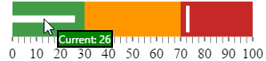
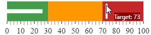
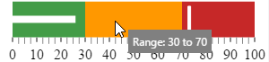

---
title: "ツールチップの構成 (igBulletGraph)"
slug: igbulletgraph-configuring-the-tooltips
---

# ツールチップの構成 (igBulletGraph)

## トピックの概要

#### 目的

このトピックではコード例を使用して、`igBulletGraph`™ コントロールのツールチップを有効にする方法および表示する遅延時間を設定する方法、カスタム ツールチップ テンプレートの作成方法、およびコード サンプルを説明します。

### 前提条件

このトピックを理解するために、以下のトピックを参照することをお勧めします。

- [*igBulletGraph* の概要](/igbulletgraph-overview): このトピックは、主要機能、最小要件およびユーザー機能性など、`igBulletGraph` コントロールの概念的な情報を提供します。

- [*igBulletGraph* の追加](/igbulletgraph-adding): このトピック グループでは、`igBulletGraph`™ コントロールを HTML ページと ASP.NET MVC アプリケーションに追加する方法を説明します。


### このトピックの内容

このトピックは、以下のセクションで構成されます。

-   [**概要**](#introduction)
    -   [ツールチップ構成の概要](#configuration-summary)
    -   [ツールチップ構成の概要表](#configuration-summary-chart)
-   [**ツールチップの有効 / 無効**](#enabling-disabling)
    -   [プロパティ設定](#enabling-disabling-property)
    -   [コード例](#enabling-disabling-example)
-   [**ツールチップ遅延の構成**](#delay)
    -   [プロパティ設定](#delay-property)
    -   [コード例](#delay-example)
-   [**パフォーマンス バーのカスタム ツールチップの構成**](#performance-bar)
    -   [概要](#performance-bar-overview)
    -   [プロパティ設定](#performance-bar-property)
    -   [例](#performance-bar-example)
-   [**比較マーカーのカスタム ツールチップの構成**](#comparative-marker)
    -   [プロパティ設定](#comparative-marker-property)
    -   [例](#comparative-marker-example)
-   [**比較範囲のカスタム ツールチップの構成**](#comparative-ranges)
    -   [プロパティ設定](#comparative-ranges-property)
    -   [例](#comparative-ranges-example)
-   [**ツールチップの構成のサンプル**](#configuring-tooltips-sample)
-   [**関連コンテンツ**](#related-content)
    -   [トピック](#topics)


## <a id="introduction"></a> 概要

#### <a id="configuration-summary"></a> ツールチップ構成の概要

`igBulletGraph` コントロールはツールチップをサポートします。ツールチップは、パフォーマンス バー、比較マーカーおよび比較範囲で指定された値を表示するように、あらかじめ設定されています。各視覚要素に対応するツールチップは、プロパティ設定で個別に設定されています。 

ツールチップの可視性 (有効 / 無効)、遅延 (ツールチップが表示されるまでのタイムアウト値が設定可能です)、値について、それぞれ設定できます。ツールチップの値はカスタム テンプレートに設定できるため、具体的なユース ケースをより詳細に示すことができます。

デフォルトでは、ツールチップは無効になっています。

### <a id="configuration-summary-chart"></a> ツールチップ構成の概要表

以下の表は、ツールチップに関する `igBulletGraph` コントロールで構成できる項目と管理に使用するプロパティをマップしています。

<table class="table table-bordered">
	<thead>
		<tr>
            <th>構成可能な項目</th>
            <th colspan="2">詳細</th>
            <th>プロパティ/イベント</th>
            <th>デフォルト値</th>
</tr>
	</thead>
	<tbody>
        <tr>
            <th>[\*\*可視性\*\*](#enabling-disabling)</th>
            <td colspan="2">\*igBulletGraph\* コントロールのツールチップを有効または無効にできます。</td>
            <td>[showToolTip](&#123;environment:jQueryApiUrl&#125;/ui.igBulletGraph#options:showToolTip)</td>
            <td>\*False\*</td>
</tr>
        <tr>
            <th>[\*\*遅延時間\*\*](#delay)</th>
            <td colspan="2">視覚要素にマウスを合わせたときにツールチップが表示されるまでのタイムアウトを、ミリ秒数単位で設定します。</td>
            <td>[showToolTipTimeout](&#123;environment:jQueryApiUrl&#125;/ui.igBulletGraph#options:showToolTipTimeout)</td>
            <td>\*500\*</td>
</tr>
        <tr>
            <th rowspan="3">値</th>
            <td rowspan="3">ツールチップ テンプレートのそれぞれのプロパティにカスタム値を設定できます。</td>
            <td>[\*\*パフォーマンス バー\*\*](#performance-bar)</td>
            <td>[valueToolTipTemplate](&#123;environment:jQueryApiUrl&#125;/ui.igBulletGraph#options:valueToolTipTemplate)</td>
            <td>[valueName](&#123;environment:jQueryApiUrl&#125;/ui.igBulletGraph#options:valueName) の初期化状態による ([\*\*パフォーマンス バーのカスタム ツールチップの構成\*\*](#performance-bar)を参照)</td>
</tr>
        <tr>
            <td>[\*\*比較マーカー\*\*](#comparative-marker)</td>
            <td>[targetValueToolTipTemplate](&#123;environment:jQueryApiUrl&#125;/ui.igBulletGraph#options:targetValueToolTipTemplate)</td>
            <td>比較マーカーで示された値</td>
</tr>
        <tr>
            <td>[\*\*比較範囲\*\*](#comparative-ranges)</td>
            <td>[rangeToolTipTemplate](&#123;environment:jQueryApiUrl&#125;/ui.igBulletGraph#options:rangeToolTipTemplate)</td>
            <td>ハイフン (-) で区切られた範囲の開始値と終了値です。</td>
</tr>
    </tbody>
</table>


> **注: **デフォルトのツールチップ テンプレートを変更して、それぞれの視覚要素に異なる値をバインドするには、テンプレートの $&#123;Item.Property&#125; 構文を使用する必要があります。


## <a id="enabling-disabling"></a> ツールチップの有効 / 無効

`igBulletGraph` のツールチップを、表示または非表示 (デフォルト設定) にします。

### <a id="enabling-disabling-property"></a> プロパティ設定

以下の表は、要求ビヘイビアーをプロパティ設定にマップしています。

目的:|使用するプロパティ:|設定の選択肢:
---|---|---
ツールチップの表示|[showToolTip](&#123;environment:jQueryApiUrl&#125;/ui.igBulletGraph#options:showToolTip)|true
ツールチップの非表示|[showToolTip](&#123;environment:jQueryApiUrl&#125;/ui.igBulletGraph#options:showToolTip)|false


### <a id="enabling-disabling-example"></a> コード例

以下のコード例はツールチップを表示します:

**JavaScript の場合:**

```js
$("#bulletgraph").igBulletGraph({
                …
                showToolTip: true
});
```


## <a id="delay"></a> ツールチップ遅延の構成
視覚要素がホバーされてからマウスツールチップが表示されるまでの遅延を設定できます。デフォルト値は 500 ミリ秒です。

### <a id="delay-property"></a> プロパティ設定

以下の表は、要求ビヘイビアーをプロパティ設定にマップしています。

目的:|使用するプロパティ:|設定の選択肢:
---|---|---
ツールチップが表示される前の初期遅延の設定|[showToolTipTimeout](&#123;environment:jQueryApiUrl&#125;/ui.igBulletGraph#options:showToolTipTimeout)|任意の値 (ミリ秒)


### <a id="delay-example"></a> コード例

以下のコード例では、ツールチップの遅延として 2000 ミリ秒を設定します:

**JavaScript の場合:**

```js
$("#bulletgraph").igBulletGraph({
                …
                showToolTip: true,
                showToolTipTimeout: 2000
});
```


## <a id="performance-bar"></a> パフォーマンス バーのカスタム ツールチップの構成

### <a id="performance-bar-overview"></a> 概要

ツールチップの既定値は、[`valueName`](&#123;environment:jQueryApiUrl&#125;/ui.igBulletGraph#options:valueName) プロパティが初期化されているかどうかにより事前に設定されます。

`valueName` プロパティが初期化されている場合は、ツールチップ プロパティのデフォルト書式は以下のようになります。

```
<valueName> : <value>
```

`valueName` プロパティが初期化されていない場合は、ツールチップのデフォルト書式は次のようになります。

```
<value>
```

ツールチップで表示されるデータとそのルック アンド フィールの両方またはいずれか一方を変更するには、カスタム テンプレートで設定します。

### <a id="performance-bar-property"></a> プロパティ設定

以下の表では、任意の動作と各プロパティ設定のマップを示します。

目的:|使用するプロパティ:|設定の選択肢:
---|---|---
パフォーマンス バーのカスタム ツールチップの設定|[valueToolTipTemplate](&#123;environment:jQueryApiUrl&#125;/ui.igBulletGraph#options:valueToolTipTemplate) |必要なテンプレートの ID。


### <a id="performance-bar-example"></a> 例

以下のスクリーンショットは、以下の設定の結果、`igBulletGraph` パフォーマンス バーのツールチップの外観がどのようになるか示しています。

プロパティ|値
---|---
[valueToolTipTemplate](&#123;environment:jQueryApiUrl&#125;/ui.igBulletGraph#options:valueToolTipTemplate)|"valueToolTipTemplate" 
"valueToolTipTemplate" はテンプレートの ID です。

**HTML の場合:**

```html
<script id="valueToolTipTemplate" type="text/x-jquery-tmpl">
    <span style="background: green; border:black solid 2px; color:white">Current: ${item.value}</span>
</script>
```




以下のコードはこの例を実装します。

**HTML の場合:**

```html
<script id="valueToolTipTemplate" type="text/x-jquery-tmpl">
    <span style="background: green; border:black solid 2px; color:white">Current: ${item.value}</span>
</script>
<script type="text/javascript">
    $(function () {
        $("#bulletgraph").igBulletGraph({
            showToolTip: true,
            valueToolTipTemplate: "valueToolTipTemplate"
            …
        });
    });
</script>
```


## <a id="comparative-marker"></a> 比較マーカーのカスタム ツールチップの構成

比較マーカーのツールチップは、値についてはデフォルトのシステム フォントを使用し、またコントロールの外観についてはデフォルトのスタイル設定で表示されます。カスタム設定の場合、ツールチップの値をカスタム テンプレートで設定します。

### <a id="comparative-marker-property"></a> プロパティ設定

以下の表では、任意の動作と各プロパティ設定のマップを示します。

目的:|使用するプロパティ:|設定の選択肢:
---|---|---
比較マーカーのカスタム ツールチップの構成|[targetValueToolTipTemplate](&#123;environment:jQueryApiUrl&#125;/ui.igBulletGraph#options:targetValueToolTipTemplate) |必要なテンプレートの ID。


### <a id="comparative-marker-example"></a> 例

以下のコードは、以下の設定の結果、比較マーカーのツールチップに値がどのように表示されるか示しています。

プロパティ|値
---|---
[targetValueToolTipTemplate](&#123;environment:jQueryApiUrl&#125;/ui.igBulletGraph#options:targetValueToolTipTemplate)|"targetValueToolTipTemplate" 

"targetValueToolTipTemplate" はテンプレートの ID です。

**HTML の場合:**

```html
<script id="targetValueToolTipTemplate" type="text/x-jquery-tmpl">
    <span style="background: darkred;color:white">Target: ${item.value}</span>
</script>
```




以下のコードはこの例を実装します。

**HTML の場合:**

```html
<script id="targetValueToolTipTemplate" type="text/x-jquery-tmpl">
    <span style="background: darkred;color:white">Target: ${item.value}</span>
</script>
<script type="text/javascript">
    $(function () {
        $("#bulletgraph").igBulletGraph({
            showToolTip: true,
            targetValueToolTipTemplate: "targetValueToolTipTemplate",
            …
        });
    });
</script>
```


## <a id="comparative-ranges"></a> 比較範囲のカスタム ツールチップの構成

比較範囲のツールチップはデフォルトで、マウスでホバーしている範囲が厳密には範囲内ではない場合でも、区切り文字にハイフンを使用して範囲の開始値と終了値 (例：0 - 34) を表示します。事前に設定されている内容を変更するには、カスタム テンプレートを設定します。


### <a id="comparative-ranges-property"></a> プロパティ設定

以下の表では、任意の動作と各プロパティ設定のマップを示します。

目的:|使用するプロパティ:|設定の選択肢:
--|--|--
比較範囲のカスタム ツールチップの構成|[rangeToolTipTemplate](&#123;environment:jQueryApiUrl&#125;/ui.igBulletGraph#options:rangeToolTipTemplate)|必要なテンプレートの ID。


### <a id="comparative-ranges-example"></a> 例

以下のスクリーンショットは、以下の設定の結果、比較範囲のツールチップで示される値がどのように表示されるか示しています。

プロパティ|値
---|---
[rangeToolTipTemplate](&#123;environment:jQueryApiUrl&#125;/ui.igBulletGraph#options:rangeToolTipTemplate)|"rangeToolTipTemplate" 

"rangeToolTipTemplate" はテンプレートの ID です。

**HTML の場合:**

```html
<script id="rangeToolTipTemplate" type="text/x-jquery-tmpl">
    <span style="padding:5px; background: grey;color: white">Range: ${item.startValue} to ${item.endValue}</span>
</script>
```




以下のコードはこの例を実装します。

**HTML の場合:**

```html
<script id="rangeToolTipTemplate" type="text/x-jquery-tmpl">
    <span style="padding:5px; background: grey;color: white">Range: ${item.startValue} to ${item.endValue}</span>
</script>
<script type="text/javascript">
    $(function () {
        $("#bulletgraph").igBulletGraph({
            showToolTip: true,
            targetValueToolTipTemplate: "targetValueToolTipTemplate",
            valueToolTipTemplate: "valueToolTipTemplate",
            rangeToolTipTemplate: 'rangeToolTipTemplate',
            value: 26,
            targetValue: 73,
            height: "70px",
            width: "300px",
            ranges: [
                {
                    name: 'bad',
                    startValue: 0,
                    endValue: 30
                },
                {
                    name: 'acceptable',
                    startValue: 30,
                    endValue: 70
                },
                {
                    name: 'good',
                    startValue: 70,
                    endValue: 100
                }]
        });
    });
</script>
```

## <a id="configuring-tooltips-sample"></a> ツールチップの構成のサンプル

このサンプルは、以上に説明したカスタム ツールチップをすべて結合する方法を紹介します。[パフォーマンス バー](&#123;environment:jQueryApiUrl&#125;/ui.igbulletgraph#options:valueToolTipTemplate)、[比較マーカー](&#123;environment:jQueryApiUrl&#125;/ui.igbulletgraph#options:targetValueToolTipTemplate)、および[範囲](&#123;environment:jQueryApiUrl&#125;/ui.igbulletgraph#options:rangeToolTipTemplate)のツールチップが可能なすべての構成領域にテンプレートを含みます。 
最初の `igBulletGraph` が開発タスクの視覚化のために使用され、デフォルト ツールチップが options API によって有効にして構成されます。品質保証タスクを視覚化する第 2 のグラフはカスタム ツールチップ テンプレートを使用し、主な領域にホバーすると、外観がカスタマイズされます。

サンプルで、このタスクは 3 週間で同時に実行されますが、開発に他のタスク以上の時間が費やされました。進行状況バーは、タスク完了の可能性を表す状態範囲 (「高」、「中」、「低」) を表します。
  
<div class="embed-sample">
   [&#123;environment:SamplesEmbedUrl&#125;/bullet-graph/tooltip-settings](&#123;environment:SamplesEmbedUrl&#125;/bullet-graph/tooltip-settings)
</div>

## <a id="related-content"></a> 関連コンテンツ

### <a id="topics"></a> トピック

このトピックの追加情報については、以下のトピックも合わせてご参照ください。

- [スケールの構成 (*igBulletGraph*)](/igbulletgraph-configuring-the-scale): このトピックではコード例を使用して、igBulletGraph コントロールのスケールを構成する方法を説明します。説明には、コントロール内のスケールの配置、スケールの目盛およびラベルの構成が含まれます。

- [パフォーマンス バーの構成 (*igBulletGraph*)](/igbulletgraph-configuring-the-performance-bar): このトピックではコード例を使用して、igBulletGraph コントロールのパフォーマンス バーを構成する方法を説明します。説明には、バーが示す値、幅、位置、および書式設定が含まれます。

- [比較マーカーの構成 (*igBulletGraph*)](/igbulletgraph-configuring-the-comparative-marker): このトピックではコード例を使用して、`igBulletGraph` コントロールの比較目盛マーカーを構成する方法を説明します。説明には、マーカーの値、幅、および書式設定が含まれます。

- [比較範囲の構成 (*igBulletGraph*)](/igbulletgraph-configuring-comparative-ranges): このトピックではコード例を使用して、`igBulletGraph` コントロールの範囲を構成する方法を説明します。説明には、範囲の数、位置、長さ、幅、および書式設定が含まれます。

- [背景の構成 (*igBulletGraph*)](/igbulletgraph-configuring-the-background): このトピックではコード例を使用して、ブレット グラフの背景を構成する方法を説明します。説明には、背景のサイズ、位置、色、および境界線の設定が含まれます。


 

 


