---
title: "igBulletGraph の概要"
slug: igbulletgraph-overview
---

# igBulletGraph の概要

## トピックの概要

#### 目的

このトピックは、主要機能、最小要件およびユーザー機能性など、`igBulletGraph`™ コントロールの概念的な情報を提供します。

#### 前提条件

このトピックを理解するためには、以下の概念を理解しておく必要があります。

-   [ブレット グラフ](http://www.perceptualedge.com/articles/misc/Bullet_Graph_Design_Spec.pdf)

#### このトピックの内容

このトピックは、以下のセクションで構成されます。

-   [**概要**](#Introduction)
    -   [igBulletGraph の概要](#summary)
-   [**主要機能**](#main-features)
-   [**論理領域と構成可能な視覚要素の概要**](#areas-elements)
    -   [論理領域](#logical-areas)
    -   [構成可能な視覚要素](#configurable-visual-elements)
-   [**構成可能な視覚要素および関連プロパティ**](#configurable-visual-elements-properties)
    -   [構成可能な視覚要素および関連プロパティの概要](#configurable-visual-elements-properties-summary)
    -   [スケール](#scale)
    -   [パフォーマンス バー](#performance-bar)
    -   [比較マーカー](#comparative-marker)
    -   [比較範囲](#comparative-ranges)
    -   [背景](#background)
    -   [ツールチップ](#tooltips)
-   [**デフォルトの構成**](#default-configuration)
-   [**要件**](#requirements)
-   [**関連コンテンツ**](#related-countent)
    -   [トピック](#related-topics)
    -   [サンプル](#related-samples)
    -   [リソース](#related-resource)

## 概要

#### igBulletGraph の概要

`igBulletGraph` コントロールは、データをブレット グラフ形式で視覚化する **&#123;environment:ProductName&#125;**™ コントロールです。このコントロールはリニアのデザインで、複数の他のメジャーと比較した主要なメジャーをシンプルで簡潔に表示します。

igBulletGraph コントロールは、魅力的なデータ表現を作成するための機能を提供します。ダッシュボードで使用されるメーターやゲージを、シンプルでなおかつ直感的で明解な棒チャートに置き換えます。ブレット グラフは、水平または垂直のわずかな領域で、ゴールに至る進捗、評価の範囲、複数の測定比較を表現するための最も効率的で効果的な方法の 1 つです。

##  主要機能

igBulletGraph の機能には構成可能な向きや方向、視覚要素やツールチップなどがあります。このコントロールには、アニメーション化されたトランジションのサポートも組み込まれています。

### 構成可能な向きと方向

igBulletGraph コントロールでは、スケールの向きと方向の状態を設定する API が公開され、グラフの外観を大幅にカスタマイズすることができます。(詳細は、[向きと方向の構成 (*igBulletGraph*)](/igbulletgraph-configuring-the-orientation-and-direction) のトピックを参照してください。)

### 構成可能な視覚要素

ブレット グラフの各[視覚要素](/igbulletgraph-overview#configurable-visual-elements-properties-summary)は、さまざまな形で構成できます。(詳細は、[*igBulletGraph* の構成可能な視覚要素と関連プロパティ](#configurable-visual-elements-properties)を参照してください。)

### アニメーション化されたトランジション

igBulletGraph コントロールには、その [transitionDuration](&#123;environment:jQueryApiUrl&#125;/ui.igBulletGraph#options) プロパティによるアニメーションの組み込みサポートが提供されています。アニメーション結果は、コントロールの読み込みで再生し、プロパティの値が変更するときにも再生します。デフォルトで、アニメーション化されたトランジションは無効になっています。ミリ秒単位で値を設定できるコントロールの transitionDuration プロパティにより、ビューでコントロールをスワイプする時間枠を定義します。視覚要素は左下から右上に移動するスライド効果によって、すべて滑らかに表示されます。値を 0 に設定するとアニメーション トランジションが無効になります。アニメーション化されたトランジション効果を示すサンプルは、[アニメーション化されたトランジション](&#123;environment:SamplesUrl&#125;/bullet-graph/animated-transitions)のサンプルを参照してください。

### ツールチップのサポート

igBulletGraph コントロールに組み込まれたツールチップは、パフォーマンス バーを作成するための値、異なる範囲に対応したターゲット値またはそれぞれの値を示します。コントロールのデフォルト ルックに合わせて初期スタイル設定がされていますが、その外観はテンプレートでカスタマイズできます。デフォルトでは、ツールチップは無効になっています。(詳細は、[ツールチップの構成 (*igBulletGraph*)](/igbulletgraph-configuring-the-tooltips) を参照してください)

##  論理領域と構成可能な視覚要素の概要

###  論理領域

igBulletGraph コントロールの表示領域は、論理的にグラフ領域と予約領域に分割されます。

水平方向|垂直方向
---------------------- | --------------------
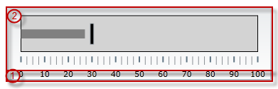 | 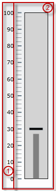

-   予約領域 (1) - この領域は以下のように展開します。
    -   スケールに沿う － 予約領域はコントロールの端で開始され、コントロールの端で終了します。
    -   スケール全域:
        -   水平方向: 予約領域は、コントロールの下端から開始され、ラベルのフォントのサイズなどの書式設定に従い、番号ラベルと同じ高さまで上に広がります。
        -   垂直方向: 予約領域は、コントロールの左端から開始され、スケール測定番号の大きさおよびラベルのフォントのサイズなどの書式設定に従い、番号ラベルと同じ幅まで右に広がります。

予約領域の主な目的は、スケールの番号ラベルに対して、水平方向にも垂直方向にも十分なスペースを与えることにあります。(方向が変化した場合、番号ラベルを表示するための各方向へのスペース要求に対応するために、予約領域はサイズを自動的に調整します。水平方向ではラベルの高さ、垂直方向では最大幅に合わせます。)これは、必ずしも番号ラベルを予約領域に配置する必要があることを意味しません。実際、ラベル行はスケール全域で、[グラフ領域](/igbulletgraph-overview#areas-elements)内のどこにでも配置できます。しかし、ラベル行を予約領域の外に配置しても、予約領域自体のスプレッドおよび位置にはまったく影響はありません。予約領域は変化せず、番号ラベルの高さと幅により (方向に従い) 決定されます。

さらに予約領域が重要なのは、内側の端がスケール全体のディメンションにおいて[グラフ領域](/igbulletgraph-overview#areas-elements)の最初の端を特定する点です。この端が、スケール全域に[視覚要素](/igbulletgraph-overview#configurable-visual-elements-properties-summary)の一部を配置する範囲関連プロパティの参照マークの役割を果たします。(最も一般的な場合、これらのプロパティの正の値は視覚要素を[グラフ領域](/igbulletgraph-overview#areas-elements)の内部に置き、負の値は視覚要素を予約領域の内部に配置します。)

-   グラフ領域 (2) - ブレット グラフのパフォーマンス バー、目盛、範囲、およびオプションで番号ラベルを表示する領域です。ラベルを除く視覚要素の範囲関連のプロパティはすべて、その端に対して測定されます。グラフ領域は、プレースホルダーではなくコントロール内部にスケールを配置する (正確には、スケールの[視覚要素](/igbulletgraph-overview#configurable-visual-elements-properties-summary)を配置する) 参照フレームとして役割を果たします。

グラフ領域のスプレッド:

-   スケールに沿う - グラフ領域はコントロールの開始位置 (水平方向の左端または垂直方向の下端) から開始され、その終了位置（水平方向の右端または垂直方向の上端）で終了します。スケールの開始位置および終了位置はどちらも、グラフ領域の始点側の端に対して測定されます。
-   スケール全域 - グラフ領域は、[予約領域](/igbulletgraph-overview#areas-elements)の端 (水平方向でグラフ領域の下端または垂直方向でグラフ領域の左端) から開始されます。予約領域の境界線で接しているグラフ領域の端は、スケールの一部の視覚要素の範囲関連プロパティに対する、スケール全域に視覚要素を配置するための参照点としての役割を果たします。

###  構成可能な視覚要素

igBulletGraph コントロールは、以下の視覚要素が特徴です(下の図を参照)。

-   パフォーマンス バー (3) - コントロールにより表示される主要なメジャーで、バーとして視覚化されます。
-   比較マーカー (4) - パフォーマンス バー メジャーの比較評価。パフォーマンス バーの向きに対して直角に交わるマーカーとして表示されます。
-   比較範囲 (5) - 範囲は、スケール上で指定した値の領域を強調表示する視覚的な要素です。その目的は、パフォーマンス バー メジャーの質的状態を視覚で伝えると同時に、その状態をレベルとして示すことにあります。
-   目盛 (6) - 目盛は、ブレット グラフを読み取りやすくするために、目盛の間隔でスケールを分割して見せる役割を果たします。
    -    主目盛 - 主目盛は、スケールの主要な区切りとして使用されます。表示間隔、範囲、およびスタイルは、対応するプロパティを設定し制御できます。
    -   補助目盛 - 補助目盛は主目盛を補助し、スケールの数値を読み取りやすくするために追加して使用します。主目盛と同じ方法でカスタマイズできます。
-   スケール ラベル (7) - このラベルはスケールのメジャーを示します。
-   境界線 (8) - コントロールのディメンションを視覚的に区切る線です。
-   背景 (9) - 視覚要素が配置された背景の色を設定できます。

-   ツールチップ - パフォーマンス バーを作成するための値、異なる範囲に対応したターゲット値またはそれぞれの値を示します。

## 構成可能な視覚要素および関連プロパティ

### 構成可能な視覚要素および関連プロパティの概要

各要素は複数の項目で構成することができます。

以下の表は、*igBulletGraph* コントロールの視覚要素で構成できる項目を示します。構成できる項目の詳細は、この表の次に示す各視覚要素の説明で、図および構成するプロパティと一緒に参照できます。

| 視覚要素 | 構成できる主な項目 |
| --- | --- |
| [スケール](#scale) | 位置 目盛 ラベル |
| [パフォーマンス バー](#performance-bar) | 表示値 幅と位置 ルック アンド フィール |
| [比較マーカー](#comparative-marker) | 表示値 幅 ルック アンド フィール |
| [比較範囲](#comparative-ranges) | グラフに表示する範囲の数値 長さ、幅、位置 ルック アンド フィール |
| [背景](#background) | サイズと位置 ルック アンド フィール |
| [ツールチップ](#tooltips) | 表示遅延 |

### スケール

以下の図は、下の表にリストされたスケール関連の範囲を示しています。

グラフ領域内でスケールを配置する範囲|ラベルの位置を設定する範囲
---|---
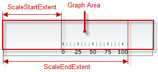 | 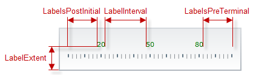

スケールに沿って主目盛を設定する範囲|スケール全域で主目盛を設定する範囲
-----------|--------------
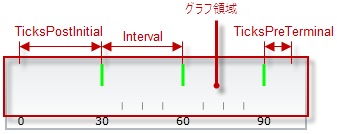 | 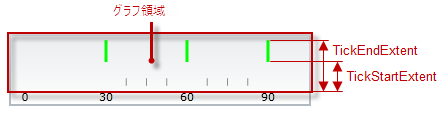

|スケール全域で補助目盛を設定する範囲|
|-------------|
|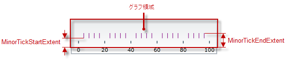|

以下の表は、ブレット グラフのスケールの構成できる項目を示し、管理に使用する `igBulletGraph` プロパティにマップします。

<table class="table table-bordered">
	<tbody>
		<tr>
            <th colspan="4">構成可能な要素</th>
            <th>プロパティ</th>
            <th>デフォルト値</th>
</tr>
        <tr>
            <th rowspan="2" colspan="4">\*\*位置\*\*</th>
            <td>[scaleStartExtent](&#123;environment:jQueryApiUrl&#125;/ui.igBulletGraph#options:scaleStartExtent)</td>
            <td>0.05</td>
</tr>
        <tr>
            <td>[scaleEndExtent](&#123;environment:jQueryApiUrl&#125;/ui.igBulletGraph#options:scaleEndExtent)</td>
            <td>0.95</td>
</tr>
        <tr>
            <th rowspan="2" colspan="2">\*\*範囲と値\*\*</th>
            <th colspan="2">\*\*最大値\*\*</th>
            <td>[minimumValue](&#123;environment:jQueryApiUrl&#125;/ui.igBulletGraph#options:minimumValue)</td>
            <td>0</td>
</tr>
        <tr>
            <th colspan="2">\*\*最小値\*\*</th>
            <td>[maximumValue](&#123;environment:jQueryApiUrl&#125;/ui.igBulletGraph#options:maximumValue)</td>
            <td>100</td>
</tr>
        <tr>
            <th rowspan="12">\*\*目盛\*\*</th>
            <th rowspan="7">\*\*主目盛\*\*</th>
            <th rowspan="5" colspan="2">スケール内の位置、スペースおよび長さ</th>
            <td>[interval](&#123;environment:jQueryApiUrl&#125;/ui.igBulletGraph#options:interval)</td>
            <td>設定されていません</td>
</tr>
        <tr>
            <td>[ticksPostInitial](&#123;environment:jQueryApiUrl&#125;/ui.igBulletGraph#options:ticksPostInitial)</td>
            <td>0</td>
</tr>
        <tr>
            <td>[ticksPreTerminal](&#123;environment:jQueryApiUrl&#125;/ui.igBulletGraph#options:ticksPreTerminal)</td>
            <td>0</td>
</tr>

        <tr>
            <td>[tickStartExtent](&#123;environment:jQueryApiUrl&#125;/ui.igBulletGraph#options:tickStartExtent)</td>
            <td>0.02</td>
</tr>
        <tr>
            <td>[tickEndExtent](&#123;environment:jQueryApiUrl&#125;/ui.igBulletGraph#options:tickEndExtent)</td>
            <td>0.2</td>
</tr>
        <tr>
            <th rowspan="2">\*\*ルック アンド フィール\*\*</th>
            <th>色</th>
            <td>[tickBrush](&#123;environment:jQueryApiUrl&#125;/ui.igBulletGraph#options:tickBrush)</td>
            <td>デフォルトのテーマで定義済み</td>
</tr>
        <tr>
            <th>幅</th>
            <td>[tickStrokeThickness](&#123;environment:jQueryApiUrl&#125;/ui.igBulletGraph#options:tickStrokeThickness)</td>
            <td>2.0</td>
</tr>
        <tr>
            <th rowspan="5">\*\*補助目盛\*\*</th>
            <th colspan="2">隣接する 2 つの主目盛間の\*\*数値\*\*</th>
            <td>[minorTickCount](&#123;environment:jQueryApiUrl&#125;/ui.igBulletGraph#options:minorTickCount)</td>
            <td>3.0</td>
</tr>
        <tr>
            <th rowspan="2" colspan="2">\*\*位置\*\*</th>
            <td>[minorTickStartExtent](&#123;environment:jQueryApiUrl&#125;/ui.igBulletGraph#options:minorTickStartExtent)</td>
            <td>0.06</td>
</tr>
        <tr>
            <td>[minorTickEndExtent](&#123;environment:jQueryApiUrl&#125;/ui.igBulletGraph#options:minorTickEndExtent)</td>
            <td>0.2</td>
</tr>
        <tr>
            <th rowspan="2">\*\*ルック アンド フィール\*\*</th>
            <th>色</th>
            <td>[minorTickBrush](&#123;environment:jQueryApiUrl&#125;/ui.igBulletGraph#options:minorTickBrush)</td>
            <td>デフォルトのテーマで定義済み</td>
</tr>

        <tr>
            <th>幅</th>
            <td>[minorTickStrokeThickness](&#123;environment:jQueryApiUrl&#125;/ui.igBulletGraph#options:minorTickStrokeThickness)</td>
            <td>1.0</td>
</tr>
        <tr>
            <th rowspan="7">\*\*ラベル\*\*</th>
            <th rowspan="4" colspan="3">\*\*位置とスペース\*\*</th>
            <td>[labelExtent](&#123;environment:jQueryApiUrl&#125;/ui.igBulletGraph#options:labelExtent)</td>
            <td>0</td>
</tr>
        <tr>
            <td>[labelInterval](&#123;environment:jQueryApiUrl&#125;/ui.igBulletGraph#options:labelInterval)</td>
            <td>設定されていません</td>
</tr>
        <tr>
            <td>[labelsPostInitial](&#123;environment:jQueryApiUrl&#125;/ui.igBulletGraph#options:labelsPostInitial)</td>
            <td>0</td>
</tr>
        <tr>
            <td>[labelsPreTerminal](&#123;environment:jQueryApiUrl&#125;/ui.igBulletGraph#options:labelsPreTerminal)</td>
            <td>0</td>
</tr>
        <tr>
            <th colspan="3">\*\*数値書式\*\*</th>
            <td>[labelFormat](&#123;environment:jQueryApiUrl&#125;/ui.igBulletGraph#options:labelFormat)</td>
            <td>設定されていません</td>
</tr>
        <tr>
            <th rowspan="2" colspan="2">ルック アンド フィール</th>
            <th>色</th>
            <td>[fontBrush](&#123;environment:jQueryApiUrl&#125;/ui.igBulletGraph#options:fontBrush)</td>
            <td>デフォルトのテーマで定義済み</td>
</tr>
        <tr>
            <th>フォント</th>
            <td>[font](&#123;environment:jQueryApiUrl&#125;/ui.igBulletGraph#options:font)</td>
            <td>デフォルトのテーマで定義済み</td>
</tr>
    </tbody>
</table>

#### 関連トピック

-   [スケールの構成 (*igBulletGraph*)](/igbulletgraph-configuring-the-scale)

### パフォーマンス バー

以下の図は、下の表にリストされたパフォーマンス バー関連の範囲を示しています。

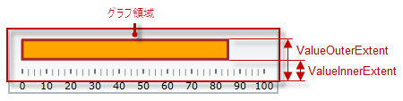

以下の表は、ブレット グラフのパフォーマンス バーの構成できる項目を示し、管理に使用する `igBulletGraph` プロパティにマップします。

<table class="table table-bordered">
	<tbody>
		<tr>
            <th colspan="2">\*\*構成可能な要素\*\*</th>
            <th>プロパティ</th>
            <th>デフォルト値</th>
</tr>
        <tr>
            <th colspan="2">\*\*名前\*\*</th>
            <td>[valueName](&#123;environment:jQueryApiUrl&#125;/ui.igBulletGraph#options:valueName)</td>
            <td>設定されていません</td>
</tr>
        <tr>
            <th colspan="2">\*\*表示する値\*\*</th>
            <td>[value](&#123;environment:jQueryApiUrl&#125;/ui.igBulletGraph#options:value)</td>
            <td>設定されていません</td>
</tr>
        <tr>
            <th rowspan="2" colspan="2">\*\*幅と位置\*\*</th>
            <td>[valueInnerExtent](&#123;environment:jQueryApiUrl&#125;/ui.igBulletGraph#options:valueInnerExtent)</td>
            <td>\*0.5\*</td>
</tr>
        <tr>
            <td>[valueOuterExtent](&#123;environment:jQueryApiUrl&#125;/ui.igBulletGraph#options:valueOuterExtent)</td>
            <td>\*0.65\*</td>
</tr>
        <tr>
            <th rowspan="3">\*\*ルック アンド フィール\*\*</th>
            <th>塗りつぶし色</th>
            <td>[valueBrush](&#123;environment:jQueryApiUrl&#125;/ui.igBulletGraph#options:valueBrush)</td>
            <td>デフォルトのテーマで定義済み</td>
</tr>
        <tr>
            <th>境界線の色</th>
            <td>[valueOutline](&#123;environment:jQueryApiUrl&#125;/ui.igBulletGraph#options:valueOutline)</td>
            <td>デフォルトのテーマで定義済み</td>
</tr>
        <tr>
            <th>境界線の線幅</th>
            <td>[valueStrokeThickness](&#123;environment:jQueryApiUrl&#125;/ui.igBulletGraph#options:valueStrokeThickness)</td>
            <td>\*1.0\*</td>
</tr>
        <tr>
            <th colspan="2">\*\*ツールチップ\*\*</th>
            <td>[valueToolTip](&#123;environment:jQueryApiUrl&#125;/ui.igBulletGraph#options:valueToolTip)</td>
            <td>[valueName](&#123;environment:jQueryApiUrl&#125;/ui.igBulletGraph#options:valueName) の初期化状態による</td>
</tr>
    </tbody>
</table>

#### 関連トピック

-   [パフォーマンス バーの構成 (*igBulletGraph*)](/igbulletgraph-configuring-the-performance-bar)

### 比較マーカー

以下の図は、下の表にリストされた比較マーカー関連の範囲を示しています。

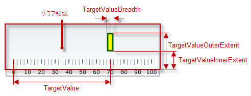

以下の表は、ブレット グラフの比較マーカーの構成できる項目を示し、管理に使用する `igBulletGraph` プロパティにマップします。

<table class="table table-bordered">
    <tbody>
		<tr>
            <th colspan="2">構成可能な要素</th>
            <th>プロパティ</th>
            <th>デフォルト値</th>
</tr>
        <tr>
            <th colspan="2">\*\*表示値\*\*</th>
            <td>[targetValue](&#123;environment:jQueryApiUrl&#125;/ui.igBulletGraph#options:targetValue)</td>
            <td>設定されていません</td>
</tr>
        <tr>
            <th colspan="2">\*\*幅\*\*</th>
            <td>[targetValueBreadth](&#123;environment:jQueryApiUrl&#125;/ui.igBulletGraph#options:targetValueBreadth)</td>
            <td>\*3.0\*</td>
</tr>
        <tr>
            <th rowspan="3">\*\*ルック アンド フィール\*\*</th>
            <th>塗りつぶし色</th>
            <td>[targetValueBrush](&#123;environment:jQueryApiUrl&#125;/ui.igBulletGraph#options:targetValueBrush)</td>
            <td>デフォルトのテーマで定義済み</td>
</tr>
        <tr>
            <th>境界線の色</th>
            <td>[targetValueOutline](&#123;environment:jQueryApiUrl&#125;/ui.igBulletGraph#options:targetValueOutline)</td>
            <td>デフォルトのテーマで定義済み</td>
</tr>
        <tr>
            <th>境界線の線幅</th>
            <td>[targetValueStrokeThickness](&#123;environment:jQueryApiUrl&#125;/ui.igBulletGraph#options:targetValueStrokeThickness)</td>
            <td>\*1.0\*</td>
</tr>
    </tbody>
</table>

#### 関連トピック

-   [比較マーカーの構成 (*igBulletGraph*)](/igbulletgraph-configuring-the-comparative-marker)

### 比較範囲

以下の図は、下の表にリストされた比較範囲関連の範囲を示しています。

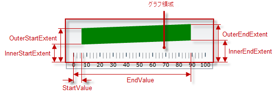

以下の表は、ブレット グラフの比較範囲の構成できる項目を示し、管理に使用する `igBulletGraph` プロパティにマップします。

<table class="table table-bordered">
    <tbody>
        <tr>
            <th colspan="2">構成可能な要素</th>
            <th>プロパティ</th>
            <th>デフォルト値</th>
</tr>
        <tr>
            <th colspan="2">グラフに表示する範囲の\*\*数値\*\*</th>
            <td>[ranges](&#123;environment:jQueryApiUrl&#125;/ui.igBulletGraph#options:ranges)</td>
            <td>設定されていません</td>
</tr>
        <tr>
            <th rowspan="6" colspan="2">\*\*長さ、幅、位置\*\*</th>
            <td>[startValue](&#123;environment:jQueryApiUrl&#125;/ui.igBulletGraph#options:startValue)</td>
            <td>設定されていません</td>
</tr>
        <tr>
            <td>[endValue](&#123;environment:jQueryApiUrl&#125;/ui.igBulletGraph#options:endValue)</td>
            <td>設定されていません</td>
</tr>
        <tr>
            <td>[innerStartExtent](&#123;environment:jQueryApiUrl&#125;/ui.igBulletGraph#options:innerStartExtent)</td>
            <td>設定されていません</td>
</tr>
        <tr>
            <td>[innerEndExtent](&#123;environment:jQueryApiUrl&#125;/ui.igBulletGraph#options:innerEndExtent)</td>
            <td>設定されていません</td>
</tr>
        <tr>
            <td>[outerStartExtent](&#123;environment:jQueryApiUrl&#125;/ui.igBulletGraph#options:outerStartExtent)</td>
            <td>設定されていません</td>
</tr>
        <tr>
            <td>[outerEndExtent](&#123;environment:jQueryApiUrl&#125;/ui.igBulletGraph#options:outerEndExtent)</td>
            <td>設定されていません</td>
</tr>
        <tr>
            <th rowspan="3">\*\*ルック アンド フィール\*\*</th>
            <th>塗りつぶし色</th>
            <td>[brush](&#123;environment:jQueryApiUrl&#125;/ui.igBulletGraph#options:brush)</td>
            <td>デフォルトのテーマで定義済み</td>
</tr>
        <tr>
            <th>境界線の色</th>
            <td>[outline](&#123;environment:jQueryApiUrl&#125;/ui.igBulletGraph#options:outline)</td>
            <td>デフォルトのテーマで定義済み</td>
</tr>
        <tr>
            <th>境界線の線幅</th>
            <td>[strokeThickness](&#123;environment:jQueryApiUrl&#125;/ui.igBulletGraph#options:strokeThickness)</td>
            <td>\*1.0\*</td>
</tr>
        <tr>
            <th colspan="2">\*\*ツールチップ\*\*</th>
            <td>[rangeToolTip](&#123;environment:jQueryApiUrl&#125;/ui.igBulletGraph#options:rangeToolTip)</td>
            <td>ハイフン (-) で区切られた範囲の開始値と終了値です。</td>
</tr>
    </tbody>
</table>

#### 関連トピック

-   [比較範囲の構成 (*igBulletGraph*)](/igbulletgraph-configuring-comparative-ranges)

### 背景

以下の図は、下の表にリストされた背景関連の範囲を示しています。

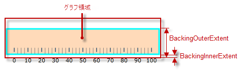

以下の表は、ブレット グラフの背景の構成できる項目を示し、管理に使用する `igBulletGraph` プロパティにマップします。

<table class="table table-bordered">
    <tbody>
        <tr>
            <th colspan="2">構成可能な要素</th>
            <th>プロパティ</th>
            <th>デフォルト値</th>
</tr>
        <tr>
            <th rowspan="2" colspan="2">スケール全域の\*\*スプレッドおよび位置\*\*</th>
            <td>[backingInnerExtent](&#123;environment:jQueryApiUrl&#125;/ui.igBulletGraph#options:backingInnerExtent)</td>
            <td>\*0\*</td>
</tr>
        <tr>
            <td>[backingOuterExtent](&#123;environment:jQueryApiUrl&#125;/ui.igBulletGraph#options:backingOuterExtent)</td>
            <td>\*1.0\*</td>
</tr>
        <tr>
            <th rowspan="3">\*\*ルック アンド フィール\*\*</th>
            <th>色</th>
            <td>[backingBrush](&#123;environment:jQueryApiUrl&#125;/ui.igBulletGraph#options:backingBrush)</td>
            <td>デフォルトのテーマで定義済み</td>
</tr>
        <tr>
            <th>境界線の色</th>
            <td>[backingOutline](&#123;environment:jQueryApiUrl&#125;/ui.igBulletGraph#options:backingOutline)</td>
            <td>デフォルトのテーマで定義済み</td>
</tr>
        <tr>
            <th>境界線の線幅</th>
            <td>[backingStrokeThickness](&#123;environment:jQueryApiUrl&#125;/ui.igBulletGraph#options:backingStrokeThickness)</td>
            <td>\*2.0\*</td>
</tr>
    </tbody>
</table>

#### 関連トピック

-   [背景の構成 (*igBulletGraph*)](/igbulletgraph-configuring-the-background)

### ツールチップ

以下の表は、ツールチップに関する `igBulletGraph` コントロールで構成できる項目と管理に使用するプロパティをマップしています。

<table class="table table-bordered">
    <tbody>
        <tr>
            <th>構成可能な項目</th>
            <th colspan="2">詳細</th>
            <th>プロパティ/イベント</th>
            <th>デフォルト値</th>
</tr>
        <tr>
            <th>可視性</th>
            <td colspan="2">\*\*igBulletGraph\*\* コントロールのツールチップを有効または無効にできます。</td>
            <td>[showToolTip](&#123;environment:jQueryApiUrl&#125;/ui.igBulletGraph#options:showToolTip)</td>
            <td>\*False\*</td>
</tr>
        <tr>
            <th>遅延時間</th>
            <td colspan="2">視覚要素にマウスを合わせたときにツールチップが表示されるまでのタイムアウトを、ミリ秒数単位で設定します。</td>
            <td>[showToolTipTimeout](&#123;environment:jQueryApiUrl&#125;/ui.igBulletGraph#options:showToolTipTimeout)</td>
            <td>\*500\*</td>
</tr>
        <tr>
            <th rowspan="3">値</th>
            <td rowspan="3">ツールチップのプロパティでカスタムに値を設定できます。</td>
            <td>[\*\*パフォーマンス バー\*\*](/igbulletgraph-configuring-the-tooltips#performance-bar)</td>
            <td>[valueToolTip](&#123;environment:jQueryApiUrl&#125;/ui.igBulletGraph#options:valueToolTip)</td>
            <td>[valueName](&#123;environment:jQueryApiUrl&#125;/ui.igBulletGraph#options:valueName) の初期化状態による ([ツールチップの構成 (\*igBulletGraph\*)](/igbulletgraph-configuring-the-tooltips) を参照)</td>
</tr>
        <tr>
            <td>[\*\*比較マーカー\*\*](/igbulletgraph-configuring-the-tooltips#comparative-marker)</td>
            <td>[targetValueToolTip](&#123;environment:jQueryApiUrl&#125;/ui.igBulletGraph#options:targetValueToolTip)</td>
            <td>比較マーカーで示された値</td>
</tr>
        <tr>
            <td>[\*\*比較範囲\*\*](/igbulletgraph-configuring-the-tooltips#comparative-ranges)</td>
            <td>[rangeToolTip](&#123;environment:jQueryApiUrl&#125;/ui.igBulletGraph#options:rangeToolTip)</td>
            <td>ハイフン (-) で区切られた範囲の開始値と終了値です。</td>
</tr>
    </tbody>
</table>

#### 関連トピック

-   [ツールチップの構成 (*igBulletGraph*)](/igbulletgraph-configuring-the-tooltips)

##  デフォルトの構成
デフォルトで、`igBulletGraph` コントロールは水平方向です。スケールの範囲は、0 から 100 までです。コントロールの主目盛は 10 の間隔で表示され、主目盛間は補助目盛で 3 つに区切られています。タイトルまたはサブタイトルが表示されていない場合、背景色はライト グレーになります。境界線は、2 ピクセルのダーク グレーの線です。比較マーカーまたは比較範囲が表示されていません。アニメーション化されたトランジションが無効です。

以下の図は、デフォルト設定の `igBulletGraph` を示します。

## 要件

`igBulletGraph` コントロールは jQuery UI ウィジェットであるため、jQuery ライブラリと jQuery UI ライブラリに依存します。これらのリソースへの参照は、実際の jQuery または &#123;environment:ProductNameMVC&#125; が使用されているとしても必要となります。コントロールが ASP.NET MVC のコンテクスト内で使用されている場合、*Infragistics.Web.Mvc* アセンブリが必要です。

ブレット グラフにパフォーマンス値を表示するには、[`targetValue`](&#123;environment:jQueryApiUrl&#125;/ui.igBulletGraph#options:targetValue) プロパティを設定する必要があります。

完全な要件の一覧については、[*igBulletGraph* の追加](/igbulletgraph-adding)のトピックを参照してください。

## 関連コンテンツ

### トピック

このトピックの追加情報については、以下のトピックも合わせてご参照ください。

- [*igBulletGraph* の追加](/igbulletgraph-adding): このグループ トピックでは、igBulletGraph™ コントロールを HTML ページと ASP.NET MVC アプリケーションに追加する方法を説明します。

- [*igBulletGraph* の構成](/igbulletgraph-configuring): このトピック グループは、向きや方向および視覚要素を含む igBulletGraph コントロールのさまざまな要素を構成する方法を説明します。

- [jQuery および MVC API リファレンス リンク (*igBulletGraph*)](/igbulletgraph-api-links): このトピックでは、igBulletGraph コントロールと ASP.NET MVC ヘルパーに関する API 参照ドキュメントへのリンクを提供します。

- [既知の問題と制限 (*igBulletGraph*)](/igbulletgraph-known-issues-and-limitations): このトピックでは、igBulletGraph コントロールの既知の問題点および制限に関する情報を提供します。

### サンプル

このトピックについては、以下のサンプルも参照してください。

- [基本構成](&#123;environment:SamplesUrl&#125;/bullet-graph/basic-configuration): このサンプルでは、igBulletGraph コントロールのシンプルな構成を紹介します。

- [アニメーション化されたトランジション](&#123;environment:SamplesUrl&#125;/bullet-graph/animated-transitions): このサンプルでは、複数の igBulletGraph コントロールの設定間でのアニメーション化されたトランジションを紹介します。

### リソース

以下の資料 (Infragistics のコンテンツ ファミリー以外でもご利用いただけます) は、このトピックに関連する追加情報を提供します。

- [ブレット グラフのデザイン仕様](http://www.perceptualedge.com/articles/misc/Bullet_Graph_Design_Spec.pdf): この PDF 文書は、ブレット グラフの概念を紹介し、推奨するデザインを提供しています。

 

 

