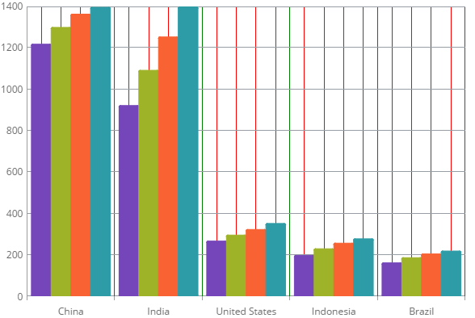

---
title: "軸間隔"
slug: igcategorychart-axis-intervals
---

# 軸間隔

### 目的
このトピックでは、コード例を使用して igCategoryChart コントロールのチャート軸に主目盛と副目盛を構成する方法を示します。 

igCategoryChart コントロールで、軸の主間隔は主グリッド線および軸ラベルがどれくらいの頻度で軸に描画されるかを指定します。同様に、軸副間隔は副グリッド線が軸に描画される頻度を指定します。


### このトピックの内容

このトピックは、以下のセクションで構成されます。

- [X軸とY軸に主間隔と副間隔を構成](#ConfiguringXAxis)
- [コード スニペット](#codesnippet)
- [関連トピック](#relatedtopics)

### <a id="ConfiguringXAxis"></a>X軸とY軸に主間隔と副間隔を構成

構成の目的:|使用するプロパティ|設定値
---|---|---
主間隔グリッド線の頻度。|`xAxisInterval`,`yAxisInterval` |この値は、軸ラベルおよび主グリッド線 (使用する場合) に必要なスペースを提供します。軸ラベルの間隔も、この値によって設定され、間隔に関連付けられた軸のポイントにラベルが 1 つ表示されることに注意してください。<br/>X 軸では、この値が最初と最後のカテゴリ項目間のインデックスとして表されます。通常、この値は、カテゴリ項目の合計数の 10～20% に相当します。その結果、すべての軸ラベルは軸にフィットし、他の軸ラベルによって切り取られることはありません。<br/>日付/時刻軸では、この値は軸の最小値から最大値の範囲の時間間隔として表されます。<br/>Y 軸では、この値は軸の最小値から最大値の範囲の double 値として表されます。数値軸はデフォルトで、軸の最小値および最大値から四捨五入されたバランスの良い数値に、自動的に計算されます。
主間隔グリッド線の色。|`xAxisMajorStroke`,`yAxisMajorStroke` |軸の主グリッド線の色。
主間隔グリッド線の太さ。|`xAxisMajorStrokeThickness`,`yAxisMajorStrokeThickness` |double 値として設定された軸の主グリッド線の太さ
副間隔グリッド線の頻度。|`xAxisMinorInterval`,`yAxisMinorInterval` |この値は、主グリッド線と主グリッド線の間に描画される副グリッド線に必要なスペースを提供します。その結果、XAxisMinorInterval プロパティの値は、常に XAxisInterval プロパティの値より小さい値 (通常、2 分の 1 から 5 分の 1) であることが必要です。<br/>カテゴリ軸では、この値が MajorInterval プロパティの小数として表されます。通常、この値は 0.25 から 0.5 の間です。<br/>数値軸でこの値は軸の最小値から最大値までの double として表示されます。デフォルトで数値軸は軸の最小値および最高値に基づいて自動的に適切な間隔を計算しません。<br/>日付/時刻軸では、この値は軸の最小値から最大値の範囲の時間間隔として表されます。
副間隔グリッド線の色。|`xAxisMinorStroke`, `yAxisMinorStroke` |軸の副グリッド線の色。
副間隔グリッド線の太さ。|`xAxisMajorStrokeThickness`, `yAxisMajorStrokeThickness`|double 値として設定された軸の主グリッド線の太さ

### <a id="codesnippet"></a> コード スニペット

以下のコード スニペットは、x 軸の間隔を設定する方法を示します。

*HTML の場合:*

```html

$(function () {
   $("#chart").igCategoryChart({
       xAxisInterval: 1,
       xAxisMinorInterval: 0.25, 
       xAxisMinorStroke: "Red",    
       xAxisMajorStroke: "Green",  
       xAxisMinorStrokeThickness: 1,
       xAxisMajorStrokeThickness: 1
    });
});
```



## <a id="relatedtopics"></a>関連トピック:

- [チュートリアル](/controls/igcategorychart/adding)

- [データ バインド](/controls/igcategorychart/categorychart-binding-to-data)

- [軸間隔と重複の構成](ccategorychart-onfiguring-axis-gap-and-overlap.html)

- [軸ラベルの構成](igcategorychart-axis-labels.html)

- [軸範囲の構成](/controls/igcategorychart/axes/categorychart-configuring-axis-range)

- [軸目盛りの構成](/controls/igcategorychart/axes/axis-tickmarks)

- [軸タイトルの構成](/controls/igcategorychart/axes/categorychart-configuring-axis-titles)
