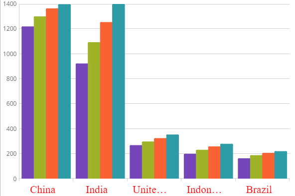

# 軸ラベルの構成 

igCategoryChart は、チャートの構成、書式設定、ラベルのスタイル設定など詳細に制御することが可能です。デフォルトでは、ラベルを明示的に設定する必要はありません。カテゴリ チャートは、提供したデータ内で最初の適切な文字列プロパティを使用し、ラベルに使用します。 

### このトピックの内容

このトピックは、以下のセクションで構成されます。

- [ラベル設定](#labelsettings)
- [ラベルのスタイル](#labelstyling)
- [コード スニペット](#codesnippet)
- [関連トピック](#relatedtopics)

### <a id="labelsettings"></a>ラベル設定

igCategoryChart™ コントロールでは、以下のプロパティで x 軸および y 軸のラベルの回転角度、マージン、水平/垂直の配置、不透明度、パディングと表示を変更できます。

プロパティ名|プロパティ タイプ|説明
---|---|---
`xAxisLabelAngle`, `yAxisLabelAngle` | double |x 軸と y 軸のラベルの回転角度を決定します。
`xAxisLabelHorizontalAlignment`, `yAxisLabelHorizontalAlignment` |HorizontalAlignment|x 軸と y 軸のラベルの水平方向の配置を決定します。
`xAxisLabelVerticalAlignment`, `yAxisLabelVerticalAlignment`|VerticalAlignment|x 軸と y 軸のラベルの垂直方向の配置を決定します。
`xAxisLabelVisibility`, `yAxisLabelVisibility`|Visibility bool|x 軸と y 軸のラベルを表示するかどうかを決定します。
`xAxisLabelLeftMargin`, `yAxisLabelLeftMargin`, `xAxisLabelRightMargin`, `yAxisLabelRightMargin`|Number|x 軸と y 軸のラベルに適用するマージンを決定します。


### <a id="labelstyling"></a>ラベルのスタイル
カテゴリ チャートの x 軸および y 軸のラベルのルックアンドフィールをスタイル設定できます。主にフォントタイプ、フォント サイズ、テキスト色など異なるフォント スタイルをラベルに適用できます。以下のプロパティを使用します。

プロパティ名|プロパティ タイプ|説明
---|---|---
`xAxisLabelTextStyle`,`yAxisLabelTextStyle`|object|x 軸と y 軸ラベルに使用するフォント ファミリ、サイズ、スタイルを決定します。
`xAxisLabelTextColor`,`yAxisLabelTextColor`|Brush|x 軸と y 軸のラベルのテキストの色を決定します。


### <a id="codesnippet"></a>コード スニペット
以下のコード例は、スタイル プロパティを使用して x 軸のラベルにスタイル設定します。

*HTML の場合:*

```html
$(function () {
            $("#chart").igCategoryChart({
                dataSource: data,
                xAxisLabelTextStyle: "16pt Verdana",
                xAxisLabelRightMargin: "14",
                xAxisLabelTextColor: "red"
            });
        });
```


以下のスクリーンショットは、x 軸ラベルをスタイル設定した igCategoryChart コントロールを示します。



## <a id="relatedtopics"></a>関連トピック:

- [チュートリアル](/igcategorychart-adding)

- [データ バインド](/categorychart-binding-to-data)

- [軸間隔と重複の構成](/categorychart-configuring-axis-gap-and-overlap)

- [軸間隔の構成](igcategorychart-configuring-axis-intervals.html)

- [軸範囲の構成](/categorychart-configuring-axis-range)

- [軸目盛りの構成](igcategorychart-configuring-axis-tickmarks.html)

- [軸タイトルの構成](/categorychart-configuring-axis-titles)
