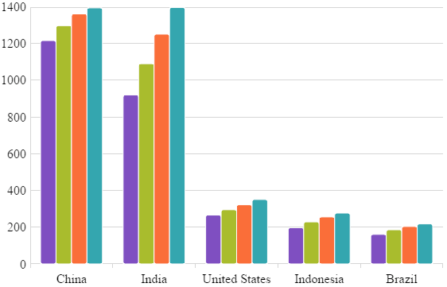
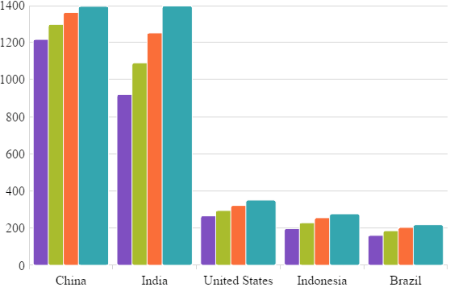
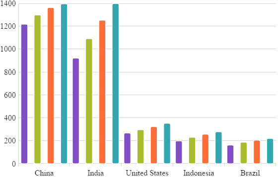

---
title: "igCategoryChart の軸間隔と重複の構成"
slug: categorychart-configuring-axis-gap-and-overlap
---

# igCategoryChart の軸間隔と重複の構成

## トピックの概要

### 目的

このトピックでは、`igCategoryChart`™ コントロール軸間隔および軸の重なりを構成する方法を説明します。

### 前提条件

このトピックを理解するためには、以下のトピックを理解しておく必要があります。
- [チュートリアル](/igcategorychart-adding)

このトピックでは、`igCategoryChart`™ コントロールをページに追加し、データにバインドする方法を紹介します。

## 軸間隔

### 概要

`igCategoryChart`™ コントロールの軸間隔機能は、チャート シリーズ間の間隔を設定できます。

### プロパティ

プロパティ名: `xAxisGap`。

ウィジェット初期化時またはウィジェット初期後にオプションとして設定できます。
```javascript
$("#chart").igCategoryChart("option", "xAxisGap", 0.5);
```

プロパティ値は、0 と 1 の間の float 値である必要があります。値は、シリーズ間で利用可能なピクセル数から間隔の相対幅を表します。0 - シリーズ間に間隔は描画されません。 1 - シリーズ間に利用可能な最大の間隔が描画されます。

たとえば、`xAxisGap` 0.5 は間隔を描画するための利用可能なスペースの半分です。<br/>
 

### 例

以下は、`igCategoryChart` を `xAxisGap` `0.5`で初期化するコードです。

```javascript
$("#chart").igCategoryChart({
    title: "Countries population",
    xAxisTitle: "Countries",
    yAxisTitle: "Millions of people",
    dataSource: data,
    chartType: "column",
    xAxisGap: 0.5
});
```

## 軸の重複

### 概要

`igCategoryChart`™ コントロールの軸の重複機能は、描画されたカテゴリの重なりを設定できます。

### プロパティ

プロパティ名: `xAxisOverlap`。

ウィジェット初期化時またはウィジェット初期後にオプションとして設定できます。
```javascript
$("#chart").igCategoryChart("option", "xAxisOverlap", 0.5);
```

プロパティ値は、-1 と 1 の間の float 値である必要があります。値は、各シリーズに利用可能なピクセル数から相対する重複を示します。

負の値 (-1 以上): カテゴリは互いに生成する間隔によって引き離されます。

正の数 (1 以下): カテゴリが互いに重なります。値 1 は、互いのチャート上にカテゴリを描画します。 

たとえば、`xAxisOverlap` 0.5 は間隔を描画するための利用可能なスペースの半分です。<br/>
 

`xAxisOverlap` -1 はカテゴリが互いにできるだけ離されます。<br/>


### 例

以下は、`igCategoryChart` を `xAxisGap` `0.5`で初期化するコードです。

```javascript
$("#chart").igCategoryChart({
    title: "Countries population",
    xAxisTitle: "Countries",
    yAxisTitle: "Millions of people",
    dataSource: data,
    chartType: "column",
    xAxisOverlap: 0.5
});
```

## 関連トピック:

- [チュートリアル](/igcategorychart-adding)

- [データ バインド](/categorychart-binding-to-data)
