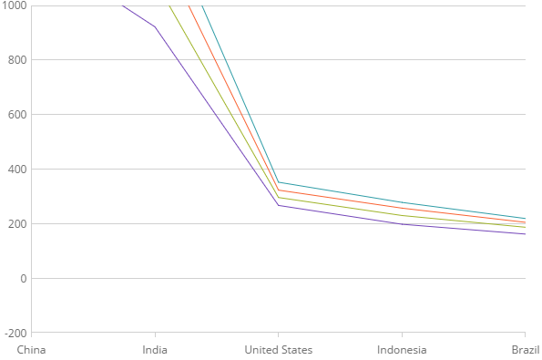

# 軸の範囲

igCategoryChart™ コントロールで、数値軸の範囲は軸の最初と終わり、つまりデータの最小値と最大値の数値の差です。範囲の最小値は、軸の最小値です。範囲の最大値は、軸の最大値です。

### このトピックの内容

このトピックは、以下のセクションで構成されます。

- [概要](#overview)
- [コード スニペット](#codesnippet)
- [関連トピック](#relatedtopics)

### 概要
デフォルトで、igDataChart コントロールは、チャート プロット領域を最大化するために、最小データ ポイントおよび最大データ ポイントに基づいて軸の範囲の最小値と最大値を計算します。軸の最小値と最大値の自動計算は、データ ポイントのセットに適切でない場合があります。たとえば、データの最小値が 850 の場合、軸の `yAxisMinimumValue` プロパティを使用して軸の最小値を 800 に設定したい場合があります。これにより、軸の最小値とデータ ポイントの最小値の間に 50 のスペース値ができることになります。軸の `yAxisMaximumValue` プロパティを使用すれば軸の最大値とデータ ポイントの最大値にも同様のことが適用できます。

### コード スニペット
以下のサンプル コードは、y 軸で軸の範囲を変更する方法を示します。

*HTML の場合:*

```html
$(function () {
            $("#chart").igCategoryChart({
                dataSource: data,
                yAxisMinimumValue: -200,
                yAxisMaximumValue: 1000
            });
        });
```



### 関連トピック:

- [igCategoryChart の追加](/igcategorychart-adding)

- [データ バインド](/categorychart-binding-to-data)

- [軸間隔と重複の構成](/categorychart-configuring-axis-gap-and-overlap)

- [軸ラベルの構成](igcategorychart-axis-labels.html)

- [軸間隔の構成](/igcategorychart-axis-intervals)

- [軸目盛りの構成](/igcategorychart-axis-tickmarks)

- [軸タイトルの構成](/categorychart-configuring-axis-titles)
