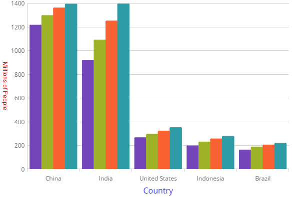

# 軸タイトル
igCategoryChart コントロールの軸タイトル機能は、チャートの x および y 軸に情報を追加できます。

### このトピックの内容

このトピックは、以下のセクションで構成されます。

- [プロパティの設定](#propertysettings)
- [コード スニペット](#codesnippet)
- [関連トピック](#relatedtopics)

### <a id="propertysettings"></a>プロパティの設定
カテゴリ チャートは、x 軸および y 軸のタイトルのフォント スタイル、マージン、配置などを変更してルックアンドフィールをカスタマイズできます。以下のプロパティを使用します。

プロパティ名|プロパティ タイプ|説明
---|---|---
`xAxisTitle`,`yAxisTitle`|string|x 軸と y 軸のタイトルに使用するテキストを決定します。
`xAxisTitleTextColor`, `yAxisTitleTextColor`|string|x 軸と y 軸のタイトルの色を決定します。
`xAxisTitleTextStyle`,`yAxisTitleTextStyle`|string|x 軸と y 軸のタイトルに適用するフォント スタイルを決定します。
`xAxisTitleAngle`,`yAxisTitleAngle`|number|x 軸と y 軸のタイトルの回転角度を決定します。
`xAxisTitleAlignment`, `yAxisTitleAlignment`|enumeration|x 軸の水平方向の配置と y 軸の垂直報告の配置を決定します。 
`xAxisTitleExtent`,`yAxisTitleExtent`|number|x 軸と y 軸のタイトルに適用する範囲を決定します。
`xAxisTitleMargin`,`yAxisTitleMargin`|number|x 軸と y 軸のタイトルに適用するマージンを決定します。
`xAxisTitleTopMargin`,`yAxisTitleTopMargin`|number|x 軸と y 軸のタイトルの上に適用するマージンを決定します。
`xAxisTitleRightMargin`,`yAxisTitleRightMargin`|number|x 軸と y 軸のタイトルの右に適用するマージンを決定します。
`xAxisTitleBottomMargin`,`yAxisTitleBottomMargin`|number|x 軸と y 軸のタイトルの下に適用するマージンを決定します。
`xAxisTitleLeftMargin`,`yAxisTitleLeftMargin`|number|x 軸と y 軸のタイトルの左に適用するマージンを決定します。

### <a id="codesnippet"></a>コード スニペット
以下のコード例は、x 軸と y 軸のタイトルをカスタマイズします。

*HTML の場合:*

```html
$(function () {
   $("#chart").igCategoryChart({
      dataSource: data,
      chartType: "auto",
      xAxisTitle: "Country",
      xAxisTitleTextColor: "blue",
      xAxisTitleTextStyle: "20pt Times New Roman|Georgia|Serif",
      yAxisTitle: "Millions of People",
      yAxisTitleAngle: 90,
      yAxisTitleTextColor: "red"
   });
});
```



## <a id="relatedtopics"></a>関連トピック:

- [チュートリアル](/igcategorychart-adding)

- [データ バインド](/categorychart-binding-to-data)

- [軸間隔と重複の構成](/categorychart-configuring-axis-gap-and-overlap)

- [軸ラベルの構成](igcategorychart-axis-labels.html)

- [軸間隔の構成](/igcategorychart-axis-intervals)

- [軸範囲の構成](/categorychart-configuring-axis-range)

- [軸目盛りの構成](/igcategorychart-axis-tickmarks)
