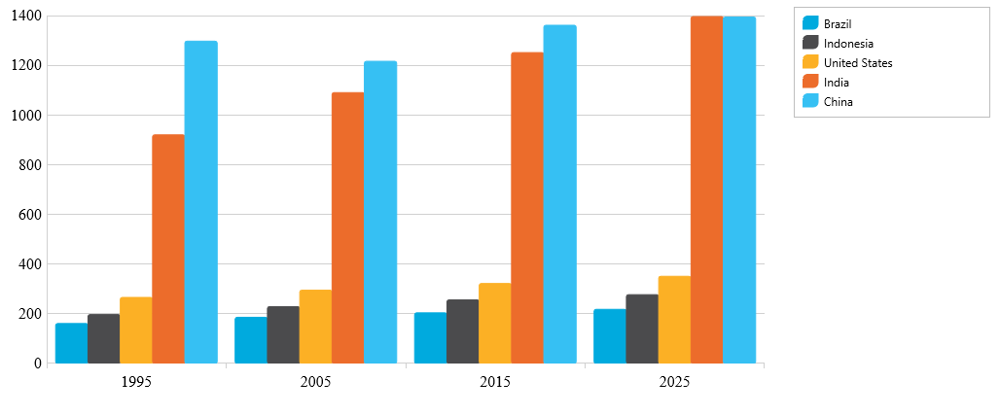
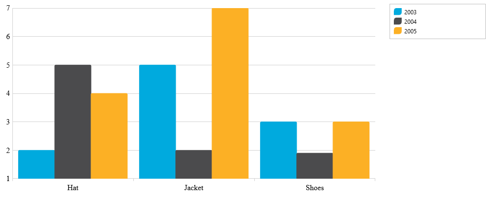

# データ バインド

### トピックの概要

このトピックは、フラットと階層データを igCategoryChart™ コントロールにバインドする方法を説明します。各セクションの最後で、サンプルの全コードを提供します。 

### 目的
以下の手順は、igCategoryChart コントロールをデータ コレクションにバインドする方法を示します。igCategoryChart は JavaScript 配列にバインドできます。ネスト コレクションもサポートされます。 
このトピックでは 2 つのデータ コレクション (フラットおよび階層) を定義し、カテゴリ チャート コントロールをアプリケーションに追加し、そのコントロールのデータソースを指定データ コレクションのインスタンスにバインドします。 


### このトピックの内容
このトピックは、以下のセクションで構成されます。
このトピックは、以下のセクションで構成されます。

- [JavaScript 配列のバインド](#BindingaJavaScriptArray)
    - [概要](#Introduction)
    - [前提条件](#Prerequisites)
    - [プレビュー](#Preview)
    - [手順](#Steps)
- [階層 JavaScript 配列のバインド](#BindingaHierarchicalJavaScriptArray)
    - [概要](#HIntroduction)
    - [前提条件](#HPrerequisites)
    - [プレビュー](#HPreview)
    - [手順](#HSteps)
- [関連トピック](#relatedcontent)

### JavaScript 配列へのバインド

#### 概要
ここでは、igCategoryChart コントロールを JavaScript データ配列にバインドする際の手順を示します。

#### 前提条件
この手順を実行するには、以下が必要です。

-	HTML5 Web ページ
-	Web サイトまたは Web アプリケーション プロジェクトに追加された、必要なすべての JavaScript および CSS ファイル。

[igCategoryChart の追加](/igcategorychart-adding) インスタンスの作成および構成の詳細については、「igDataChart の追加」を参照してください。 

#### プレビュー





#### 手順
ここでは、igCategoryChart コントロールを JavaScript データ配列にバインドする際の手順を示します。

**データ配列の定義**

*JavaScript の場合:*
```
<script type="text/javascript">
   var data = [
      { "Label": "1995", "Brazil": 161, "Indonesia": 197, "United States": 266, "India": 920, "China": 1297 },
      { "Label": "2005", "Brazil": 186, "Indonesia": 229, "United States": 295, "India": 1090, "China": 1216 },
      { "Label": "2015", "Brazil": 204, "Indonesia": 256, "United States": 322, "India": 1251, "China": 1361 },
      { "Label": "2025", "Brazil": 218, "Indonesia": 277, "United States": 351, "India": 1396, "China": 1394 }];
</script>
```

**igCategoryChart コントロールを追加して構成します。**

チャートの div 要素を Web ページに追加します。Web ページの body 部分に igCategoryChart チャート コントロール用の div 要素を追加します。

*HTML の場合:*
```     
<body>
   …
   <div id="theChart"></div>
   <div id="theLegend"></div>
   …
</body>
```

**igCategoryChart コントロールのインスタンスを作成し、データ ソースを構成します。**

これを行うには、1 つ前の手順で定義したデータ配列を igCategoryChart コントロールの dataSource オプションに割り当てます。

*HTML の場合:*
```  
<script type="text/javascript">
$(function() {
            $("#theChart").igCategoryChart({
                chartType: "column",
	   dataSource: data,
                legend: { element: "theLegend" }
            });
          });
</script>
```

### 階層 JavaScript 配列にバインド

#### 概要
ここでは、igCategoryChart コントロールをセミネスト階層 JavaScript データ配列にバインドする際の手順を示します。

#### 前提条件

この手順を実行するには、以下が必要です。
- HTML5 Web ページ
- Web サイトまたは Web アプリケーション プロジェクトに追加された、必要なすべての JavaScript および CSS ファイル。

[igCategoryChart の追加](/igcategorychart-adding) インスタンスの作成および構成の詳細については、「igDataChart の追加」を参照してください。 

#### プレビュー





#### 手順
ここでは、igCategoryChart コントロールを JavaScript データ配列にバインドする際の手順を示します。

**データ配列の定義**

*JavaScript の場合:*
```
<script>
var data = [
 [
    [
       { "AmountSold": 2, "Item": "Hat" },
       { "AmountSold": 5, "Item": "Jacket" },
       { "AmountSold": 3, "Item": "Shoes" }
 	]
 ],
 [
    [
        { "AmountSold": 5, "Item": "Hat" },
        { "AmountSold": 2, "Item": "Jacket" },
        { "AmountSold": 1.9, "Item": "Shoes" }
   ]
 ],
 [
    [
        { "AmountSold": 4, "Item": "Hat" },
        { "AmountSold": 7, "Item": "Jacket" },
        { "AmountSold": 3, "Item": "Shoes" }
    ]
 ]
];
</script>

```

**igCategoryChart コントロールを追加して構成します。**

チャートの div 要素を Web ページに追加します。Web ページの body 部分に igCategoryChart チャート コントロール用の div 要素を追加します。

*HTML の場合:*
```     
<body>
   …
   <div id="theChart"></div>
   <div id="theLegend"></div>
   …
</body>
```

**igCategoryChart コントロールのインスタンスを作成し、データ ソースと xAxis ラベルを構成します。**

これを行うには、1 つ前の手順で定義したデータ配列を igCategoryChart コントロールの dataSource オプションに割り当てます。

*HTML の場合:*
```  
<script type="text/javascript">
  $(function() {
    data[0].Label = "2003";
	data[1].Label = “2004";
	data[2].Label = "2005";

    $("#theChart").igCategoryChart({
       chartType: "column",
	   dataSource: data,
       legend: { element: "theLegend" }
    });
  });
</script>

```

## 関連トピック:

- [チュートリアル](/igcategorychart-adding)

- [軸](/categorychart-axes)
