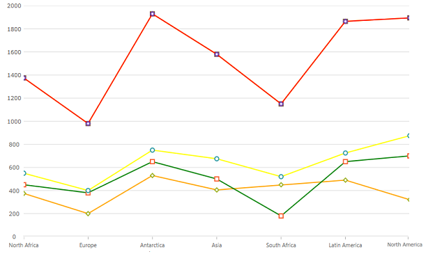
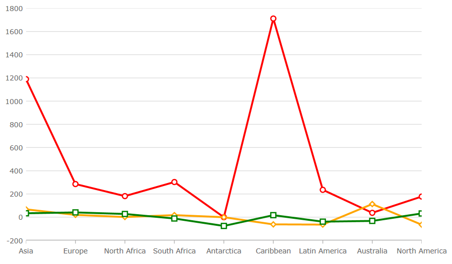

# チャート マーカーの構成

マーカーは、igCategoryChart™ コントロールのプロット領域のデータ ポイント値を表示する視覚的要素です。マーカーは、値が主グリッド線と副グリッド線の間にある場合に、指定したデータ ポイントの値をただちに識別できるようユーザーをサポートをします。
このセクションは、igCategoryChart コントロールのマーカーでの作業に関するタスクベースの手順についての役立つ情報を提供します。

- [マーカーの外観](#markerappearance)
- [マーカー タイプ](#markertypes)
- [マーカー ブラシとアウトライン](#markerbrushesandoutlines)

チャート マーカーの外観は、igCategoryChart クラスのマーカー プロパティで管理できます。

#### <a id="markerappearance"></a> マーカーの外観
以下の表は、マーカーのすべての外観プロパティの一覧です。


プロパティ名|プロパティ タイプ|説明
---|---|---
`markerTypes`| MarkerType |チャートのすべてのシリーズで表示されるマーカーのタイプを決定します。
`markerBrushes` |Brush |マーカーの塗りつぶし色を決定します。
`markerOutlines`|Brush|マーカーのアウトライン色を決定します。


#### <a id="markertypes"></a> マーカー タイプ
プロパティ名|プロパティ タイプ|説明
---|---|---
`circleMarker`|MarkerType|円マーカーのタイプを表示します。
`diamondMarker`|MarkerType|ダイアモンド マーカーのタイプを表示します。
`hexagonMarker`|MarkerType|六角形マーカーのタイプを表示します。
`hexagramMarker`|MarkerType|六線星形マーカーのタイプを表示します。
`pentagramMarker`|MarkerType|星形五角形マーカーのタイプを表示します。
`pentagonMarker`|MarkerType|五角形マーカーのタイプを表示します。
`pyramidMarker`|MarkerType|ピラミッドマーカーのタイプを表示します。
`squareMarker`|MarkerType|四角形マーカーのタイプを表示します。
`tetragramMarker`|MarkerType|テトラグラム マーカーのタイプを表示します。
`triangleMarker`|MarkerType|三角形マーカーのタイプを表示します。


以下のコードは、igCategoryChart のマーカー タイプの変更方法を示します。

*HTML の場合:*

```html
$(function () {
     $(“chart1”).igCategoryChart({
	     markerTypes: [“diamond, "circle”, "square"]
     });
});
```

以下のスクリーンショットは、折れ線チャート タイプでダイアモンド マーカーを使用した igCategoryChart コントロールを示します。




#### <a id="markerbrushesandoutlines"></a> マーカー ブラシとアウトライン

以下のコード スニペットは、igCategoryChart の markerBrushes および markerOutlines の変更方法を示します。

*HTML の場合:*

```html
$(function () {
     $(“chart1”).igCategoryChart({
	    markerBrushes: [“White”],
	    markerOutlines: [“Red”, “Orange”, “Green”]
     });
});
```

以下のスクリーンショットは、折れ線チャート タイプでマーカーをカスタマイズした igCategoryChart コントロールを示します。



## <a id="relatedtopics"></a>関連トピック:

- [igCategoryChart の追加](/igcategorychart-adding)

- [データ バインド](/categorychart-binding-to-data)
