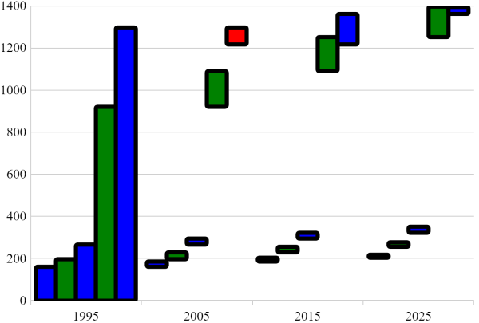

---
title: "チャート タイプの構成"
slug: categorychart-configuring-chart-types
---

# チャート タイプの構成

## チャート タイプの設定

[チャート タイプ](/categorychart-chart-types)トピックに説明されているとおり、チャートはプロパティを変更するだけでさまざまなチャートタイプを描画できます。

初期化時にチャート タイプを割り当てる方法:

```javascript
$("#theChart").igCategoryChart({
    dataSource: data,
    chartType: "spline"
});
```

初期化後にチャート タイプを変更する方法:

```javascript
$("#theChart").igCategoryChart("option", "chartType", "area");
```

## プロパティ

チャートの外観をカスタマイズには、多数のプロパティが用意されています。

プロパティ名|プロパティ タイプ|デフォルト値|説明
---|---|---|---
`brushes`|object|null|チャート シリーズの色設定に使用するブラシのパレットを取得または設定します。提供された値は、CSS 色文字列またはグラデーションを定義する JavaScript オブジェクトの配列である必要があります。最初の要素は、コレクションの補間モードを指定する RGB または HSV の文字列に設定するオプションがあります。
`negativeBrushes`|object|null|チャート シリーズの色設定に使用するブラシのパレットを取得または設定します。提供された値は、CSS 色文字列またはグラデーションを定義する JavaScript オブジェクトの配列である必要があります。最初の要素は、コレクションの補間モードを指定する RGB または HSV の文字列に設定するオプションがあります。
`outlines`|object|null|チャート シリーズのアウトラインに使用するブラシのパレットを取得または設定します。提供された値は、CSS 色文字列またはグラデーションを定義する JavaScript オブジェクトの配列である必要があります。最初の要素は、コレクションの補間モードを指定する RGB または HSV の文字列に設定するオプションがあります。
`resolution`|number|1|このチャートのシリーズの描画解像度を取得または設定します。n = 解像度で、各 n 水平ピクセルのすべての項目を単一のデータポイントに結合します。解像度 = 0 の場合、すべてのデータポイントがグラフィッカル オブジェクトとして描画されます。チャートの解像度が高くなるとパフォーマンスが向上します。チャート シリーズの太さを取得または設定します。
`thickness`|number|1|チャート シリーズの太さを取得または設定します。ChartType に基づいて、これは使用されるメイン ブラシ、またはアウトラインのみです。
`xAxisGap`|number|0|X 軸の隣接カテゴリ間のスペースの量を取得または設定します。範囲 [0, inf] にサイレントで固定される間隔を取得または設定します。
`xAxisOverlap`|number|0|X 軸の隣接カテゴリ間で重複する量を取得または設定します。範囲 [-1, inf] にサイレントで固定される重複を取得または設定します。
`xAxisInverted`|bool|null|最初のデータ項目を左側ではなく右側に配置し、X 軸の方向を反転するかどうかを取得または設定します。
`yAxisInverted`|bool|null|最小の数値を軸の下側ではなく上側に配置し、Y 軸の方向を反転を取得または設定します。

## 例

以下の例では上記で説明したプロパティのいくつかを使用します。
構成オプションの詳細については、このトピックの最後にあるリンクをご利用ください。

```javascript
$("#theChart").igCategoryChart({
	dataSource: data,
	chartType: "waterfall",
	brushes: ["blue", "green"],
	negativeBrushes: ["red", "yellow"],
	outlines: ["black"],
	thickness: 5
});
```
ウェブページでコードを実行した結果です。


## 関連トピック

- [チュートリアル](/igcategorychart-adding)

- [チャート タイプ](/categorychart-chart-types)

- [軸の間隔と重複](/categorychart-configuring-axis-gap-and-overlap)
