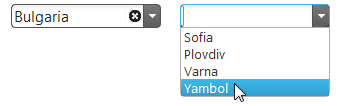

---
title: "カスケード igCombo の作成"
slug: igcombo-cascading
---

# カスケード igCombo の作成


##トピックの概要


### 目的

このトピックでは、あるコンボの選択が次のコンボでの選択に利用できるデータをフィルター処理するカスケード方式で igCombo を実装する方法を説明します。

### 前提条件

このトピックを理解するために、以下のトピックを参照することをお勧めします。


-	[igCombo の概要](/controls/igcombo/overview): このトピックでは、機能、データ ソースへのバインド、要件、テンプレートなどの、`igCombo` コントロールの概要について説明します。

-	[igCombo をデータにバインド](/controls/igcombo/binding/data-binding): このトピックでは、`igCombo` コントロールでの各種データ バインド方式について説明し、データ バインディングに関するその他の詳細情報を示します。

-   [選択の構成](/controls/igcombo/configuring/configure-selection): このトピックでは、選択イベントの処理方法に関する情報も含め、選択を実装する方法を説明します。

### このトピックの内容

このトピックは、以下のセクションで構成されます。

-   [コンボのカスケードの作成](#creating-cascading-combos)
  -   [概要](#introduction)
  -   [プレビュー](#preview)
  -   [前提条件](#prerequisites)
  -   [手順](#steps)
  -   [完成した例](#finished-example)
-   [関連コンテンツ](#related-content)

##<a id="creating-cascading-combos"></a>コンボのカスケードの作成
### <a id="introduction"></a>概要

この例では、2 つの igCombo が作成され、異なるデータ ソースにバインドされます。次に、最初の igCombo の選択が 2 番目の igCombo で利用できるデータをフィルター処理します。

### <a id="preview"></a>プレビュー

以下のスクリーンショットは最終結果のプレビューです。



### <a id="prerequisites"></a>前提条件

この手順を実行するには、以下が必要です。

- 編集用に開かれた標準的な HTML ページ 

### <a id="steps"></a>手順

以下の手順では、親と子の `igCombo` コントロールを異なるデータ ソースにバインドする方法を示します。

1. `igCombo` コントロール親子の HTML プレースホルダーを追加します。

	この例では、ドロップダウンを格納するための SPAN 要素を定義します。HTML プレースホルダーとして div 要素を使用することもできますが、ここでは、両方のコンボ ボックスが同じ行に表示されるようにしたいため、SPAN 要素を使用します。
	
	**HTML の場合:**
	
```html
	<span id="comboCountry"></span>
	<span id="comboDistrict"></span>
```

2. 親 `igCombo` コントロールにデータ ソースを追加します。

	この手順では、親 `igCombo` データ ソースをオブジェクト配列として定義します。
	
	**JavaScript の場合:**
	
```js
	var dsCountry = [
	      { txtCountry: 'United States', valCountry: "US" },
	      { txtCountry: 'Bulgaria', valCountry: "BG" }
	];
```

3. 親 `igCombo` コントロールを追加します。

	親 `igCombo` を追加して、必要なプロパティを定義します。
	
	**JavaScript の場合:**
	
```js
	$("#comboCountry").igCombo({
	      textKey: "txtCountry",
	      valueKey: "valCountry",
	      dataSource: dsCountry
	});
```

4. 子 `igCombo` コントロールにデータ ソースを追加します。

	この手順では、子 `igCombo` データ ソースをオブジェクト配列として定義します。親との関係を持つ追加のキー (`keyCountry`) に注意してください。
	
	**JavaScript の場合:**
	
```js
	var dsCascDistrict = [
	      { keyCountry: "US", txtDistrict: "New Jersey", valDistrict: "NJ" },
	      { keyCountry: "US", txtDistrict: "California", valDistrict: "CA" },
	      { keyCountry: "US", txtDistrict: "Illinois", valDistrict: "IL" },
	      { keyCountry: "US", txtDistrict: "New York", valDistrict: "NY" },
	      { keyCountry: "US", txtDistrict: "Florida", valDistrict: "FL" },
	      { keyCountry: "BG", txtDistrict: "Sofia", valDistrict: "SA" },
	      { keyCountry: "BG", txtDistrict: "Plovdiv", valDistrict: "PV" },
	      { keyCountry: "BG", txtDistrict: "Varna", valDistrict: "V" },
	      { keyCountry: "BG", txtDistrict: "Yambol", valDistrict: "Y" }
	];
```

5. 子 `igCombo` コントロールを追加します。

	子 `igCombo` コントロールを追加します。ここでは、dataSource プロパティを設定しません。
	
	**JavaScript の場合:**
	
```js
	$("#comboDistrict").igCombo({
	      valueKey: "valDistrict",
	      textKey: "txtDistrict"
	});
```

6. selectionChanged イベント ハンドラーを親 `igCombo` に追加します。 

	selectionChanged イベント ハンドラーを親 `igCombo` に追加します。空の配列を作成し、親 `igCombo` の選択された値を使用して、子 `igCombo` のデータ ソースをフィルター処理し、フィルター処理された結果を空の配列で並べ替えます。

	**JavaScript の場合:**

```js
	selectionChanged: function (evt, ui) {
        var filteredCascDistrict = [];
        if (ui.items && ui.items[0]) {
            var itemData = ui.items[0].data;
            
            filteredCascDistrict = dsCascDistrict.filter(function (district) {
                return district.keyCountry == itemData.valCountry;
            });
        }
    }
```

7. 子 `igCombo` をバインドします。

	親 `igCombo` で、selectionChanged イベントが子 `igCombo` をフィルター処理されたデータにバインドします。ここで deselectAll に対する呼び出しに注意してください。これは、子 `igCombo` の以前の選択のクリアに必要で、新しくフィルター処理されたデータのセットに以前に選択された値が入らないようにするためです。

	**JavaScript の場合:**
```js
	var $comboDistrict = $("#comboDistrict");
    $comboDistrict.igCombo("deselectAll", {}, true);
    $comboDistrict.igCombo("option", "dataSource", filteredCascDistrict);
    $comboDistrict.igCombo("dataBind");
```

8. (オプション) 結果を確認します。

	この HTML ページをブラウザーで開き、結果を確認します。上記の手順が完了すると、[プレビュー](#preview)に示すとおり、2 つの機能ドロップダウンが水平方向に並べて配置されます。

### <a id="finished-example"></a>完成した例

以下は、完了時のページの表示を実際に示すために作成されたサンプル用の完全なコードです。

**HTML と JavaScript の場合:**

```html
	<span id="comboCountry"></span>
	<span id="comboDistrict"></span>

	<script>
		var dsCountry = [
			{ txtCountry: 'United States', valCountry: "US" },
			{ txtCountry: 'Bulgaria', valCountry: "BG" }
		];

		var dsCascDistrict = [
			{ keyCountry: "US", txtDistrict: "New Jersey", valDistrict: "NJ" },
			{ keyCountry: "US", txtDistrict: "California", valDistrict: "CA" },
			{ keyCountry: "US", txtDistrict: "Illinois", valDistrict: "IL" },
			{ keyCountry: "US", txtDistrict: "New York", valDistrict: "NY" },
			{ keyCountry: "US", txtDistrict: "Florida", valDistrict: "FL" },
			{ keyCountry: "BG", txtDistrict: "Sofia", valDistrict: "SA" },
			{ keyCountry: "BG", txtDistrict: "Plovdiv", valDistrict: "PV" },
			{ keyCountry: "BG", txtDistrict: "Varna", valDistrict: "V" },
			{ keyCountry: "BG", txtDistrict: "Yambol", valDistrict: "Y" }
		];

		$(function () {
			$("#comboCountry").igCombo({
				textKey: "txtCountry",
				valueKey: "valCountry",
				dataSource: dsCountry,
				selectionChanged: function (evt, ui) {
                    var filteredCascDistrict = [];
                    if (ui.items && ui.items[0]) {
                        var itemData = ui.items[0].data;
                        filteredCascDistrict = dsCascDistrict.filter(function (district) {
                            return district.keyCountry == itemData.valCountry;
                        });
                    }

                    var $comboDistrict = $("#comboDistrict");
                    $comboDistrict.igCombo("deselectAll", {}, true);
                    $comboDistrict.igCombo("option", "dataSource", filteredCascDistrict);
                    $comboDistrict.igCombo("dataBind");
                }
			});

			$("#comboDistrict").igCombo({
                valueKey: "valDistrict",
                textKey: "txtDistrict"
            });
		});
	</script>
```

##<a id="related-content"></a>関連コンテンツ

### <a id="samples"></a> サンプル

このトピックについては、以下のサンプルも参照してください。

-	[コンボのカスケード](&#123;environment:SamplesUrl&#125;/combo/cascading-combos): このサンプルでは、3 つの `igCombo` コントロールのカスケードを示します。


 

 


