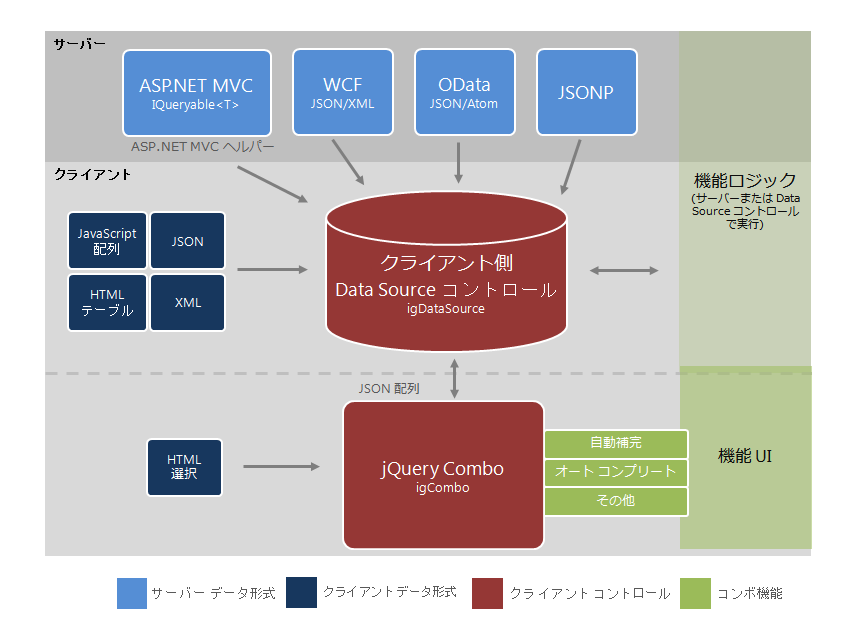
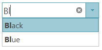

# igCombo データにバインドについての概要


## トピックの概要


### 目的


このトピックでは、`igCombo` コントロールでの各種データ バインド方式について説明し、データ バインディングに関するその他の詳細情報を示します。

### このトピックの内容


このトピックは、以下のセクションで構成されます。

-   [igCombo をデータにバインド - 概要](#binding-to-data-sources)
-   バインドの要件
-   サポートされるデータ ソース
-   データ ソースへのバインドに関する概要
-   データ ソースへのバインドに関するクラス図
-   [igCombo をデータにバインド - 手順](#basicig-combo-data-binding)
-	[サンプル](#demos)
	-	[JSON のバインド](#json-binding)
	-	[HTML のバインド](#html-binding)
	-	[XML のバインド](#xml-binding)
-   [関連トピック](#related-topics)

###　前提条件


まず以下のトピックを読む必要があります。

-   [igCombo の概要](/igcombo-overview)
-   [igCombo のセットアップ](/igcombo-getting-started)

##　<a id="BindingtoDataSources"></a>igCombo をデータにバインド - 概要


###　バインドの要件


次は、`igCombo` コントロールとデータ ソースとのバインドに関する要件をカテゴリ別にまとめたものです。

***データ構造***

以下のいずれかの形態を使用できます。

-   ローカルまたは Web サーバーから提供される適格な JSON または XML
-   JavaScript 配列または HTML TABLE 要素
-   SELECT 要素
-   OData サービス
-   JSONP
-   ASP.NET MVC での `IQueryable<T>`

***データ型***

-   String
-   Number
-   Boolean
-   Date

###　サポートされるデータ ソース


以下は、サポートされているデータ ソース、および各データ ソースのバインドに関する基本情報を示します。

-	**igDataSource**: `igDataSource` は、コントロールのデータ操作を管理するために `igCombo` によって内部的に使用されるデータ ソースです。このデータ ソースは、さまざまなタイプのローカル データやリモート データを受け入れます。

-	**HTML SELECT 要素**: この要素は `igCombo` コントロールに固有です。`igCombo` の jQuery セレクターからこの要素を選択すると、SELECT 要素が自動的に `igCombo` コントロールに換され、ベース要素のオプションが継承されます。

-	**`IQueryable<T>`**: ASP.NET MVC では、igCombo のデータ ソースとして `IQueryable<T>` を指定します。そのコレクションは、ブラウザーでの使用に合わせて JSON にシリアル化されて View と共に返されます。

##　<a id="binding-to-data-sources"></a>データ ソースへのバインドに関する概要


ほとんどの場合、`igCombo` の `dataSource` または `dataSourceUrl` オプションを使用してデータのバインドを行います。このオプションは、サポートされるさまざまなデータ形式を処理できる `igDataSource` へデータを提供します。ただし、SELECT 要素を使用して `igCombo` のインスタンスを作成する場合は例外で、このオプションは使用しません。この場合、`igCombo` はそのベース SELECT 要素のデータおよびオプションを継承します。ASP.NET MVC では、\{environment:ProductNameMVC\} に `IQueryable<T>` を供給すると、サーバーからのデータを簡単にシリアル化して、View と共にクライアントへ渡せるようになります。そのページがブラウザーに渡されると、`igCombo` の `dataSource` オプションが設定されてクライアント側での操作に使用されます。

###　データ ソースへのバインドに関するクラス図


次のクラス図はデータ バインドの仕組みを示したものです。



##　<a id="basicig-combo-data-binding"></a>igCombo をデータにバインド - 手順


###　概要


以下の手順は基本オプションの構成方法と、jQuery および ASP.NET MVC ヘルパーの両方を使用したデータへのバインド方法を示しています。

###　プレビュー


以下は最終結果のプレビューです。



###　要件


この手順を実行するには、以下が必要です。

-   この例を追加する Web サイトと Web ページ
-   Web サイト上の必要な JavaScript リソースおよび jQuery テーマ
-   Web ページ上の必要な JavaScript ファイルと CSS ファイルへの参照
-   (ASP.NET MVC) `Infragistics.Web.Mvc.dll` アセンブリへの参照

###　概要


以下はプロセスの概念的概要です。

**1.`igCombo` のインスタンス化**

**2.データへのバインド**

###　手順

1. **`igCombo` をインスタンス化します。**

	**a. ターゲット要素を定義します。**

	Web ページで、`igCombo` のベース オブジェクトとしての役割を果たすターゲットの HTML 要素を定義し、その ID を設定します。これは ASP.NET MVC のオプション手順です。

	**HTML の場合:**

```html
	<select id="comboTarget"></select>
```

	**b. `igCombo` をインスタンス化します。**jQuery では、document ready JavaScript イベントを使用してコンボをインスタンス化できます。ASP.NET MVC では、ASP.NET MVC ヘルパーを使用して、`IQueryable` データ ソースにバインドします。

	**HTML の場合:**

```html
	<script type="text/javascript">
	     $(function () {
	          $("#comboTarget").igCombo({

	          });
	      });
	</script>
```

	**ASPX の場合:**

```csharp
	<%= Html.
	    Infragistics().
	    Combo().
	    ID("comboTarget")
	%>
```

2. **データへバインドします。**

	**a. データを定義します。**

	jQuery では、この例は単純な JSON 配列にバインドします。このデータはページ要求の一部分として渡すか、Web サービスから返すことができます。ASP.NET MVC では、この例はサーバーの Controller クラスで定義され、View でモデルとして返される、Color オブジェクトのコレクションにバインドします。

	**HTML の場合:**

```html
	var colors = [
	     { "Name": "Black" },
	     { "Name": "Blue" },
	     { "Name": "Brown" },
	     { "Name": "Red" },
	     { "Name": "White" },
	     { "Name": "Yellow" }
	];
```

	**C# の場合:**

```csharp
	public class DefaultController : Controller
	{
	     public ActionResult Index()
	     {
	        List<Color> colors = new List<Color>();
	        colors.Add(Color.Black);
	        colors.Add(Color.Blue);
	        colors.Add(Color.Brown);
	        colors.Add(Color.Red);
	        colors.Add(Color.White);
	        colors.Add(Color.Yellow);

	        return View("default", colors.AsQueryable());
	     }
	}
```

	**b. データ ソースを設定します。**

	`dataSource` オプションを使用してデータをコンボに提供します。ASP.NET MVC では、ヘルパーの DataSource メソッドを使用して、Model の一部として渡されるデータにバインドします。

	**HTML の場合:**

```html
	$("#comboTarget").igCombo({
	    dataSource: colors});
```

	**ASPX の場合:**

```csharp
	<%= Html.
	    Infragistics().
	    Combo().
	    ID("comboTarget").
	    DataSource(this.Model as IQueryable<System.Drawing.Color>)
	%>
```

	**c. text フィールドおよび value フィールドを構成します。**

	`igCombo` の `textKey` オプションおよび `valueKey` オプションを設定します。この単純な例では、`textKey` と `valueKey` は両方とも「Name」という同じオブジェクト値に設定されています。ただし、`textKey` および `valueKey` は 2 つの異なるフィールドとして設定できます。たとえば、`valueKey` は各 Color オブジェクトの ID フィールドをポイントする場合があります。

	**HTML の場合:**

```html
	$("#comboTarget").igCombo({
	    dataSource: colors,    textKey: "Name",
	    valueKey: "Name",
	});
```

	**ASPX の場合:**

```csharp
	<%= Html.
	    Infragistics().
	    Combo().
	    ID("comboTarget").
	    TextKey("Name").
	    ValueKey("Name").
	    DataSource(this.Model as IQueryable<System.Drawing.Color>)
	%>
```

	**d. (ASP.NET MVC) DataBind() および Render() を呼び出します。**

	ASP.NET MVC ヘルパーで `igCombo` をインスタンス化する場合、他のオプションの構成がすべて終了した後、DataBind メソッドを呼び出してデータにバインドし、最後にレンダリング メソッドを呼び出します。これは、クライアントで `igCombo` をインスタンス化するのに必要な HTML および JavaScript を描画するメソッドです。

	**ASPX の場合:**

```csharp
	<%= Html.
	    Infragistics().
	    Combo().
	    ID("comboTarget").
	    TextKey("Name").
	    ValueKey("Name").
	    DataSource(this.Model as IQueryable<System.Drawing.Color>).
	    DataBind().
	    Render() %>
```

## <a id="demos"></a>サンプル
オンライン コンボへのバインディングの実例

### <a id="json-binding"></a>JSON のバインド
コンボを JSON データまたは JavaScript 配列にバインドできます。このサンプルはクライアント側バインディングの基本実例を含みます。

<div class="embed-sample">
   [\{environment:SamplesEmbedUrl\}/combo/json-binding](\{environment:SamplesEmbedUrl\}/combo/json-binding)
</div>

### <a id="html-binding"></a>HTML のバインド

igCombo は HTML SELECT 要素に直接バインドできます。

<div class="embed-sample">
   [\{environment:SamplesEmbedUrl\}/combo/html-binding](\{environment:SamplesEmbedUrl\}/combo/html-binding)
</div>
  
### <a id="xml-binding"></a>XML のバインド
igCombo は XML データへのバインドをサポートします。このサンプルは、XML 文字列への基本バインドを表示します。

<div class="embed-sample">
   [\{environment:SamplesEmbedUrl\}/combo/xml-binding](\{environment:SamplesEmbedUrl\}/combo/xml-binding)
</div>
	
##<a id="related-topics"></a>関連トピック

以下は、その他の役立つトピックです。

-   [igCombo データにバインドについての概要](/igcombo-binding-to-data) 
-   [カスケード igCombo コントロールをデータにバインド](/igcombo-cascading) 


