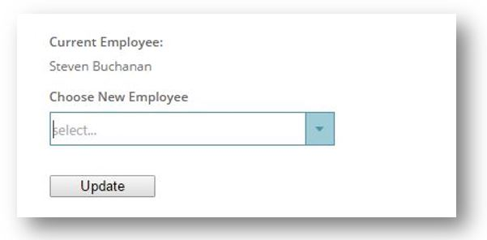
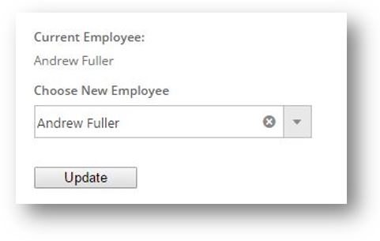

# ASP.NET MVC コンボの構成

## トピックの概要
このトピックでは、igCombo コントロールを基本的な ASP.NET MVC のシナリオで使用する方法を紹介します。

### 目的

ビューでコンボをインスタンス化するために \{environment:ProductNameMVC\} Combo が使用されます。また、従業員のコレクションのリモート要求を処理し、リモート フィルタリング パラメーターを処理するために `ComboDataSourceAction` 属性が使用されます。最後に、フォームで モデルのフィールドを更新するために使用されるコンボを確認できます。

#### 概念

-   \{environment:ProductNameMVC\} Combo の使用


### このトピックの内容

このトピックは、以下のセクションで構成されます。

-   [プレビュー](#_Preview)
-	[要件](#_Requirements)
-   [概要](#_Requirements_Overview)
-   [手順](#_Steps)
	-	[Order クラスの作成](#_create_order_class)
	-	[コントローラーとビューの追加](#_add_controler_and_view)
	-	[サンプルの実行](#_run_the_sample)
-   [関連コンテンツ](#_Related_Content)


### <a id="_Preview"></a>プレビュー

以下のスクリーンショットは最終結果のプレビューです。



### <a id="_Requirements"></a> 要件

手順を完了するには、ASP.NET MVC プロジェクトの他に次が必要になります。

-   必要な \{environment:ProductName\} の JavaScript と CSS ファイル
-   参照されている Infragistics.Web.Mvc.dll アセンブリ

### <a id="_Requirements_Overview"></a> 概要

このトピックでは、モデル、ビュー、コントローラーの作成について順を追って説明します。

1.  `Order` クラスの作成
2.  コントローラーとビューの作成

### <a id="_Steps"></a>手順

​<a id="_create_order_class"></a>`Order` クラスの作成

1. `Order` クラスの追加

	`Order` クラスを `Models` フォルダーに追加します。

2. クラス メンバーの作成

	`Order.cs` ファイルを開き、以下のメンバーをクラスに追加します。

	**C# の場合:**

```csharp
	public class Order
    {
        public int OrderID { get; set; }
        public string CustomerID { get; set; }
        public Nullable<int> EmployeeID { get; set; }
        public Nullable<System.DateTime> OrderDate { get; set; }
        public Nullable<System.DateTime> RequiredDate { get; set; }
        public Nullable<System.DateTime> ShippedDate { get; set; }
        public Nullable<int> ShipVia { get; set; }
        public Nullable<decimal> Freight { get; set; }
        public string ShipName { get; set; }
        public string ShipAddress { get; set; }
        public string ShipCity { get; set; }
        public string ShipRegion { get; set; }
        public string ShipPostalCode { get; set; }
        public string ShipCountry { get; set; }
        public string ContactName { get; set; }
        public string EmployeeName { get; set; }
        public int ShipperID { get; set; }
        public string ShipperName { get; set; }
        public decimal TotalPrice { get; set; }
        public int TotalItems { get; set; }
    }
```

​<a id="_add_controler_and_view"></a>コントローラーとビューの追加

1. `ComboController` の作成

	ASP.NET MVC アプリケーションの `Controllers` フォルダーに、`ComboController.cs` という名前で新しいコントローラーを作成します。

2. アクション メソッドの作成

	Action メソッドをコントローラーに追加して `Order` を作成します。

	**C# の場合:**

```csharp
	public class ComboController : Controller
    {
        //
        // GET: /Combo/

        [ComboDataSourceAction]
        [ActionName("employee-combo-data")]
        public ActionResult ComboData()
        {
            IEnumerable<Employee> employees = RepositoryFactory.GetEmployeeRepository().Get();
            return View(employees);
        }

        [ActionName("aspnet-mvc-helper")]
        public ActionResult UsingAspNetMvcHelper()
        {
            Order order = RepositoryFactory.GetOrderRepository().Get().First();
            return View("aspnet-mvc-helper", order);
        }

        [HttpPost]
        [ActionName("aspnet-mvc-helper")]
        public ActionResult UsingAspNetMvcHelper(Order updatedOrder)
        {
            ItemRepository<Order> orderRepository = RepositoryFactory.GetOrderRepository();
            ItemRepository<Employee> employeeRepository = RepositoryFactory.GetEmployeeRepository();

            Order existingOrder = orderRepository.Get(o => o.OrderID == updatedOrder.OrderID);
            Employee newEmployee = employeeRepository.Get(e => e.ID == updatedOrder.EmployeeID);

            if (existingOrder != null && newEmployee != null)
            {
                existingOrder.EmployeeID = newEmployee.ID;
                existingOrder.EmployeeName = newEmployee.Name;

                orderRepository.Update(existingOrder, o => o.OrderID == existingOrder.OrderID);
                orderRepository.Save();
            }

            return View("aspnet-mvc-helper", existingOrder);
        }

    }
```
3. ビューの作成

	厳密に型指定されたビューを作成し、`Order` クラスをモデルとして使用します。

	**ASPX の場合:**

```csharp
	@using Infragistics.Web.Mvc
	@using IgniteUI.SamplesBrowser.Models
	@model IgniteUI.SamplesBrowser.Models.Northwind.Order
```

4. JavaScript と CSS の参照の追加

	この例では、ASP.NET MVC アプリケーションでローカルで参照される、結合された JavaScript および CSS ファイルを使用します。

	**ASPX の場合:**

```csharp
	<link href="/Content/css/themes/infragistics/infragistics.theme.css" rel="stylesheet" type="text/css" />
	<link href="/Content/css/structure/infragistics.css" rel="stylesheet" type="text/css" />
	<script src="/Scripts/jquery.js" type="text/javascript"></script>
	<script src="/Scripts/jquery-ui.js" type="text/javascript"></script>
	<script src="/Scripts/js/infragistics.core.js" type="text/javascript"></script>
	<script src="/Scripts/js/infragistics.lob.js" type="text/javascript"></script>

	...

	<style>

        .sample-ui div {
            margin-bottom: 1em;
        }

        .sample-ui h4 {
            margin-bottom: .5em;
        }

        .sample-ui #submitBtn {
            width: 100px;
        }

    </style>
```

5. `Order` オブジェクト用のフォームを作成します。

	**ASPX の場合:**

```csharp
	@using (Html.BeginForm())
    {
        <div class="sample-ui">
            @Html.HiddenFor(item => item.OrderID)

            <div>
                <h4>Current Employee:</h4>
                @Html.DisplayFor(item => item.EmployeeName)
            </div>

            <div>
                <h4>Choose New Employee</h4>

                @(Html.Infragistics().ComboFor(item => item.EmployeeID)
                    .Width("270px")
                    .DataSource(Url.Action("employee-combo-data"))
                    .ValueKey("ID")
                    .TextKey("Name")
                    .DataBind()
                    .Render()
                )
            </div>

            <input id="submitBtn" type="submit" value="Update" />
        </div>
    }
```

​<a id="_run_the_sample"></a>サンプルの実行


サンプルを実行してドロップダウンから項目を選択します。次に更新ボタンをクリックして現在の従業員の値を更新します。



### <a id="_Related_Content"></a>関連コンテンツ

-	[igCombo データ バインドについての概要](/igcombo-data-binding): このトピックでは、`igCombo` コントロールでの各種データ バインド方式について説明し、データ バインディングに関するその他の詳細情報を示します。
