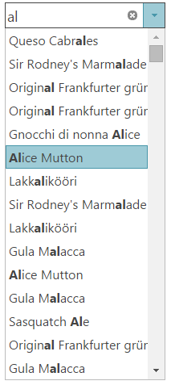
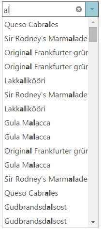

import ApiLink from 'docs-template/components/mdx/ApiLink.astro';

# 自動補完の構成 (igCombo)

## トピックの概要
### 目的

このトピックでは、`igCombo`™ コントロールの自動補完および各種フィルタリング オプションを構成する方法を説明します。

### このトピックの内容

このトピックは、以下のセクションで構成されます。

-   [igCombo 構成の概要](#control_configuration_overview)
-   [自動補完の構成](#configure_auto_suggest)
    -   [自動補完の詳細](#configure_auto_suggest_details)
    -   [自動補完のプロパティ設定](#configure_auto_suggest_property_settings)
    -   [例: ローカル フィルタリングを使用した自動補完](#auto_suggest_example)
    -   [例: ローカル フィルタリングを使用した大文字と小文字を区別する自動補完](#auto_suggest_case_sensitive_example)
    -   [自動補完プロパティ参照](#auto_suggest_property_reference)
-   [関連トピック](#related_topics)

### 前提条件

以下のリストは、このトピックの情報を完全に理解するために前提条件を示しています。

**概念**

以下の概念を理解する必要があります。

-   ASP.NET MVC のみ
    -   [ASP.NET MVC ルーティング](http://www.asp.net/mvc/tutorials/older-versions/controllers-and-routing/asp-net-mvc-routing-overview-cs)

**トピック**

まず以下のトピックを読む必要があります。

-   [igCombo の概要](/igcombo-overview) 
-   [igCombo の追加](/igcombo-getting-started)
-   [igCombo をデータにバインド](/igcombo-binding-to-data)

## igCombo 構成の概要

### コントロールの構成表

以下の表は、`igCombo` コントロールの構成可能なビヘイビアーを示しています。

### 自動補完

自動補完機能は、ドロップダウン リストのフィルタリングと一致の強調表示を組み合わせたもので、考えられる選択肢をユーザーに提案します。構成プロパティは以下のとおりです。

- <ApiLink type="igCombo" member="filteringType" section="options" label="filteringType" />

- <ApiLink type="igCombo" member="highlightMatchesMode" section="options" label="highlightMatchesMode" />

- <ApiLink type="igCombo" member="caseSensitive" section="options" label="caseSensitive" />

- <ApiLink type="igCombo" member="filteringCondition" section="options" label="filteringCondition" />

## 自動補完の構成

### 自動補完の詳細

`igCombo` auto-suggest 機能は、ドロップダウン リストのフィルタリングと一致の強調表示を組み合わせたもので、考えられる選択肢をユーザーに提案します。filteringType を「local」に設定するとリスト フィルタリングが有効になり、highlightMatchesMode を設定するとドロップダウンの一致テキストを強調表示できます。

`igCombo` コントロールがクライアントにバインドされていても、サーバーにバインドされていても、リスト上のフィルタリングはローカルで行われ、フィルターされたデータのサーバー要求量を減らします。ローカル フィルタリング タイプを使用するには、`igCombo` コントロールのすべてのデータをクライアントに提供する必要があります。

>**注:** 1 つの要求にとって選択肢の数が大きすぎる場合は、リモート フィルタリングの使用を検討します。

また、フィルタリング ビヘイビアーと強調表示ビヘイビアーをカスタマイズして、どの条件が一致をトリガーするか変更できます。最も一般的な設定は、プロパティ設定表に示しています。条件は `filteringCondition` オプションを使用したフィルタリングをカスタマイズでき、同様のビヘイビアーは `highlightMatchesMode` オプションを使用した強調表示についてカスタマイズできます。`caseSensitive` オプションを true に設定してフィルタリングの大文字と小文字を区別できます。

### 自動補完のプロパティ設定

以下の表は、要求ビヘイビアーをプロパティ設定にマップしています。プロパティの設定画面は、`igCombo` コントロールのオプションから呼び出します。

| 目的: | 使用するプロパティ | 設定値 |
| --- | --- | --- |
| 自動補完フィルタリングを有効にする | <ApiLink type="igCombo" member="filteringType" section="options" label="filteringType" /> | local |
| 単一の項目内のすべてのインスタンスの一致の強調表示を有効にする | <ApiLink type="igCombo" member="highlightMatchesMode" section="options" label="highlightMatchesMode" /> | multi |
| 入力されたテキストから始まる項目のみ検索するようフィルタリングを構成する | <ApiLink type="igCombo" member="filteringCondition" section="options" label="filteringCondition" /> | startsWith |
| 入力されたテキストを含むすべての項目を検索するようフィルタリングを構成する | <ApiLink type="igCombo" member="filteringCondition" section="options" label="filteringCondition" /> | contains |
| 入力されたテキストから始まる項目のみ照合するよう一致の強調表示を構成する | <ApiLink type="igCombo" member="highlightMatchesMode" section="options" label="highlightMatchesMode" /> | startsWith |
| 各項目内で入力されたテキストのインスタンス 1 つだけ照合するよう一致の強調表示を構成する | <ApiLink type="igCombo" member="highlightMatchesMode" section="options" label="highlightMatchesMode" /> | contains |
| フィルタリングの大文字と小文字を区別する | <ApiLink type="igCombo" member="caseSensitive" section="options" label="caseSensitive" /> | true |
| オートコンプリートを有効にする | <ApiLink type="igCombo" member="autoComplete" section="options" label="autoComplete" /> | true |

### 例: ローカル フィルタリングを使用した自動補完

以下の設定は、ローカル データからリスト値を照合する自動補完ビヘイビアーを構成する方法を示しています。

<table class="table">
	<thead>
		<tr>
			<th>プロパティ</th>
			<th>設定</th>
			<th>プレビュー</th>
</tr>
	</thead>
	<tbody>
		<tr>
			<td><ApiLink type="igCombo" member="filteringType" section="options" label="filteringType" /></td>
			<td>local</td>
			<td rowspan="4"></td>
</tr>
		<tr>
			<td><ApiLink type="igCombo" member="highlightMatchesMode" section="options" label="highlightMatchesMode" /></td>
			<td>multi</td>
</tr>
		<tr>
			<td><ApiLink type="igCombo" member="filteringCondition" section="options" label="filteringCondition" /></td>
			<td>contains</td>
</tr>
	</tbody>
</table>

## 例: ローカル フィルタリングを使用した大文字と小文字を区別する自動補完

以下の設定は、ローカル データからの入力されたテキストの大文字と小文字が正確に一致するリスト値を照合する自動補完ビヘイビアーを構成する方法を示しています。

<table class="table">
	<thead>
		<tr>
			<th>プロパティ</th>
			<th>設定</th>
			<th>プレビュー</th>
</tr>
	</thead>
	<tbody>
		<tr>
			<td><ApiLink type="igCombo" member="filteringType" section="options" label="filteringType" /></td>
			<td>local</td>
			<td rowspan="4"></td>
</tr>
		<tr>
			<td><ApiLink type="igCombo" member="highlightMatchesMode" section="options" label="highlightMatchesMode" /></td>
			<td>contains</td>
</tr>
		<tr>
			<td><ApiLink type="igCombo" member="filteringCondition" section="options" label="filteringCondition" /></td>
			<td>contains</td>
</tr>
		<tr>
			<td><ApiLink type="igCombo" member="caseSensitive" section="options" label="caseSensitive" /></td>
			<td>true</td>
</tr>
	</tbody>
</table>

### 例: 自動補完とオートコンプリートおよびローカル フィルタリング

<table class="table">
	<thead>
		<tr>
			<th>プロパティ</th>
			<th>設定</th>
			<th>プレビュー</th>
</tr>
	</thead>
	<tbody>
		<tr>
			<td><ApiLink type="igCombo" member="filteringType" section="options" label="filteringType" /></td>
			<td>local</td>
			<td rowspan="4"></td>
</tr>
		<tr>
			<td><ApiLink type="igCombo" member="highlightMatchesMode" section="options" label="highlightMatchesMode" /></td>
			<td>startsWith</td>
</tr>
		<tr>
			<td><ApiLink type="igCombo" member="filteringCondition" section="options" label="filteringCondition" /></td>
			<td>startsWith</td>
</tr>
		<tr>
			<td><ApiLink type="igCombo" member="autoComplete" section="options" label="autoComplete" /></td>
			<td>true</td>
</tr>
	</tbody>
</table>

### 自動補完プロパティ参照

これらのプロパティの詳細情報は、プロパティ参照セクションのリストを参照してください。

-   <ApiLink type="igcombo" label="igCombo のオプション" />

### 関連トピック

以下は、その他の役立つトピックです。

-   [リモート フィルタリングの構成 (igCombo) ](/igcombo-configure-remote-filtering) 

 

 

