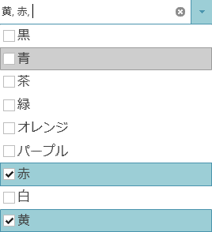
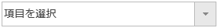

---
title: "選択の構成 (igCombo)"
slug: igcombo-configure-selection
---

# 選択の構成 (igCombo)


##トピックの概要


###目的


`igCombo`™ コントロールは、選択ビヘイビアーをプログラム的に変更するための単一の選択および複数選択、チェックボックス、選択イベント、および API をサポートしています。このトピックでは、選択機能を構成する方法を示します。

###このトピックの内容


このトピックは、以下のセクションで構成されます。

-   [igCombo 選択構成の概要](#configuration_overview)
-   [複数選択の構成](#configure_multiple_selection)
    -   [複数選択の詳細](#multiple_selection_details)
    -   [複数選択の設定](#multiple_selection_settings)
-   [コード例: チェックボックスの構成](#code_example)
-   [選択のクリア](#clear_selection)
    -   [選択の詳細のクリア](#clear_selection_details)
    -   [選択の設定のクリア](#clear_selection_settings)
-   [選択イベントの処理](#handle_selection_events)
    -   [選択イベントの詳細](#selection_events_details)
    -   [選択イベントの設定](#selection_events_settings)
-   [選択のキャンセル](#cancel_selection)
    -   [概要](#cancel_selection_introduction)
    -   [概要](#cancel_selection_overview)
    -   [手順](#cancel_selection_steps)
-   [関連トピック](#related_topics)

###前提条件


以下の表は、このトピックの情報を完全に理解するために前提条件を示しています。

**トピック**

[igCombo の概要](/controls/igcombo/overview)および [igCombo の追加](/controls/igcombo/getting-started)トピックをお読みください。

**外部リソース**

まず以下のセクションを読む必要があります。

-   [jQuery bind() API](http://api.jquery.com/bind/)
-   [jQuery live() API](http://api.jquery.com/live/)

##<a id="configuration_overview"></a>igCombo 選択構成の概要 


###選択の構成 


以下の表は、`igCombo` コントロールの構成可能なビヘイビアーを示しています。


| 構成可能な動作 | ビヘイビアーの詳細 | 構成プロパティ |
| --- | --- | --- |
| 複数選択 | 複数選択では、ユーザーはドロップダウンから、またはテキスト ボックスに複数の値を入力してコンボの 1 つ以上の項目を選択できます。 | [multiSelection](environment:jQueryApiUrl/ui.igCombo#options:multiSelection) |
| 選択のクリア | igCombo コントロールから選択をプログラム的にクリアします。 | [deselectAll](environment:jQueryApiUrl/ui.igCombo#methods:deselectAll) |
| 選択イベントの処理 | 選択イベントをキャプチャし、発生している選択操作に対するロジックを実行します。 | [selectionChanging](environment:jQueryApiUrl/ui.igCombo#events:selectionChanging) |
| 選択イベントの処理 | 選択イベントをキャプチャし、発生している選択操作に対するロジックを実行します。 | [selectionChanging](environment:jQueryApiUrl/ui.igCombo#events:selectionChanging), [selectionChanged](environment:jQueryApiUrl/ui.igCombo#events:selectionChanged) |
| 選択のキャンセル | 選択操作をキャンセルするには、選択変更イベントをキャンセルします | [selectionChanging](environment:jQueryApiUrl/ui.igCombo#events:selectionChanging) |


##<a id="configure_multiple_selection"></a>複数選択の構成 


###<a id="multiple_selection_details"></a>複数選択の詳細


複数選択が有効になっている場合、ユーザーはマウスまたはキーボードによってドロップダウン リストから複数項目を選択できます。また、テキスト ボックスに複数の値を入力し、`itemSeparator` で区切って対応する値を選択することもできます。`itemSeparator` のデフォルト値は `', '` です。

最後に、複数選択が簡単にできるようチェックボックスを有効にできます。



###<a id="multiple_selection_settings"></a>複数選択の設定


以下の表は、プロパティ設定の推奨構成をマップしています。プロパティは `igCombo` コントロールのオプションからアクセスされます。


| 構成の目的: | このオプションの使用: | プロパティ値 |
| --- | --- | --- |
| 複数選択 | [**multiSelection.enabled**](environment:jQueryApiUrl/ui.igCombo#options:multiSelection.enabled) | true |
| チェックボックスの表示 | [**multiSelection.showCheckboxes**](environment:jQueryApiUrl/ui.igCombo#options:multiSelection.showCheckboxes) | true |


###<a id="code_example"></a>コード例: チェックボックスの構成 


以下のパラメーターを指定した `igCombo` コントロール オプションを使用して複数選択を構成するため、この例で使用されている完全なコードを次に示します。

**複数選択** - チェックボックスで有効

**HTML の場合:**

```html
<script type="text/javascript">
    $(function () {
        $("#comboTarget").igCombo({
            dataSource: colors,
            multiSelection: {
				enabled: true,
				showCheckboxes: true
			}
        });
    });
</script>
```


**ASPX の場合:**

```csharp
<%= Html.
    Infragistics().
    Combo().
    DataSource(this.Model as IQueryable<System.Drawing.Color>).
    MultiSelectionSettings(ms => {
		ms.Enabled(true);
		ms.ShowCheckBoxes(true);
	}).    
    Render()
%>
```

###複数選択プロパティの参照


これらのプロパティの詳細情報は、プロパティ参照セクションのリストを参照してください。

**igCombo のオプション**

####<a id="clear_selection"></a>選択のクリア


######<a id="clear_selection_details"></a>選択の詳細のクリア 


`igCombo` コントロールの選択をプログラム的にクリアするには、deselectAll メソッドを使用します。



######<a id="clear_selection_settings"></a>選択の設定のクリア


以下の表は、要求ビヘイビアーをプロパティ設定にマップしています。プロパティは `igCombo` オプションからアクセスされます。


| 目的: | このメソッドおよびイベントの使用: |
| --- | --- |
| 選択のクリア | [**deselectAll**](environment:jQueryApiUrl/ui.igCombo#methods:deselectAll) |
| 選択が変更された後でイベントを処理します | [**selectionChanged**](environment:jQueryApiUrl/ui.igCombo#events:selectionChanged) |


###<a id="handle_selection_events"></a>選択イベントの処理


######<a id="selection_events_details"></a>選択イベントの詳細


選択イベントを使用して、選択操作の発生時にロジックを実行できます。`selectionChanging` はコントロール内で選択が変更される前に発生し、`selectionChanged` イベントは igCombo の選択が変更された直後に発生します。

######<a id="selection_events_settings"></a>選択イベントの設定


以下の表は、プロパティ設定の推奨構成をマップしています。プロパティは `igCombo` オプションからアクセスされます。


| 目的: | このイベントの使用: | プロパティ値 |
| --- | --- | --- |
| 変更中の選択の前にイベントを処理します | [**selectionChanging**](environment:jQueryApiUrl/ui.igCombo#events:selectionChanging) | `function()` |
| 選択が変更された後でイベントを処理します | [**selectionChanged**](environment:jQueryApiUrl/ui.igCombo#events:selectionChanged) | `function()` |


##<a id="cancel_selection"></a>選択のキャンセル 


###<a id="cancel_selection_introduction"></a>概要 


`selectionChanging` イベントを処理することで、選択操作をキャンセルできます。

###<a id="cancel_selection_overview"></a>概要


-	以下はプロセスの概念的概要です。

-	`selectionChanging` イベントの処理

-	false を返すことによるイベントのキャンセル

###<a id="cancel_selection_steps"></a>手順


1.  `selectionChanging` イベントを処理します。

    1.  ハンドラー関数を定義します。

        `selectionChanging` イベントが発生したときに呼び出される関数を定義します。

        **HTML と ASPX の場合:**

```html
        <script type="text/javascript">        
            function comboSelectionChanging(evt, ui) {

            };   
        </script>
```

    2.  `selectionChanging` イベントのハンドラーを構成します。

        いったんハンドラーを定義したら、`selectionChanging` イベントのハンドラーとして設定する必要があります。jQuery では、これはウィジェットがインスタンス化されるときに行うことができます。ASP.NET MVC では、jQuery live または bind API を使用してイベントを添付する必要があります。また live または bind API の使用は、純粋な jQuery 実装のイベントを添付するためのオプションです。このイベントの型は「igcomboselectionchanging」です。

        **HTML の場合:**

```html
        $("#comboTarget").igCombo({
                    selectionChanging: comboSelectionChanging
        });
```

		 **ASPX の場合:**

```csharp
		 $("#comboTarget").bind("igcomboselectionchanging", comboSelectionChanging);
```

2.  false を返すことでイベントをキャンセルします。

    **HTML と ASPX の場合:**

```html
    <script type="text/javascript">
            
        function comboSelectionChanging(evt, ui) {
           if (conditionNotMet)
              return false;
         };   
    </script>
```

##<a id="related_topics"></a>関連トピック 


以下は、その他の役立つトピックです。

-	[igCombo の構成](/controls/igcombo/configuring/configuring)

 

 


