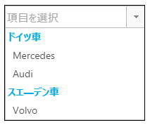

import ApiLink from 'docs-template/components/mdx/ApiLink.astro';

# グループ化の構成 (igCombo)

グループ化機能を使用すると、項目を特定の基準または共通カテゴリ別にグループ化することができます。

##トピックの概要
### 目的
このトピックでは、グループ化機能の使用方法、`Grouping` ウィジェットの主なプロパティの概説と実行可能な構成を説明します。
### このトピックの内容

このトピックは、以下のセクションで構成されます。

-   [概要](#introduction)
-   [グループ化の概要](#groupingOverview)
-   [関連コンテンツ](#relatedContent)

## <a id="introduction"></a> 概要
`igCombo` がサポートするグループ化機能は、関連する項目をグループ化することができます。これは、バージョン 15.2 からの機能です。以下の図に、項目を車`種`別に昇順でグループ化した `igCombo` を示します。
> **注:** デフォルトでは、並べ替え順序は、`昇順`に設定されています。 



##<a id="groupingOverview"></a>グループ化の概要
コンボの`グループ化`を有効にするには、<ApiLink type="igcombo" member="grouping.key" section="options" label="key" /> プロパティを設定する必要があります。このプロパティは、レコードのグループ化で使用する`列の名前`で表示されます。コンボを初期化すると、すべての項目がキーによる昇順でグループ化されます。`並べ替え方向`は、<ApiLink type="igcombo" member="grouping.dir" section="options" label="dir" /> プロパティを使用して変更できます。以下のコード スニペットにこの例を示します。
**JavaScript の場合:**

```js

$(".selector").igCombo({
	dataSource: data,
	textKey: 'name',
	valueKey: 'id',
	closeDropDownOnBlur: false,
	grouping: {
		key: 'carType',
		dir: 'desc'
	}
});
```

**ASPX の場合:**

```csharp
@(Html.Infragistics().ComboFor(item => item.ID)
        .Width("400px")
        .DataSourceUrl(Url.Action("ComboDataLocation"))
        .ValueKey("ID")
        .TextKey("CarName")
        .CompactData(false)
        .Grouping(gr =>
        {
            gr.Key("Country");
            gr.Dir(ComboGroupingDirection.Desc);
        })
        .DataBind()
        .Render()
)
```

> **注:** ロードオンデマンドおよびグループ化を使用する場合は、データソースのすべての項目をグループ化に使用したキーで並べ替えることをお勧めします。

##<a id="relatedContent"></a> 関連コンテンツ
###API ヘルプ

-	<ApiLink type="igcombo" member="grouping" section="options" label="API のグループ化 ヘルプ" />

### サンプル

このトピックについては、以下のサンプルも参照してください。
-	[ヘッダーテンプレートおよびフッターテンプレートを使用するグループ化](&#123;environment:SamplesUrl&#125;/combo/grouping): このサンプルでは、ヘッダーテンプレートおよびフッターテンプレートを使用した効率的なグループ化の方法を紹介します。
