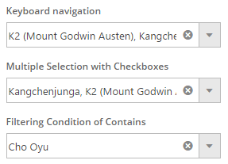

---
title: "TypeScript サポート (igCombo)"
slug: igcombo-typescript-support
---

# TypeScript サポート (igCombo)

## トピックの概要
本トピックは、TypeScript データソースで `igCombo` を構成する方法について説明します。TypeScript クラスを定義し、クラスのインスタンスでデータソースを作成してデータソースを `igCombo` にバインドします。

### このトピックの内容

このトピックは、以下のセクションで構成されます。

-   [プレビュー](#Preview)
-   [要件](#Requirements)
-   [概要](#Overview)
-   [手順](#Steps)
    -   [HTML の作成](#create_html_markup)
    -   [TypeScript クラスの作成](#create_typescript_class)
    -   [データソースの作成](#create_data_source)
    -   [TypeScript データソースで igCombo を作成](#create_combos)
-   [関連コンテンツ](#Related_Content)

### <a id="Preview"></a>プレビュー
以下のスクリーンショットは最終結果のプレビューです。



### <a id="Requirements"></a>要件
このサンプルを実行するために以下が必要です。
-   必要となる &#123;environment:ProductName&#125; の JavaScript と CSS ファイル
-   必須な &#123;environment:ProductName&#125; TypeScript 定義

### <a id="Overview"></a>概要
このトピックでは、TypeScript クラスの作成、データソース、および `igCombo` について順を追って説明します。

### <a id="Steps"></a>手順

​<a id="create_html_markup"></a>HTML の作成 - それぞれ 3 つのコンボでキーボード ナビゲーション、複数選択、フィルタリングをデモします。

**HTML の場合:**
```html
<div>
    <h4 class="combo-label">
        キーボード ナビゲーション
    </h4>
    <div id="keyNavigationCombo"></div>
</div>
<div>
    <h4 class="combo-label">
        チェックボックスの複数選択
    </h4>
    <div id="checkboxSelectCombo"></div>
</div>
<div>
    <h4 class="combo-label">
        フィルタリング条件
    </h4>
    <div id="filterContainsCombo"></div>
</div>
```
​<a id="create_typescript_class"></a>TypeScript クラスの作成 - `id`、`mountainName`、`country`、`height`など、山頂とその特徴についての情報を保存します。

**TypeScript の場合:**
```typescript
/// <reference path="http://www.igniteui.com/js/typings/jquery.d.ts" />
/// <reference path="http://www.igniteui.com/js/typings/jqueryui.d.ts" />
/// <reference path="http://www.igniteui.com/js/typings/igniteui.d.ts" />
class MountainTop {
    id: number;
    mountainName: string;
    country: string;
    height: number;
    constructor(inId: number, inMountanName: string, inCountry: string, inHeight: number) {
        this.id = inId;
        this.mountainName = inMountanName;
        this.country = inCountry;
        this.height = inHeight;
    }
}
```

​<a id="create_data_source"></a>データソースの作成 - `MountainTop` クラスのインスタンスを　10 個作成し、データソースとなる配列に追加します。

**TypeScript の場合:**
```typescript
var mountainTopsData: MountainTop[] = [];
mountainTopsData.push(new MountainTop(1, "Everest", "Nepal/Tibet", 29.035));
mountainTopsData.push(new MountainTop(2, "K2 (Mount Godwin Austen)", "Pakistan/China", 29.250));
mountainTopsData.push(new MountainTop(3, "Kangchenjunga", "India/Nepal", 28.169));
mountainTopsData.push(new MountainTop(4, "Lhotse", "Nepal/Tibet",  27.940));
mountainTopsData.push(new MountainTop(5, "Makalu", "Nepal/Tibet", 27.766));
mountainTopsData.push(new MountainTop(6, "Cho Oyu", "Nepal/Tibet", 26.906));
mountainTopsData.push(new MountainTop(7, "Dhaulagiri", "Nepal", 26.795));
mountainTopsData.push(new MountainTop(8, "Manaslu", "Nepal", 26.781));
mountainTopsData.push(new MountainTop(9, "Nanga Parbat", "Pakistan", 26.660));
mountainTopsData.push(new MountainTop(10, "Annapurna", "Nepal", 26.545));
```

​<a id="create_combos"></a>TypeScript データ ソースで igCombo を作成 - コンボを 3 つ定義し、データソースを割り当てます。

**TypeScript の場合:**
```typescript
$(function () {
    $("#keyNavigationCombo").igCombo({
        width: "270px",
        textKey: "mountainName",
        valueKey: "id",
        dataSource: mountainTopsData,
        multiSelection: {
            enabled: true
        },
    });

    $("#checkboxSelectCombo").igCombo({
        width: "270px",
        dataSource: mountainTopsData,
        textKey: "mountainName",
        valueKey: "id",
        multiSelection: {
            enabled: true,
            showCheckboxes: true
        }
    });

    $("#filterContainsCombo").igCombo({
        width: "270px",
        textKey: "mountainName",
        valueKey: "mountainName",
        dataSource: mountainTopsData,
        filteringType: "local",
        filteringCondition: "contains",
        highlightMatchesMode: "contains"
    });
});
```

### <a id="Related_Content"></a>関連コンテンツ
以下のトピックでは、このトピックに関連する追加情報を提供しています。
-   [TypeScript で &#123;environment:ProductName&#125; を使用](Using-Ignite-UI-with-TypeScript.html) - このトピックでは、&#123;environment:ProductName&#125; の型定義を TypeScript で使用する方法の概要を説明します。
