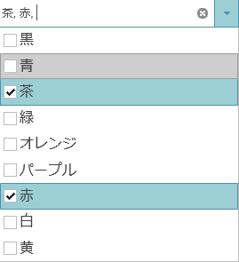

# igCombo の概要

##トピックの概要

###目的

このトピックでは、機能、データ ソースへのバインド、要件、およびテンプレートに関する情報を含めて、`igCombo`™ コントロールの概要を示します。

###このトピックの内容

このトピックは、以下のセクションで構成されます。

- [主要機能](#main-features)

- [データ ソースにバインド](#binding-to-data-source)

- [最低必要条件](#minimum-requirements)

- [テンプレートの使用および選択](#template-use-and-selection)

### 前提条件

以下の表は、このトピックを理解するために必要な前提条件です。

**トピック**

最初に、以下のトピックを読む必要があります。

-	[&#123;environment:ProductName&#125; の概要](/igniteui-for-jquery-overview)

-	[&#123;environment:ProductName&#125; で JavaScript リソースを使用](/deployment-guide-javascript-resources)

-	[&#123;environment:ProductName&#125; のスタイル設定とテーマ設定](/deployment-guide-styling-and-theming)

-	[igGrid/igDataSource アーキテクチャの概要](/iggrid-igdatasource-architecture-overview)のデータ ソース コントロール セクション

**外部リソース**

あらかじめ [jQuery ウィジェットの使用](http://learn.jquery.com/jquery-ui/getting-started/) を読んでおくことをお勧めします。

##主要機能

###機能の概要

下の表は、`igCombo` の主な機能の概要を説明します。

|  |  |
| --- | --- |
| 機能 | 説明 |
| 仮想化 | igCombo コントロールは、大量のデータをバインドする際に HTML 要素を再利用してパフォーマンスを高めることができます。 |
| オート コンプリート | この機能を有効にすると、igCombo コントロールは、候補リストの先頭にある一致文字列から予測して残りの入力テキストを自動的に埋めていきます。 |
| 自動補完 | igCombo コントロールは入力ボックスに入力されたテキストに基づいて候補リストを絞り込むことができます。 |
| 複数選択 | ユーザーは 1 つまたは複数の項目を選択することができ、チェックボックスを使用して複数選択を実行することもできます。 |
| キーボード ナビゲーション | ユーザーは、igCombo がサポートする豊富なキーボード ナビゲーションにより、簡単な操作で項目間を迅速に移動でき、選択する項目や強調表示する項目を変更することができます。 |
| ロード オン デマンド | igCombo コントロールは、ロード オン デマンド機能をサポートしています。ロード オン デマンドを有効にすると、サーバーとクライアントの両方で帯域幅と処理のオーバーヘッドが大幅に削減されます。 |
| 強調表示 | igCombo 入力でユーザーがテキストを入力すると、ドロップダウン項目で一致する結果が強調表示で表示されます。 |
| environment:ProductNameMVC | サポートされる .NET コードで igCombo コントロールを構成できるようになります。 |

### 仮想化

仮想化を有効にすると、メモリの消費を低いレベルに抑えながら `igCombo` コントロールを数百の項目にバインドできるようになります。このコンボでは、コンボのスクロール可能領域を埋める必要な量の HTML 要素のみが作成され、ユーザーがデータをスクロールする際にはそうした要素が再利用されます。

#### 関連トピック

-	[パフォーマンスの最適化 (igCombo)](/igcombo-optimize-performance)

#### 関連サンプル

- [igCombo 仮想化](&#123;environment:SamplesUrl&#125;/combo/virtualization)

### オートコンプリート

オートコンプリート機能を使用すると、すでに候補リストに含まれている文字列をすばやく入力できるようになります。このコンボでは、最初の文字が入力されると、候補リストの先頭にある一致項目から残りの文字列が予測され、その文字列が残りの入力テキストとして埋められていきます。

#### 関連トピック

-	[igCombo の追加](/igcombo-getting-started)

### 自動補完

ドロップダウン リストから特定の値を素早く見つけ出すには、自動補完機能を有効にします。入力ボックスに入力されたテキストに基づきドロップダウン リストの項目選択肢が絞り込まれます。「～を含む」や「～から始まる」といった演算子を使用した絞り込みなど、条件の異なる絞り込みができます。

#### 関連トピック

-	[自動補完の構成 (igCombo)](/igcombo-configure-auto-suggest)

### 複数選択

`igCombo` コントロールでは、単一選択と複数選択が利用できます。複数選択が有効な場合、ドロップダウン リストから複数の項目を選択できます。データを入力する際には、入力ボックスで複数の値をコンマ (,) で区切ってタイピングする方法で複数の値を選択することもできます。

#### 関連トピック

-	[選択の構成 (igCombo)](/igcombo-configure-selection)

#### 関連サンプル

- [igCombo の複数選択](&#123;environment:SamplesUrl&#125;/combo/selection-and-checkboxes)

### ロード オン デマンド

ロード オン デマンドを有効にすると、最初にドロップダウン コンテナーにスクロールバーが表示され、リスト項目の最初のページが表示されます。リストの最後までスクロールすると、非同期コールバックを通じて次の項目ページが取得され、リストの一番下に追加されます。

#### 関連トピック
- [ロード オン デマンドの構成 ](/igcombo-load-on-demand)

#### 関連サンプル

- [ロード オン デマンド](&#123;environment:SamplesUrl&#125;/combo/load-on-demand)

### キーボード ナビゲーション

コンボはキーボードでナビゲートできます。これは重要なユーザー補助機能です。この機能は、エンドユーザーがドロップダウン 項目間を簡単かつ迅速に移動できるようにして、時間を節約します。これはユーザー エクスペリエンスを向上させます。

#### 関連トピック
- [igCombo キーボード ナビゲーション](/igCombo-keyboard-navigation)

#### 関連サンプル

- [キーボード ナビゲーション](&#123;environment:SamplesUrl&#125;/combo/keyboard-navigation)

### &#123;environment:ProductNameMVC&#125;

ASP.NET MVC ヘルパーを使用すると、サポートされるコード言語で &#123;environment:ProductNameMVC&#125; `igCombo` コントロールを構成できるようになります。再利用可能な View または ViewModel を ASP.NET MVC アプリケーションに作成すると、このコンボとのインターフェイスを確保できます。ASP.NET で IQueryable オブジェクトへのバインドもできます。さらに、ヘルパーによりクライアント側で使用する `igCombo` コントロールの JSON データが生成されます。

### 関連トピック

-	[igCombo の追加](/igcombo-getting-started)

-	[自動補完の構成 (igCombo)](/igcombo-configure-auto-suggest)

#### 関連サンプル

- [&#123;environment:ProductNameMVC&#125; Combo](&#123;environment:SamplesUrl&#125;/combo/aspnet-mvc-helper)

##最低必要条件

###概要

`igCombo` コントロールは jQuery UI ウィジェットの 1 つであるため、jQuery コアと jQuery UI JavaScript ライブラリに依存します。また、`igCombo` コントロールが機能の共有やデータのバインドに使用する &#123;environment:ProductName&#125;™ JavaScript リソースもいくつかあります。JavaScript の参照は、`igCombo` コントロールを純粋な JavaScript コンテキストのみで使用する場合もASP.NET MVC で使用する場合も必要になります。ASP.NET MVC で `igCombo` を使用する場合に、.NET 言語で `igCombo` を構成するには、Infragistics.Web.Mvc アセンブリが必要です。

###要件

以下の表は、`igCombo` コントロールの要件を示しています。

| 要件 | 説明 |
| --- | --- |
| jQuery および jQuery UI JavaScript リソース | environment:ProductName は、これらのフレームワークの最上位にビルドされます。 [jQuery](http://jquery.com) (igCombo では jQuery バージョン 1.8.3 が必要です) [jQuery UI](http://jqueryui.com/) (igCombo では jQuery UI バージョン 1.9.2 が必要です) |
| environment:ProductName の共用 JavaScript リソース | environment:ProductName には、ほとんどのウィジェットが使用する共用 JavaScript リソースがいくつかあります: infragistics.util.js infragistics.util.jquery.js |
| igDataSource JavaScript リソース | igCombo は igDataSource を内部で使用してデータを操作します。 infragistics.dataSource.js |
| igTemplating JavaScript リソース | igCombo は igTemplating を内部で使用して項目を描画します。 infragistics.templating.js |
| igCombo JavaScript リソース | igCombo ウィジェット用の JavaScript ファイル: infragistics.ui.combo.js |
| IG テーマ | このテーマには、environment:ProductName 向けに作成されたカスタム ビジュアル スタイルが含まれています。 |
| ベース テーマ | 基本テーマには、主に各ウィジェットのフォームと機能を定義するスタイルが含まれています。 |

##データ ソースにバインド

以下の表は、`igCombo` コントロールとデータ ソースとのバインドに関する要件をカテゴリ別に示します。

|  |  |
| --- | --- |
| 要件のカテゴリ | 要件の一覧 |
| データ構造 | 以下のいずれかの形態を使用できます。 ローカルまたは Web サーバーから提供される適格な JSON または XML JavaScript 配列 HTML SELECT 要素 KnockoutJS JSONP ASP.NET MVC における IQueryable |
| データ型 | String Number Boolean Date |

###サポートされるデータ ソース

以下の表は、サポートされるデータ ソース、および各データ ソースのバインドに関する基本情報を示します。

| データ ソース | バインディング |
| --- | --- |
| igDataSource | `igDataSource` は、`igCombo` コントロールによって内部的に使用され、データ操作を管理します。このデータ ソースは、さまざまなタイプのローカル データやリモート データを受け入れます。 |
| [igCombo をデータにバインド](/igcombo-binding-to-data) | `igCombo` コントロールの jQuery セレクターから SELECT 要素を選択すると、その SELECT 要素は自動的に `igCombo` コントロールに変換され、元の SELECT 要素のオプションが継承されます。 |
| IQueryable | ASP.NET MVC では、igCombo のデータソースとして IQueryable を指定します。そのコレクションは、ブラウザーでの使用に合わせて JSON にシリアル化されて View と共に返されます。 |
| [KnockoutJS](/igcombo-knockoutjs-support) | `igCombo` コントロールにおける Knockout ライブラリのサポートは、開発者が Knockout ライブラリとその宣言構文を使用してツリー コントロールを初期化し構成するための簡単な方法を提供することを目的としています。 |

### データ ソースへのバインドに関する概要

ほとんどの場合、`igCombo` の `dataSource` または `dataSourceUrl` オプションを使用してデータをバインドします。このオプションは、サポートされるさまざまなデータ形式を処理できる `igDataSource` にデータを提供します。ただし、SELECT 要素を使用して `igCombo` のインスタンスを作成する場合は例外で、このオプションは使用しません。この場合、`igCombo` は元の SELECT 要素のデータおよびオプションを継承します。ASP.NET MVC では、&#123;environment:ProductNameMVC&#125; ヘルパーに IQueryable を供給すると、サーバーからのデータを簡単にシリアル化して、View と共にクライアントに渡せるようになります。そのページがブラウザーに渡されると、`igCombo` の `dataSource` オプションが設定され、クライアント側での操作に使用されます。

##テンプレートの使用および選択

### 概要

テンプレートを使用して `igCombo` コントロールのレイアウトをカスタマイズできる場所がいくつかあります。ヘッダーやフッターを、それぞれドロップダウン リストの最上部または最下部に付けておくと、ユーザーの選択肢に関するコンテキスト情報を増やすことができます。また、項目テンプレートを定義しておくこともできます。これにより、それぞれの選択肢について、カスタマイズされたレイアウトで複数の情報を表示できるようになります。

### テンプレート使用チャート

下の表は、`igCombo` のテンプレートと各テンプレートの用途をまとめたものです。

|  |  |
| --- | --- |
| テンプレート | igCombo での使用 |
| ヘッダー | headerTemplate オプションをセットすると、ドロップダウン リストの最上部に表示するカスタムの HTML を定義できるようになります。 |
| フッター | footerTemplate オプションをセットすると、カスタムの HTML がドロップダウン リストの最下部に表示されます。スクロールバーが必要な大きなリストの場合、フッター テンプレートは常にスクロール可能領域の下に表示されます。 |
| 項目 | itemTemplate オプションにはカスタムの HTML を設定することができます。バインドされた各項目に関するデータはそのテンプレートを使用して表示されます。項目ごとに画像およびカスタム レイアウトを表示することができます。 |

### テンプレート選択チャート

下の表は、予想されるユーザーのニーズと、個々のニーズに適したテンプレートをリストしたものです。

| 用途 | 使用テンプレート |
| --- | --- |
| ドロップダウン リストの最上部にヘッダーを表示します | headerTemplate |
| ドロップダウン リストの最下部にフッターを表示します | footerTemplate |
| 項目選択肢ごとに画像またはアイコンを表示します | itemTemplate |
| カスタム レイアウトで各項目に複数の情報を表示します | itemTemplate |

##関連トピック

以下は、その他の役立つトピックです。

- [&#123;environment:ProductName&#125; の概要](/igniteui-for-jquery-overview)

- [&#123;environment:ProductName&#125; で JavaScript リソースを使用](/deployment-guide-javascript-resources)

- [&#123;environment:ProductName&#125; のスタイル設定とテーマ設定](/deployment-guide-styling-and-theming)

- [igGrid/igDataSource アーキテクチャの概要](/iggrid-igdatasource-architecture-overview)

- [igCombo の追加](/igcombo-getting-started)

- [igCombo をデータにバインド](/igcombo-binding-to-data)

- [igCombo の構成](/igcombo-configuring)

- [igCombo のスタイル設定](/igcombo-using-themes)

- [キーボード ナビゲーション](/igCombo-keyboard-navigation)

- [アクセシビリティ準拠 (igCombo)](/igcombo-accessibility-compliance)

- [既知の問題と制限 (igCombo)](/igcombo-known-limitations)

- [jQuery および MVC API リファレンス リンク (igCombo)](/igcombo-jquery-and-asp-net-mvc-helper-api-links)

 