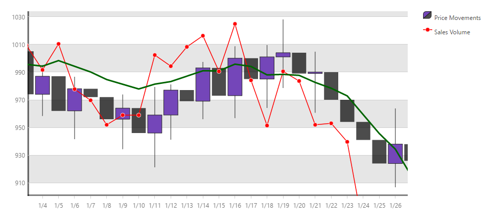

---
title: "igDataChart の追加"
slug: igdatachart-adding
---

# igDataChart の追加


## トピックの概要
### 目的

このトピックでは、`igDataChart`™ コントロールをページに追加し、データにバインドする方法を紹介します。

### 必要な背景

以下の表に、このトピックを理解するための前提条件として求められる素材をリストします。


**概念**

-   [jQuery](http://docs.jquery.com/Main_Page)、[jQuery UI](http://jqueryui.com/)
-   [ASP.NET MVC](http://www.asp.net/mvc)

**トピック**

-	[&#123;environment:ProductName&#125; の概要](/igniteui-for-jquery-overview): &#123;environment:ProductName&#125;™ ライブラリにつぃての一般的情報

-	[&#123;environment:ProductName&#125; で JavaScript リソースを使用](/deployment-guide-javascript-resources): このトピックは、必要な JavaScript リソースを追加して &#123;environment:ProductName&#125; ライブラリからコントロールを使用する場合の全般的なガイダンスを提供します。

-	[igDataChart 概要](/igdatachart-overview): このトピックは、`igDataChart`™ コントロールについて、その主要機能、最低必須事項、ユーザー機能といった事項の概念的情報を提供します。

### このトピックの構成

このトピックは、以下のセクションで構成されます。

-   [チャートの Web ページへの追加](#add-chart)
   -   [概要](#introduction)
    -   [プレビュー](#preview)
    -   [要件](#requirements)
    -   [概要](#overview)
    -   [手順](#steps)
-   [チャート参照のリソース](#charts-reference)
-   [関連コンテンツ](#related-content)
   -   [トピック](#topics)
    -   [サンプル](#samples)
    -   [リソース](#resources)

##<a id="add-chart"></a>チャートの Web ページへの追加


###<a id="introduction"></a> 概要

ここでは、Web ページに凡例とデータ シリーズを含むチャート コントロールを追加する手順を案内します。例のチャートのデータは、HTML/jQuery の例では JavaScript 配列で提供し、ASP.NET MVC の例ではモデル オブジェクトから提供します。チャートは財務チャートと折れ線チャートです。

### <a id="preview"></a>プレビュー

以下のスクリーンショットは最終結果のプレビューです。



###<a id="requirements"></a> 要件

-   この手順を実行するには、以下が必要です。
  -   MVC 例では、Visual Studio の ASP.NET MVC Web アプリケーション。
    -   HTTP 例では、HTML5 Web ページ。

###<a id="overview"></a> 概要

このトピックでは、Web ページにチャート コントロールを追加する方法をステップごとに示します。以下はプロセスの概念的概要です。

1.  [必要なリソースへ参照の追加](#add-references-to-required-resources)
    1.  [準備](#preparation)
    2.  [JavaScript での igLoader の使用](#use-igLoader-in-js)
    3.  [MVC Loader の使用](#use-mvc-loader)
    4.  [リソースの静的なロード](#load-resources-staticallty)
2.  [igDataChart が必要とする HTML マークアップの追加](#add-html-markup)
3.  [データ ソースの追加](#add-data-array)
4.  [基本チャート オプションの設定](#configure-basic)
5.  [チャート軸オプションの設定](#configure-axis)
6.  [データ シリーズ オプション](#configure-dataSeries)
7.  [(オプション) 最終結果を観察](#view-results)

###<a id="steps"></a> 手順

以下のステップは、Web ページに `igDataChart` コントロールを追加する方法を示します。

1. 必要なリソースへの参照を追加します。<a id="add-references-to-required-resources"></a> 

	<a id="preparation"></a>**準備**

	Web サイトまたは Web アプリケーションの `Scripts` という名のフォルダーに jQuery、 jQueryUI および Modernizr JavaScript リソースを追加します。

	Web サイトまたは Web アプリケーションの `Content/ig` という名前のフォルダーへの &#123;environment:ProductName&#125; CSS ファイルの追加 (詳細は、[&#123;environment:ProductName&#125; のスタイルとテーマの設定](/deployment-guide-styling-and-theming)のトピックを参照してください)。

	Web サイトまたは Web アプリケーションの `Scripts/ig` という名前のフォルダーへの &#123;environment:ProductName&#125; JavaScript ファイルの追加 (詳細は、[&#123;environment:ProductName&#125; での JavaScript リソースの使用](/deployment-guide-javascript-resources)のトピックを参照してください)。

	<a id="use-igLoader-in-js"></a>**JavaScript での igLoader の使用**

	`igLoader`™ コントロールは、&#123;environment:ProductName&#125; ライブラリのコントロールで必要な JavaScript および CSS リソースをロードするための推奨される方法です。最初に、`igLoader` スクリプトをページに追加します。

	**HTML の場合:**

```html
	<script  type="text/javascript" src="Scripts/ig/infragistics.loader.js"></script>
```

	HTML ビューでは、以下のように `igLoader` のインスタンスを作成する必要があります。

	**HTML の場合:**

```html
	<script type="text/javascript">
        $.ig.loader({
            scriptPath: "Scripts/ig/",
            cssPath: "Content/ig/",
            resources: "igDataChart.Category.Financial,igChartLegend"
        });
    <script>
```

	`resources` オプションは、描画する特定のチャート シリーズを指定します。複数のデータ シリーズをコンマで区切ったリストで指定できます。`igLoader` で各種のシリーズ タイプを参照する方法の詳細は、本書の最後の参照セクション「[チャート参照用リソース](#charts-reference)」を参照してください。

	<a id="use-mvc-loader"></a>**MVC Loader の使用**

	`Infragistics.Web.Mvc` アセンブリを ASP.NET MVC プロジェクトで参照し、対応する名前空間をビューで参照する必要があります。詳細については、[&#123;environment:ProductName&#125; で JavaScript リソースを使用](/deployment-guide-javascript-resources)をご覧ください。ただし、明確にするため、名前空間を参照するコードはここに記載します。

	**ASPX の場合:**

```csharp
	<%@ Import Namespace="Infragistics.Web.Mvc" %>
    <%= Html.Infragistics().Loader()
            .ScriptPath(Url.Content("~/Scripts/ig/"))
            .CssPath(Url.Content("~/Content/ig/"))
            .Render()
    %>
```

	`igLoader` は必要なリソースを自動的に検出するため、リソースを指定する必要はありません。

	<a id="load-resources-staticallty"></a>**リソースの静的なロード**

	静的なリソースのロードを望む場合、「[igDataChart の概要: 最小要件](/igdatachart-overview#min-requirements)」を参照してチャートを使用するためにリンクする必要があるリソース ファイルを確認してください。

2. `igDataChart` が必要とする HTML マークアップの追加<a id="add-html-markup"></a>

	**HTML の例**

	チャートの DIV 要素とチャート インスタンス コードで参照される凡例を追加します。

	**HTML の場合:**

```html
	<div id="chart" class="chartContainer"></div>
    <div id="legend" class="chartContainer"></div>
```

	**ASP.NET の例**

	ASP.NET MVC では、&#123;environment:ProductNameMVC&#125; が必要なマークアップを自動的に追加するためコンテナ要素は不要です。

3. データ ソースを追加します。 <a id="add-data-array"></a> 

	**HTML の例**

	HTML の例では、財務データの複数のデータ レコードを含む配列を定義するいくつかの JavaScript コードを追加する必要があります。他のデータ ソースへのバインドに関する情報を取得するには、[igDataChart をデータにバインド](/igdatachart-databinding)のトピックを参照してください。 

	以下のコードを HTML 文書の巻頭に組み込みます。

	**HTML の場合:**

```html
	<script type="text/javascript">
	    var data = [
            { "DateString": "2.1.2010", "Open": 1000, "High": 1028.75, "Low": 985.25, "Close": 1020, "Volume": 1995 },            
			{ "DateString": "3.1.2010", "Open": 1020, "High": 1032.5, "Low": 999.5, "Close": 1021, "Volume": 1964.5 },            
			{ "DateString": "4.1.2010", "Open": 1021, "High": 1033.5, "Low": 996, "Close": 1033, "Volume": 1974.75 },            
			{ "DateString": "5.1.2010", "Open": 1033, "High": 1062, "Low": 1018.75, "Close": 1042, "Volume": 1978.5 },            
			{ "DateString": "6.1.2010", "Open": 1042, "High": 1058.5, "Low": 1019.75, "Close": 1029, "Volume": 1979 },            
			{ "DateString": "7.1.2010", "Open": 1029, "High": 1050.75, "Low": 1006, "Close": 1042, "Volume": 1990 }        
		];
	</script>
```

	**ASP.NET の例**

	ASP.NET MVC ビューのデータは、Controller メソッドと適切なデータ モデル定義により提供されます。データ モデル部分を以下に示します。新しい空のクラスを ASP.NET MVC アプリケーションの Models フォルダーに作成し、以下のコードを追加します。

	**C# の場合:**

```csharp
	public class StockMarketDataPoint
    {
        public double Open { get; set; }
        public double High { get; set; }
        public double Low { get; set; }
        public double Close { get; set; }
        public double Volume { get; set; }
        public DateTime Date { get; set; }
        public string DateString { get { return Date.ToShortDateString(); } }
    }
```

	Controllers フォルダーに空のコントローラー クラスを追加し、Index (または、ビューに付けられた任意の名前) メソッドの以下のコードを追加します。

	**C# の場合:**

```csharp
	public ActionResult Index()
    {
        List<StockMarketDataPoint> stockMarketData = new List<StockMarketDataPoint>
        {
            new StockMarketDataPoint { Date = DateTime.Parse("2.1.2010"), Open = 1000, High = 1028.75, Low = 985.25, Close = 1020, Volume = 1995 },
            new StockMarketDataPoint { Date = DateTime.Parse("3.1.2010"), Open = 1020, High = 1032.5, Low = 999.5, Close = 1021, Volume = 1964.5 },
            new StockMarketDataPoint { Date = DateTime.Parse("4.1.2010"), Open = 1021, High = 1033.5, Low = 996, Close = 1033, Volume = 1974.75 },
            new StockMarketDataPoint { Date = DateTime.Parse("5.1.2010"), Open = 1033, High = 1062, Low = 1018.75, Close = 1042, Volume = 1978.5 },
            new StockMarketDataPoint { Date = DateTime.Parse("6.1.2010"), Open = 1042, High = 1058.5, Low = 1019.75, Close = 1029, Volume = 1979 },
            new StockMarketDataPoint { Date = DateTime.Parse("7.1.2010"), Open = 1029, High = 1050.75, Low = 1006, Close = 1042, Volume = 1990 }
        };
                
        return View(stockMarketData);
    }
```

	ASP.NET MVC ビューに次ぎのコードを追加して厳密に型指定し、上記で作成したデータ モデル クラスを指すようにします。

	**ASPX の場合:**

```csharp
    <%@ Page Language="C#" Inherits="System.Web.Mvc.ViewPage<IQueryable<DataChartSample.Models.StockMarketDataPoint>>" %>
```

4. 基本チャート オプションを設定します。 <a id="configure-basic"></a> 

	**HTML の例**

	チャートと凡例 div タグをラップしてチャートを描くには、`igDataChart` コントロールをインスタンス化してそのメイン オプションを設定する必要があります。以下のコードを、データ配列定義について上記で使用された `<script>` タグの既存のコードに追加します。

	**JavaScript の場合:**

```js
	$(function () {
        $("#chart").igDataChart({
            width: "500px",
            height: "500px",
            dataSource: data,
            crosshairVisibility: "visible"
        });
    });
```

	以前定義した配列 data がどのようにチャート コントロールの `dataSource` オプションに割り当てられているか、およびその値を “visible” に設定するとチャートでクロスヘアが有効になる `crosshairVisibility` を確認してください。

	**ASP.NET の例**

	以下のコードは、`Infragistics.Web.Mvc` アセンブリで提供されている &#123;environment:ProductNameMVC&#125; DataChart を使用して `igDataChart` の主な機能をインスタンス化して設定します。データ モデル は、DataChart(Model) 呼び出しでコントロールに関連付けられ、残りの呼び出しは HTML の例と似た振る舞いをします。

	**ASPX の場合:**

```csharp
	<%= Html.Infragistics().DataChart(Model)
        .ID("chart")
        .Width("500px")
        .Height("500px")
        .CrosshairVisibility(Visibility.Visible)
        .DataBind()
        .Render()
    %>
```

5. チャート軸オプションを設定します。 <a id="configure-axis"></a> 

	**HTML の例**

	前のステップのコードは、意味あるチャートを表示するには不十分でインスタンス化時に軸設定も行う必要があります。`crosshairVisibility` オプションのあとに以下のコードを追加する必要があります。

	**JavaScript の場合:**

```js
	axes: [{
        type: "categoryX",
        name: "xAxis",
        label: "DateString",
        stroke: "rgba(0, 0, 0, 0.5)",
        strokeThickness: 5,
        interval: 1
    }, {
        type: "numericY",
        name: "priceAxis",
        stroke: "rgba(0, 0, 0, 0.5)",
        strip: "rgba(0, 0, 0, 0.1)",
        strokeThickness: 5
    }, {
        type: "numericY",
        name: "volumeAxis",
        labelVisibility: "collapsed",
        stroke: "rgba(0, 0, 0, 0.5)",
        majorStroke: "rgba(0, 0, 0, 0)"
    }]
```

	上記のコードは、軸プロパティにブラシを割り当てるために使用する定数に値を設定します。その後 `igDataChart` インスタンス化コードが軸の基本オプションを設定します。軸の type は、これがカテゴリ X 軸か数値 (値) Y 軸かを決定し、軸の names はデータ シリーズ構成で使用され、特定のデータ シリーズをマップする軸を参照します。stroke に割り当てられたブラシは、ページに軸をプロットする方法を設定します。ブラシを strip オプションに設定すると、軸ストリップが `priceAxis` にプロットされます。

	**ASP.NET の例**

	簡便性のため、手順のこの時点での全 ASP.NET ビュー コードを以下に示します。

	**ASPX の場合:**

```csharp
	<%= Html.Infragistics().DataChart(Model)
            .ID("chart")
            .Width("500px")
            .Height("500px")
            .CrosshairVisibility(Visibility.Visible)
            .Axes(axes =>
                {
					axes.CategoryX("xAxis")
					.Label(item => item.DateString)
					.Stroke("rgba(0, 0, 0, 0.5)")
					.StrokeThickness(5)
					.Interval(1);

					axes.NumericY("priceAxis")
					.Stroke("rgba(0, 0, 0, 0.5)")
					.StrokeThickness(5)
					.Strip("rgba(0, 0, 0, 0.1)");

					axes.NumericY("volumeAxis")
					.LabelVisibility(Visibility.Collapsed)
					.Stroke("rgba(0, 0, 0, 0.5)")
					.MajorStroke("rgba(0, 0, 0, 0)");
	            })
	        .DataBind()
	        .Render();
    %>
```

	このコードは、HTML 例と同様 3 つの軸を定義します。違いは、カテゴリ X 軸が各データ項目の日付プロパティにマップされる方法で、`Label()` 関数呼び出しで `item.DataString` を割り当てることによって行っています。

6. データ シリーズ オプション<a id="configure-dataSeries"></a> 

	**HTML の例**

	チャートを機能的にする最後のステップではデータ シリーズ オプションを設定します。以下のコードを `igDataChart` インスタンス化コードに追加します。

	**JavaScript の場合:**

```js
	series: [{
        type: "financial",
        name: "finSeries",
        title: "Price Movements",
        brush: "rgba(0, 255, 255, 1)",
        negativeBrush: "rgba(0, 0, 0, 0.7)",
        xAxis: "xAxis",
        yAxis: "priceAxis",
        openMemberPath: "Open",
        lowMemberPath: "Low",
        highMemberPath: "High",
        closeMemberPath: "Close",
        showTooltip: true,
        tooltipTemplate: "priceTooltip",
        legend: { element: "legend" }
    }, {
        type: "line",
        name: "volumeSeries",
        brush: "rgba(255, 0, 0, 1)",
        title: "Sales Volume",
        markerType: "circle",
        xAxis: "xAxis",
        yAxis: "volumeAxis",
        valueMemberPath: "Volume",
        trendLineThickness: 3,
        trendLineBrush: "rgba(0, 100, 0, 1)",
        trendLineType: "modifiedAverage",
        showTooltip: true,
        tooltipTemplate: "volumeTooltip",
        legend: { element: "legend" }
    }]
```

	このコードは、チャートにプロットする 2 つのデータ シリーズを定義します。2 つのデータ シリーズは対応する Y 軸にマップされます。なぜなら、2 つのデータ シリーズの値は異なる値範囲にあり、それらを違う方法で表示したいからです。

	1 番目は財務または「ロウソク」タイプで、そのタイトルは「価格変動」に設定されます。これは、チャートの凡例に表示されます。凡例自体 legend オプションで割り当てられます。これは、単に以前ページに入れた div 要素を指します。`openMemberPath`、`lowMemberPath`、`highMemberPath` および `closeMemberPath` オプションは、財務データ シリーズ プロットの対応するパラメーターにデータ配列のオブジェクトのどのメンバーを使用するかを決定します。

	2 番目のデータ シリーズは線タイプで、これは、個々の点をプロットし、それらを直線で結びます。これは「販売量」とうタイトルで、`markerType` オプションで各データ ポイントのマーカーとして円をプロットするよう設定されています。ここでは、`valueMemberPath` オプションの機能に注目することが重要です。これは、個々のデータ ポイントを得るためデータ配列のオブジェクトのどのメンバーを使用するかを決定します。さらに、`trendlineType` オプションを `modifiedAverage` に設定すると `volumeSeries` の傾向線が計算されチャートにプロットされます。

	**ASP.NET の例**

	HTML ヘルパー コードの `.DataBind()` 文の直前に以下のコードを追加します。このコードは、ASPX と Razor の両方に有効です。

	**ASPX の場合:**

```csharp
	.Series(series =>
        {
			series.Financial("finSeries")
					.Title("Price Movements")
					.XAxis("xAxis")
					.YAxis("priceAxis")
					.OpenMemberPath(item => item.Open)
					.CloseMemberPath(item => item.Close)
					.LowMemberPath(item => item.Low)
					.HighMemberPath(item => item.High)
					.Brush("rgba(0, 255, 255, 1)")
					.NegativeBrush("rgba(0, 0, 0, 0.7)")
					.Legend(legend => legend.ID("legend"));

			series.Line("volumeSeries")
					.Title("Sales Volume")
					.XAxis("xAxis")
					.YAxis("volumeAxis")
					.ValueMemberPath(item => item.Volume)
					.MarkerType(MarkerType.Circle)
					.Brush("rgba(255, 0, 0, 1)")
					.MarkerBrush("rgba(255, 0, 0, 1)")
					.TrendLineType(TrendLineType.ModifiedAverage)
					.TrendLineBrush("rgba(0, 100, 0, 1)")
					.TrendLineThickness(3)
					.Legend(legend => legend.ID("legend"));
    	}
    )
```

	コードの意味は、上記の JavaScript コードと同じです。

7. (オプション) 最終結果を観察。<a id="view-results"></a> 

	上記のステップをすべて完了したらページを保存して最終結果を Web ブラウザーで表示できます。それは、この手順の最初に示した図のようになるはずです。

##<a id="charts-reference"></a>チャート参照のリソース


### 概要

このセクションは、`igDataChart` コントロールがサポートする各種のシリーズ タイプの Infragistics® Loader™ リソース名の参照です。

### igLoader リソース参照

以下の表は、各種 `igDataChart` シリーズ タイプの `igLoader`™ で使用するリソース名を指定します。


| チャート シリーズの種類 | リソース名 |
| --- | --- |
| area, column, line, spline, splineArea, stepArea, stepLine, waterfall | igDataChart.Category |
| bar | igDataChart.VerticalCategory |
| rangeArea, rangeColumn | igDataChart.RangeCategory |
| financial | igDataChart.Financial |
| typicalPriceIndicator, absoluteVolumeOscillatorIndicator, averageTrueRangeIndicator, accumulationDistributionIndicator, averageDirectionalIndexIndicator | igDataChart.ExtendedFinancial |
| polarArea, polarLine, polarScatter | igDataChart.Polar |
| radialColumn, radialLine, radialPie | igDataChart.Radial |
| scatter, scatterLine, scatterArea, scatterContour | igDataChart.Scatter |
| scatterPolyline, scatterPolygon | igDataChart.Shape |
| シェープファイル | igDataChart.igShapeDataSource |
| stackedBar, stacked100Bar, stackedArea, stacked100Area, stackedColumn, stacked100Column, stackedLine, stacked100Line, stackedSpline, stacked100Spline, stackedSplineArea, stacked100SplineArea | igDataChart.Stacked |
| crosshairLayer, categoryHighlightLayer, categoryItemHighlightLayer, itemToolTipLayer, categoryToolTipLayer | igDataChart.Annotation |
| 日時軸 | igDateTimeAxis |
| TimeXAxis | igTimeXAxis |
| チャート凡例 | igChartLegend |
| 概要と詳細ペイン | igOverviewPlusDetailPane |


##<a id="related-content"></a>関連コンテンツ


###<a id="topics"></a> トピック

このトピックの追加情報については、以下のトピックも合わせてご参照ください。

-	[igDataChart をデータにバインド](/igdatachart-databinding): 各種データ ソースから chart コントロールにデータをバインドする方法を示します。これには、JavaScript 配列、JSON、WCF サービスがあります。どれだけのボリュームのデータを chart コントロールにデータ バインドできるかを示します。

-	[jQuery および MVC API リファレンス リンク (igDataChart)](/igdatachart-api-links): `igDataChart` の jQuery API リファレンスを参照し、すべての &#123;environment:ProductNameMVC&#125; プロパティとコード スニペットを記載したリファレンス テーブルが入っています。

-	[igDataChart のスタイル設定](/igdatachart-styling-themes): `igDataChart`™ コントロールを使用してスタイルとテーマを適用する方法を示します。


###<a id="samples"></a> サンプル

このトピックについては、以下のサンプルも参照してください。


-	[棒および柱状シリーズ](&#123;environment:SamplesUrl&#125;/data-chart/bar-and-column-series): `igDataChart` コントロールを使用して棒チャートおよび柱状チャートを実装する方法を紹介します。

-	[複合チャート](&#123;environment:SamplesUrl&#125;/data-chart/composite-chart): このサンプルでは、別の範囲を持つ 2 つの Y 軸と柱状シリーズと折れ線シリーズの 2 つのデータ シリーズ タイプを含む複合チャートを構成する方法を紹介します。


###<a id="resources"></a> リソース

以下の資料 (Infragistics のコンテンツ ファミリー以外でもご利用いただけます) は、このトピックに関連する追加情報を提供します。

-	[jQuery ホーム ページ](http://jquery.com/): これは、jQuery ライブラリのメイン ページへのリンクです。ここには、ライブラリのインストールと機能の詳細情報を示します。

-	[ASP.NET MVC ホーム ページ](http://www.asp.net/mvc): これは、ASP.NET MVC のメイン ページへのリンクです。ここには、ASP.NET MVC のインストールと使用方法の詳細情報を示します。


 

 


