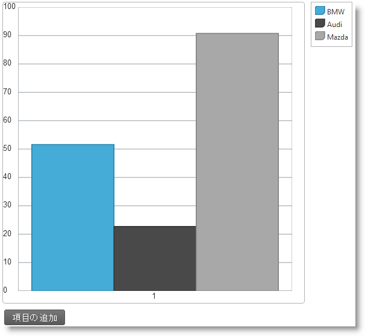

---
title: "HTML および JavaScript におけるチャートのアニメーション化 (igDataChart)"
slug: igdatachart-animating-html
---

# HTML および JavaScript におけるチャートのアニメーション化 (igDataChart)


##トピックの概要


### 目的

このトピックでは、HTML ビューを作成し、JavaScript を使用して動的に柱状チャートにデータを追加し、&#123;environment:ProductName&#125; ライブラリにあるチャートの Motion Framework を使用してデータの変化をアニメーション化する方法について説明します。

### 前提条件

以下の表は、このトピックを理解するための前提条件として必要なトピックを示しています。

-	[igDataChart の概要](/controls/igdatachart/overview/overview): Web ページで各種チャートを表示するための `igDataChart`™ コントロールに関する基本的な情報を提供します。

-	[igDataChart の追加](/controls/igdatachart/adding): 簡単な例を挙げてチャートの実装方法をステップごとに示します。

-	[igDataSource の概要](/data-sources/igdatasource/igdatasource-overview): このトピックは `igDataSource` コントロールの紹介です。

-	[チャートの Infragistics Motion Framework](/controls/igdatachart/configuring/animating/motion-framework): このトピックでは、チャートの Infragistics® Motion Framework に関する概要を示します。


### このトピックの内容

このトピックは、以下のセクションで構成されます。

-   [HTML および JavaScript での柱状チャートのアニメーション化](#animated-column-chart)
   -   [概要](#introduction)
    -   [プレビュー](#preview)
    -   [前提条件](#prerequisites)
    -   [概要](#overview)
    -   [手順](#steps)
-   [関連コンテンツ](#related-content)
   -   [トピック](#topics)
    -   [サンプル](#samples)


##<a id="animated-column-chart"></a>HTML および JavaScript におけるチャートのアニメーション化


### <a id="introduction"></a> 概要

ここでは、簡単な実例を挙げて、HTML および JavaScript で柱状チャート アニメーションを作成するために必要な手順を学んでいきます。

ここに示す例では、ランダムに生成される自動車販売データを使用して、3 つのデータ シリーズを備えた柱状チャートを実装します。チャートの下には [項目の追加] というボタンを配置します。このボタンを押すと、新規データ項目がチャートに追加され、その変更がチャートに通知されることになります。チャート上のデータ項目数が 5 件以上になると、最も古い項目 (インデックス番号の最も低い項目) がチャートから削除されます。

### <a id="preview"></a> プレビュー

次に示すのは、この手順で実装される [項目の追加] ボタン付きのチャートです。



### <a id="prerequisites"></a> 前提条件

この手順を実行するには、以下のリソースが必要です。

-   Web サーバー
-   HTML エディター

### <a id="overview"></a>概要

このトピックでは、3 つのデータ シリーズを備えた柱状チャート　アニメーションが表示される簡単な Web ページをステップ バイ ステップで作成していきます。以下はプロセスの概念的概要です。

1.  空の HTML ビューを作成する。
2.  初期データ ソースを追加する。
3.  基本チャート インスタンス作成コードを追加する。
4.  チャートのシリーズを追加する。
5.  データを更新するためのボタンを追加する。
6.  データを更新して、変更をチャートに通知する。
7.  (オプション) 結果を検証します。

### <a id="steps"></a> 手順

以下の手順に従って、柱状チャートのアニメーションを作成します。

1. 空の HTML ビューを作成します。

 「[igDataChart の追加](/controls/igdatachart/adding)」トピックの手順に従って、チャートを埋め込むスケルトンの HTML/MVC ビューを作成します。このサンプルで必要な作業は、最初の　２ つ、つまり、[必要なリソースへの参照の追加](/controls/igdatachart/adding#add-references-to-required-resources)と[igDataChart に必要な HTML マークアップの追加](/controls/igdatachart/adding#add-html-markup)だけです。

2. 初期データ ソースを追加します。

 データ オブジェクトのインスタンスを 1 つ作成する関数を追加します。このオブジェクトは、複数の数値をランダムに表示する単一のデータ オブジェクトです。

 **JavaScript の場合:**

```js
	function createNewChartItem(label) {
        var val1 = Math.round(Math.random() * 100);
        var val2 = Math.round(Math.random() * 100);
        var val3 = Math.round(Math.random() * 100);
        if (label == undefined)
            label = 1;
        return { Label: label, Value1: val1, Value2: val2, Value3: val3 };
    }
```

 オブジェクトの要素配列を 1 つ追加し、上で定義した関数を使用して配列データを初期化します。

 **JavaScript の場合:**

```js
	var currData, currDataSource;
    currData = [];
    currData[0] = createNewChartItem();
    currDataSource = new $.ig.DataSource({ dataSource: currData });
```

3. 基本チャート インスタンス作成コードを追加します。

 HTML ビューの全般的な設定を処理する JavaScrtipt コードを追加します。これには以下の設定が含まれます。

 - データ オブジェクトの配列を管理する `DataSource` オブジェクトが `dataSource` オプションに割り当てられます。
 - カテゴリの X 軸と数値の Y 軸が定義され、Y 軸の定義域が 0 から 100 の範囲に固定されます。動的にデータをチャートに追加すると軸の範囲が自動的に調整されてアニメーション効果が無効になる恐れがあるため、軸の定義域は固定しておく必要があります。

 **JavaScript の場合:**

```js
	$("#chart").igDataChart({
        width: "500px",
        height: "500px",
        dataSource: currDataSource,
        legend: { element: "legend" },
        windowResponse: "immediate",
        axes: [{
            name: "xAxis",
            type: "categoryX",
            label: "Label"
        },
        {
            name: "yAxis",
            type: "numericY",
            minimumValue: 0,
            maximumValue: 100
        }],
    ...
```

4. チャートのシリーズを追加します。

 次の JavaScript コードを追加して、データ配列に指定されているデータを表す 3 つのデータ シリーズを定義します。

 **JavaScript の場合:**

```js
	...
    series: [{
            name: "column",
            title: "BMW",
            type: "column",
            xAxis: "xAxis",
            yAxis: "yAxis",
            valueMemberPath: "Value1",
            transitionDuration: 400
        }, {
            name: "series2",
            title: "Audi",
            type: "column",
            xAxis: "xAxis",
            yAxis: "yAxis",
            valueMemberPath: "Value2",
            transitionDuration: 700
        }, {
            name: "series3",
            title: "Subaru",
            type: "column",
            xAxis: "xAxis",
            yAxis: "yAxis",
            valueMemberPath: "Value3",
            transitionDuration: 1000
        }],
    });
```

 上記のコード スニペットでは、Motion Framework に関連した `transitionDuration` オプションが設定されています。このオプションは、チャートのシリーズがある状態から別の状態に切り替わるときのアニメーション (遷移) の所要時間を管理します。このオプションの値はミリ秒単位で指定されます。この例では、視覚的な訴求力を高めることを目的として、意識的に 3 つのデータ シリーズにそれぞれ異なる値を設定しています。この設定により、1 つめのデータ シリーズの柱状チャートはすばやく変化することになるのに対して、2 つめのシリーズの変化はそれよりもやや遅く、3 つめのシリーズの動きは最も緩やかなものになるため、アニメーション効果の違いがはっきりと分かるようになります。

5. データを更新するためのボタンを追加します。

 Motion Framework をアクティブにするために、チャートの背後にあるデータを動的に更新する仕組みを組み込んでおく必要があります。この例では、クリック ハンドラーを備えたボタンを実装して、クリックするたびにデータ項目を 1 つチャートに追加できるようにします。

 1. HTML マークアップでボタンを定義します。このマークアップは、チャートの `div` 要素の下に指定する必要があります。

	**HTML の場合:**

```html
    	<input type="button" id="btnPlay" value="Add Data" />
```

  2. JavaScript でこのボタンのインスタンスを作成して構成します。インフラジスティックスの Script Loader 構文を使用して、チャートの下に `igButton`™ コントロールを作成します。このコントロールをクリックすると、`getNewChartItemFromServer()` 関数が呼び出されるようになります。

 	**JavaScript の場合:**

```js
		$.ig.loader(function () {
	        $("#btnPlay").igButton({
	            labelText: $("#btnPlay").val(),
	            click: getNewChartItemFromServer
	        });
	    });
```

  上記のコードは、チャートの下に `igButton` コントロールを作成します。このコントロールをクリックすると、`addNewItemToChart()` 関数が呼び出されます。次の手順に進んで、この関数にロジックを追加します。

6. データを更新し、変更についてのチャートに通知します。

 次のコードは `addNewItemToChart()` 関数を定義します。この関数により、チャートの背後にあるデータが更新され、Motion Framework の動作をトリガーする適切な API メソッドが呼び出されます。

 **JavaScript の場合:**

```js
	function addNewItemToChart() {
        var dataSource = $("#chart").igDataChart("option", "dataSource");
        var data = dataSource.data();
        data[data.length] = createNewChartItem(data[data.length - 1].Label + 1);
        $("#chart").igDataChart("notifyInsertItem", dataSource, data.length - 1, data[data.length - 1]);
    }
```

 この関数に含まれる最初の 2 行のコードは、現在のチャート データが保持されている `dataSource` を取得して、その `DataSource` からオブジェクトの配列を読み込みます。3 行目では、新規項目がオブジェクト配列の末尾 (`data[data.length]`) に追加されます。その際、この新規項目には、`createNewChartItem()` 関数によってランダムな数値が埋められることになります。この関数には、最後の項目ラベルに 1 を加えた値が渡されます: `data[data.length - 1].Label + 1`。

 オブジェクトの配列に新規項目が追加されると、Motion Framework ロジックを始動するために `igDataChart` オブジェクトの `notifyInsertItem()` メソッドが呼び出されます。メソッド引数は変更が行われたデータ ソース、データが挿入されたインデックス、および挿入された実際のデータ項目です。ここではデータが末尾に挿入されますが、データ ソース内でのデータの挿入位置は任意に指定できます。

7. (オプション) 結果を確認します。

HTML ビューの作成を終えれば、[項目の追加] ボタンをクリックすることによってアニメーション効果を確認できるようになります。新しい柱状チャート項目は、既存の項目の右側に表示され、項目数が 5 つになると、左端にある項目が削除され、項目すべてが 1 つずつ左にずれます。

この動作は、データ ソースに新たな変更を加えることによって確認できます。たとえば、項目を 1 つ削除して `notifyRemoveItem()` メソッドを呼び出すか、すべてのデータをクリアして `notifyClearItem()` メソッドを呼び出すことによって実際の動作を確認できます。

##<a id="related-content"></a>関連コンテンツ


###<a id="topics"></a> トピック

このトピックの追加情報については、以下のトピックも合わせてご参照ください。


-	[ASP.NET MVC でのチャートのアニメーション化 (igDataChart)](./02_Animating Charts in ASP.NET MVC.mdx): このトピックでは、MVC ビューを作成し、jQuery を使用して　AJAX POST 要求によって動的に柱状チャートにデータを追加し、&#123;environment:ProductName&#125; ライブラリにあるチャートの Motion Framework を使用してデータの変化をアニメーション化する方法について説明します。


###<a id="samples"></a> サンプル

このトピックについては、以下のサンプルも参照してください。

-	[Motion Framework](/controls/igdatachart/configuring/animating/motion-framework#motion-framework-sample): このサンプルでは、jQuery チャートで Motion Framework を使用し、データの推移を効果的に視覚化しています。


 

 


