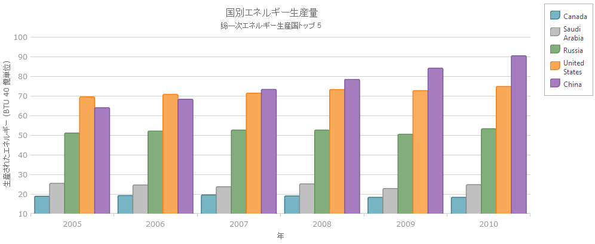
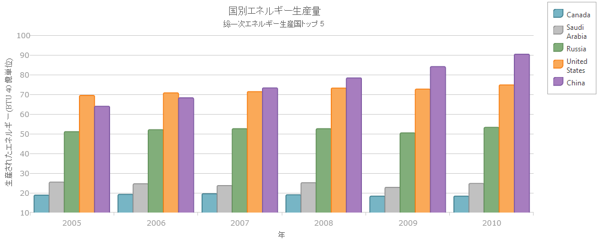

---
title: "軸のタイトルの構成 (igDataChart)"
slug: igdatachart-axis-title
---

# 軸のタイトルの構成 (igDataChart)


##トピックの概要


### 目的

このトピックでは、`igDataChart`™ コントロールでの軸タイトルの設定に関する情報を提供します。

### 前提条件

このトピックを理解するためには、以下のトピックを理解しておく必要があります:

-	[igDataChart の追加](/igdatachart-adding)

このトピックでは、`igDataChart`™ コントロールをページに追加し、データにバインドする方法を紹介します。


### このトピックの内容

このトピックは、以下のセクションで構成されます。

-   [軸タイトル](#axisTitle)
    -   [概要](#overview)
    -   [プレビュー](#preview)
    -   [プロパティ](#properties)
    -   [例](#example)
-   [関連コンテンツ](#related-content)

##<a id="axisTitle"></a>軸タイトル


###<a id="overview"></a> 概要

`igDataChart` コントロールの軸タイトル機能は、`igDataChart` コントロールの x および y 軸にコンテキスト情報を追加できます。

軸タイトルは、角度、フォント サイズ、および位置といった軸のプロパティを指定することでカスタマイズできます。

###<a id="preview"></a> プレビュー

以下のスクリーンショットは、タイトルを y 軸に設定した `igDataChart` コントロールのプレビューです。



###<a id="properties"></a> プロパティ

以下の表で、軸タイトルの構成で使用できるプロパティを簡単に説明します。


| プロパティ名 | プロパティ タイプ | 説明 |
| --- | --- | --- |
| title | string | 軸のタイトルを定義します。 |
| titlePosition | string | ラベルの位置に応じて、タイトルの位置を定義します。, このプロパティはデフォルトで Auto に設定されています。これは、軸タイトルが常に軸ストロークおよび軸ラベルの反対側になることを意味します。つまり、軸ラベルは位置を変更しても、常に軸タイトルと軸ストロークの間になります。たとえば、軸ラベルの位置を outsideRight に変更すると、軸タイトルの位置は自動的に軸ラベルの右側になります。 |
| titleAngle | double | 軸タイトルを中心としたタイトルの回転を度数で定義します。たとえば、-90 の値はタイトルを垂直に回転させ、0 の値はタイトルを水平に描画します。 |
| titleTextColor | string | タイトルのテキストの色を定義します。 |
| titleTextStyle | string | タイトルのテキストのフォント名とサイズを定義します。 |
| titleVerticalAlignment | string | タイトルの垂直方向の配置を定義します。このプロパティは y 軸のみに適用されます。 |
| titleHorizontalAlignment | string | 軸情報パネル上の軸タイトルの水平方向の配列を定義します。このプロパティは、x 軸のタイトルのみに適用されます。 |
| titleTopMargin | double | タイトルの左の余白、すなわちタイトルと軸のラベル パネルの上端との間の垂直スペースを定義します。 |
| titleBottomMargin | double | タイトルの下端の余白、すなわちタイトルと軸のラベル パネルの下端との間の縦方向のスペースを定義します。 |
| titleLeftMargin | double | タイトルの左の余白、すなわちタイトルと軸のラベル パネルの左端との間の横方向のスペースを定義します。 |
| titleRightMargin | double | タイトルの右の余白、すなわちタイトルと軸のラベル パネルの右端との間の横方向のスペースを定義します。 |


###<a id="example"></a> 例

以下の表の下のスクリーンショットは、以下の設定の結果、軸の `title` プロパティを設定した `igDataChart` コントロールの外観がどのようになるか示しています。


| プロパティ | 値 |
| --- | --- |
| title | “Year” |
| titleAngle | -90 |
| titleTextColor | “Blue” |
| titleTextStyle | "10pt Times New" |




以下のコードはこの例を実装します。

**JavaScript の場合:**

```js
$("#container").igDataChart({
	…
	axes: [
	  {
	     type: "numericY",
	     name: "yAxis",
	     title: "Quadrillion Btu",
	     titleAngle: -90,
	     titleTextStyle: "14pt Times New Roman",
	     titleTextColor: "black"
	  }, …
```


##<a id="related-content"></a>関連コンテンツ


### トピック

以下のトピックでは、このトピックに関連する追加情報を提供しています。

-	[igDataChart の追加](/igdatachart-adding): このトピックでは、`igDataChart` コントロールをページに追加し、データにバインドする方法を紹介します。


### サンプル

以下のサンプルでは、このトピックに関連する情報を提供しています。

-	[軸タイトル](&#123;environment:SamplesUrl&#125;/data-chart/axis-title) : `igDataChart` コントロールの軸タイトルの機能を使用して、チャートの軸に関する情報を追加できます。


 

 


