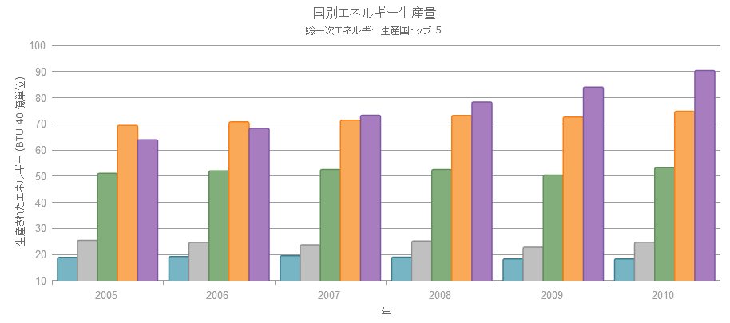

---
title: "チャートのタイトル / サブタイトルの構成 (igDataChart)"
slug: igdatachart-chart-titles-and-subtitles
---

# チャートのタイトル / サブタイトルの構成 (igDataChart)

##トピックの概要

### 目的

このトピックでは、`igDataChart`™ コントロールのチャート タイトルとサブタイトル機能を使用する方法を説明します。

### 前提条件

このトピックを理解するためには、以下のトピックを理解しておく必要があります:

-	[igDataChart の追加](/igdatachart-adding): このトピックでは、`igDataChart`™ コントロールをページに追加し、データにバインドする方法を紹介します。

### このトピックの内容

このトピックは、以下のセクションで構成されます。

-   [概要](#introduction)
    -   [タイトルとサブタイトルの概要](#title-subtitle)
    -   [タイトル / サブタイトルの構成](#configuring)
    -   [プロパティ設定](#property-settings)
    -   [例](#example)
-   [関連コンテンツ](#related-content)
    -   [トピック](#topics)
    -   [サンプル](#samples)

##概要

###タイトルとサブタイトルの概要

`igDataChart` コントロールのタイトルとサブタイトル機能は、チャート コントロールの一番上のセクションに情報を追加できます。以下のスクリーンショットは、デフォルト設定で追加されるタイトルとサブタイトルを示しています。

チャート コントロールにタイトルまたはサブタイトル、または両方を追加すると、タイトルとサブタイトルの情報に応じて、チャートの内容が自動的にサイズ変更されます。

タイトルとサブタイトルは、`igDataChart` コントロールの対応するオプションのプロパティ（title と subtitle）に、タイトルまたはサブタイトルに表示する文字列を設定すると追加されます。

###タイトル / サブタイトルの構成

`igDataChart` コントロールのタイトルとサブタイトルは非常に柔軟に構成できます。タイトルとサブタイトルのフォント、フォント サイズ、色、配置をスタイル設定できます。

### プロパティ設定

以下の表は、任意の構成とそれを管理するプロパティ設定のマッピングを示します。

| 目的: | 使用するプロパティ: | 設定の選択肢: |
| --- | --- | --- |
| サブタイトルの下の余白の設定 | subtitleBottomMargin | Integer |
| サブタイトルの水平方向の配置 | subtitleHorizontalAlignment | string |
| サブタイトルの左の余白の設定 | subtitleLeftMargin | Integer |
| サブタイトルの右の余白の設定 | subtitleRightMargin | Integer |
| サブタイトルのテキスト色の設定 | subtitleTextColor | string |
| サブタイトルのフォント スタイルとテキスト サイズの設定 | subtitleTextStyle | string |
| サブタイトルの左の余白の設定 | subtitleTopMargin | Integer |
| タイトルの下の余白の設定 | titleBottomMargin | Integer |
| タイトルのの水平方向の配置 | titleHorizontalAlignment | string |
| タイトルの左の余白の設定 | titleLeftMargin | Integer |
| タイトルの右の余白の設定 | titleRightMargin | Integer |
| タイトルのテキスト色の設定 | titleTextColor | string |
| タイトルのフォント スタイルとテキスト サイズの設定 | titleTextStyle | string |
| タイトルの左の余白の設定 | titleTopMargin | Integer |

### 例

以下は、チャート タイトルの設定表およびこの構成を実装する実例です。

| プロパティ | 値 |
| --- | --- |
| title | "国別エネルギー生産量" |
| titleTextColor | "#2e9ca6" |
| titleTextStyle | "20pt Arial" |
| subtitle | "総一次エネルギー生産国トップ 5" |
| subtitleTextColor | "#2e9ca6" |
| subtitleTextStyle | "14pt Arial" |

   [チャートのタイトルおよびサブタイトル](&#123;environment:SamplesEmbedUrl&#125;/data-chart/chart-title)
   

##関連コンテンツ

### トピック

以下のトピックでは、このトピックに関連する追加情報を提供しています。

-	[igDataChart の追加](/igdatachart-adding): このトピックでは、`igDataChart` コントロールをページに追加し、データにバインドする方法を紹介します。

 

 

