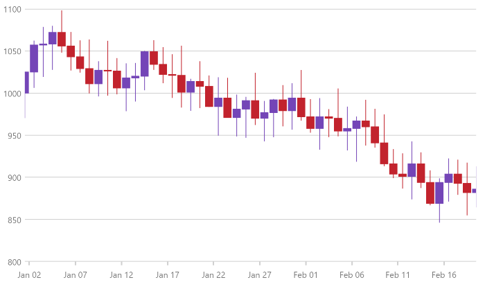
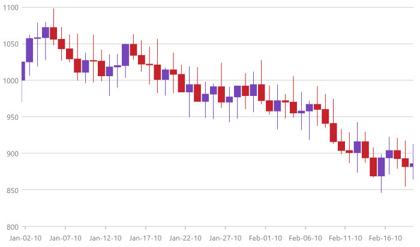

# OrdinalTimeXAxis の構成 (igDataChart)

このトピックは、コード例を示して、OrdinalTimeXAxis を `igDataChart` コントロールで使用する方法を説明します。この軸を使用する利点は、データのズームで動的に日付ラベル書式設定を変更できることです。

### このトピックの内容

このトピックは、以下のセクションで構成されます。
-   [概要](#overview)
-   [軸ラベル書式](#axis_label_formats)
-   [関連コンテンツ](#related)

<a id="overview"></a>
### 概要

OrdinalTimeXAxis を以下のシリーズ タイプで使用できます。

- カテゴリ シリーズ
- 財務指標
- 財務シリーズ

`OrdinalTimeXAxis` と `TimeXAxis` の主な違いは順序軸で、表示される日付は等距離です。`TimeXAxis` は日付を並べ替えて、時系列タイムスケールによって配置します。

以下のコード例は、`OrdinalTimeXAxis` をチャートに追加します。

**JavaScript の場合:**

```js
$(function () {
    $("#chart").igDataChart({
        width: "700px",
        height: "400px",                
        axes: [{
            name: "xAxis",
            type: "ordinalTimeX",
            dataSource: data,
            dateTimeMemberPath: "Date",                                              
        },
		{
            name: "yAxis",
            type: "numericY",            
        }],
        series: [{
            name: "series1",
            dataSource: data,            
            type: "financial",
            displayType: "candlestick",           
            xAxis: "xAxis",
            yAxis: "yAxis",
            openMemberPath: "Open",
            highMemberPath: "High",
            lowMemberPath: "Low",
            closeMemberPath: "Close",                        
        }
       ],
   });   
});
```

以下の画像は、`FinancialPriceSeries` で OrdinalTimeXAxis の使用を表示します。




<a id="axis_label_formats"></a>
### 軸ラベル書式

`OrdinalTimeXAxis` の `LabelFormats` プロパティは `TimeAxisLabelFormat` 型のコレクションです。コレクションに追加された各 `TimeAxisLabelFormat` は一意の `Format` および `Range` を割り当てます。データを年からミリ秒にドリルダウンする際にチャートで表示される時間範囲に基づいてラベルが更新されます。

以下はビューで時間の範囲に基づいたラベル書式の一般的な例です。

1. 1825 日以上 (5 年間) の書式設定は "yyyy" になります。
2. 365 日以上 (1 年間) の書式設定は "MMM yy" になります。
3. 1 日以上の書式設定は "MMM-dd-yy" になります。
4. 5 時間以上の書式設定は "hh:mm" になります。
5. 5 時間以下の書式は "hh:mm:ss" になります。

**JavaScript の場合:**
```js
$(function () {
    $("#chart").igDataChart({
        width: "700px",
        height: "400px",                
        axes: [{
            name: "xAxis",
            type: "ordinalTimeX",
            dataSource: data,
            dateTimeMemberPath: "Date",
            labelFormats: [
                {
                   format: "hh:mm:ss", 
                   range: 1000
                },
                {
                   format: "hh:mm",
                   range: 60 * 1000 
                },
                {
                   format: "MMM-dd-yy",
                   range: 24 * 60 * 60 * 1000
                },
                {
                   format: "MMM yy",
                   range: 365.24 * 24 * 60 * 60 * 1000 
                },
                {
                   format: "yyyy",
                   range: 5 * 365 * 24 * 60 * 60 * 1000  
                }],
                                          
        },
		{
            name: "yAxis",
            type: "numericY",            
        }],
        series: [{
            name: "series1",
            dataSource: data,            
            type: "financial",
            displayType: "candlestick",           
            xAxis: "xAxis",
            yAxis: "yAxis",
            openMemberPath: "Open",
            highMemberPath: "High",
            lowMemberPath: "Low",
            closeMemberPath: "Close",                        
        }
       ],
   });   
});
```

以下の画像は、`FinancialPriceSeries` でラベル書式を持つ OrdinalTimeXAxis の使用を表示します。



<a id="related"></a>
### 関連コンテンツ
- [igDataChart の追加](/igdatachart-adding):  このトピックでは、`igDataChart` コントロールをページに追加し、データにバインドする方法を紹介します。
- [TimeXAxis の構成](/igdatachart-configuring-timexaxis): このトピックは、TimeXAxis を `igDataChart` コントロールで使用する方法を説明します。