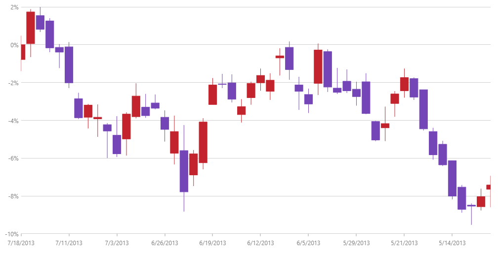

---
title: "PercentChangeYAxis の構成 (igDataChart)"
slug: igdatachart-configuring-percentchangeyaxis
---

# PercentChangeYAxis の構成 (igDataChart)

このトピックは、コード例を示して、PercentChangeYAxis を `igDataChart` コントロールで使用する方法を説明します。この軸で実際のデータ値の代わりにパーセント値を表示できます。

### このトピックの内容

このトピックは、以下のセクションで構成されます。
-   [概要](#overview)
-   [コード例](#code_example)
-   [関連コンテンツ](#related)

<a id="overview"></a>
### 概要

PercentChangeYAxis を以下のシリーズ タイプで使用できます。

- カテゴリ シリーズ
- 範囲シリーズ
- 財務指標
- 財務シリーズ
- 散布シリーズ

PercentChangeYAxis は、シリーズの最初のデータ ポイントを参照値として使用します。それ以後の値は参照値に比較して増減パーセントに基づいて拡大縮小されます。

CategorySeries の場合、参照値はシリーズの `ValueMemberPath` に相対します。

ScatterSeries の場合、参照値はシリーズの `YMemberPath` に相対します。

RangeSeries の場合、参照値は最初の安値に相対します。

FinancialSeries および財務指標の場合、参照値は最初の始値に相対します。

<a id="code_example"></a>
### コード例

以下のコード例は igDataChart コントロールで PercentChangeYAxis の使用を紹介します。

**JavaScript の場合:**

```js
$(function () {
    $("#chart").igDataChart({
        width: "100%",
        height: "500px",                
        axes: [{
            name: "xAxis",
            type: "categoryX",
            dataSource: data,                             
            label: "Date"                    
        },
		{
            name: "yAxis",
            type: "percentChangeY",            
        }],
        series: [{
            name: "series1",
            dataSource: data,            
            type: "financial",
            displayType: "candlestick",           
            xAxis: "xAxis",
            yAxis: "yAxis",
            openMemberPath: "Open",
            highMemberPath: "High",
            lowMemberPath: "Low",
            closeMemberPath: "Close",                        
        }
       ],
   });   
});
```

以下の画像は財務シリーズおよび PercentChangeYAxis を使用する igDataChart を表示します。



<a id="related"></a>
### 関連コンテンツ

- [igDataChart の追加](/igdatachart-adding):  このトピックでは、`igDataChart` コントロールをページに追加し、データにバインドする方法を紹介します。
- [OrdinalTimeXAxis の構成](/igdatachart-configuring-ordinaltimexaxis): このトピックは、OrdinalTimeXAxis を `igDataChart` コントロールで使用する方法を説明します。