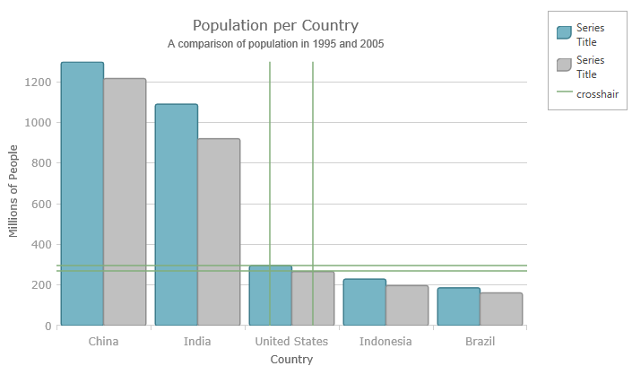

---
title: "ホバー操作プロパティ参照 (igDataChart)"
slug: hoverinteractions-common-properties
---

# ホバー操作プロパティ参照 (igDataChart)

## トピックの概要

### 目的

このトピックは、ホバー操作機能が、series クラスから継承したツールチップの相互作用を強調表示、ホバリングおよび相互作用するために使用するプロパティおよびメソッドについての情報を提供します。

### 前提条件

本トピックの理解を深めるために、以下のトピックを参照することをお勧めします。

- [Adding igDataChart](/igdatachart-adding): igDataChart の追加:このトピックでは、igDataChart コントロールをページに追加し、データにバインドする方法を紹介します。

- [igDataChart をデータへバインド](/igdatachart-databinding): このトピックでは、[igDataChart](/igdatachart-databinding)™ コントロールを各種データ ソース (JavaScript 配列、IQueryable&lt;T&gt;、Web サービス) にバインドする方法について説明します。


### このトピックの内容

このトピックは、以下のセクションで構成されます。

-   [概要](#overview)
-   [共有プロパティ](#common-properties)
-   [クロスヘア レイヤーに継承プロパティを設定](#inherited-properties-crosshair-layer)
-   [関連コンテンツ](#related-content)


## <a id="overview"></a> 概要

ホバー インタラクション レイヤーは、ホバー操作のコンテキストに関係する `series` 基本クラスのプロパティおよびメソッドを継承します。たとえば、ホバー操作の設計ではマウスとは対話しないため、マウス イベントを起動しません。また、ホバー インタラクション レイヤーはデータを直接表示しないため、`scrollIntoView` のようなメソッドはこの機能には該当しません。


## <a id="common-properties"></a>共通のプロパティ

以下の表で、ホバー インタラクション クラスより継承された series クラス プロパティを簡単に説明します。

プロパティ名 | プロパティ型 | 説明
---|---|---
brush | brush | ホバー インタラクション レイヤーは、相互作用しているシリーズからその `brush` を継承します。  ただし、`brush` プロパティを直接設定してオーバーライドできます。
outline | brush | このプロパティは、上記に示した `brush` プロパティと同じガイドラインに沿っています。
cursorPosition | point | このプロパティは、デフォルトのマウス位置 (NaN, NaN) でなく使用するワールド位置を指定します。このプロパティを設定すると、提供されるワールド位置に特定のレイヤーを固定します。**注:** ワールド位置に軸の全体範囲に対するカーソルのグローバル位置を表す 0 から 1 の範囲にある x 値と y 値があります。
isDefaultCrosshairBehaviorDisabled | bool | このプロパティは、シリーズのデフォルト十字線がチャート上のホバー インタラクション レイヤーであるときに無効になります。デフォルト値は True です。
useIndex | bool | このプロパティは、ホバー インタラクション レイヤーがシリーズ インデックスを使用し、`igDataChart` コントロールに割り当てられる Brushes コレクションに色を予約するかどうかを指定します。デフォルト値は False です。
useLegend | bool | このプロパティは、ホバー インタラクション レイヤーを凡例に表示するかどうかを指定します。このプロパティを true に設定すると、凡例に表示する必要があるものとしてシリーズをインデックス化します。凡例で認識するためには、シリーズに単一の色を割り当てなければなりません。デフォルト値は False です。

<br/>

メソッド名 | メソッドのパラメーター | 説明
---|---|---
moveCursorPoint | point | このプロパティにより、カーソルの動きをシミュレートできます。


## <a id="inherited-properties-crosshair-layer"></a>十字線レイヤーに継承プロパティを設定する 

### 例

以下のスクリーンショットは、以下の設定を使用して `igDataChart` コントロールの `crosshairLayer` の外観がどのようになるか示します。

プロパティ | 値
---|---
cursorPosition | 0.55, 0.55
useLegend | True




以下のコードはこの実装で使用されます。

**JavaScript の場合:**

```js
<script type="text/javascript">    $(function () {
        $("#chart").igDataChart({
            dataSource: data,
            axes: [{
                type: "categoryX",
                name: "NameAxis",
                label: "CountryName",
            }, {
                type: "numericY",
                name: "PopulationAxis",
            }],
            series: [            
			{
                type: "column",
                name: "2005Population",
                xAxis: "NameAxis",
                yAxis: "PopulationAxis",
                valueMemberPath: "Pop2005"
            },            
			{
                type: "line",
                name: "1995Population",
                xAxis: "NameAxis",
                yAxis: "PopulationAxis",
                valueMemberPath: "Pop1995"
            },            
			{
                type: "crosshairLayer",
                name: "crosshairLayer",
                title: "crosshair",
                useInterpolation: false,
                transitionDuration: 500,                
				useLegend: "true",                
				cursorPosition: {x:0.5 , y:0.5}
            }]
        });
    });
</script>
```

## <a id="related-content"></a>関連リンク

### <a id="topics"></a>トピック

- [ホバー インタラクションの概要 (igDataChart)](/hoverinteractions-hover-interactions-overview): このトピックは、利用可能な異なる型のホバー操作レイヤーなど、`igDataChart` コントロールで使用できるホバー操作について概念的な情報を提供します。

- [ホバー インタラクションのプロパティ参照 (igDataChart)](/hoverinteractions-common-properties): このトピックは、ホバー操作機能が、series クラスから継承したツールチップの相互作用を強調表示、ホバリングおよび相互作用するために使用するプロパティおよびメソッドについての情報を提供します。

- [十字線レイヤーの設定 (igDataChart)](/hoverinteractions-crosshair-layer): このトピックは、ホバー操作で使用される十字線レイヤーについての情報を提供します。十字線レイヤーのプロパティについての説明とその実装例を示します。

- [カテゴリ ハイライト レイヤーの設定 (igDataChart)](/hoverinteractions-category-highlight-layer): このトピックは、ホバー操作に使用する最終値レイヤーについて説明します。カテゴリ ハイライト レイヤーのプロパティについて説明し、実装例を示します。

- [カテゴリ項目ハイライト レイヤーの設定 (igDataChart)](/hoverinteractions-category-item-highlight-layer): このトピックは、ホバー操作に使用されるカテゴリ項目ハイライト レイヤーについての情報を提供します。カテゴリ項目ハイライト レイヤーのプロパティについて説明し、実装例を示します。

- [カテゴリ ツールチップ レイヤーの設定 (igDataChart)](/hoverinteractions-category-tooltip-layer): このトピックは、ホバー操作で使用されるカテゴリ ツールチップ レイヤーについての情報を提供します。カテゴリ ツールチップ レイヤーのプロパティについて説明し、実装例を提供します。

- [項目ツールチップ レイヤーの設定 (igDataChart)](/hoverinteractions-item-tooltip-layer): このトピックは、ホバー操作に使用する項目ツールチップ レイヤーについて説明します。項目ツールチップ レイヤーのプロパティについて説明し、実装例も提供します。


### <a id="samples"></a>サンプル

以下のサンプルでは、このトピックに関連する追加情報を提供します。

- [ホバー操作 - カテゴリ ハイライト レイヤー](&#123;environment:SamplesUrl&#125;/data-chart/category-highlight-layer): このサンプルは、カテゴリ軸をターゲットとするカテゴリ ハイライト レイヤー、または `igDataChart` コントロールのすべてのカテゴリ軸を示します。このサンプル オプション ペインでは、カテゴリ ハイライト レイヤーのプロパティを変更できます。強調表示の色、アウトライン、太さなどの変更が可能です。

- [ホバー操作 – カテゴリ項目ハイライト レイヤー](&#123;environment:SamplesUrl&#125;/data-chart/category-item-highlight-layer): このサンプルは、カテゴリ項目ハイライト レイヤーでカテゴリ軸を使用、その場でバンド図形またはマーカーを描画してシリーズの項目を強調表示します。このサンプル オプション ペインでは、カテゴリ ハイライト レイヤーのプロパティを変更できます。強調表示の色、アウトライン、太さなどの変更が可能です。

- [ホバー操作 - カテゴリ ツールチップ レイヤー (&#123;environment:SamplesUrl&#125;/data-chart/category-tooltip-layer): このサンプルは、カテゴリ軸を使用したカテゴリ ツールチップ レイヤーを示します。このサンプル オプション ペインでは、ツールチップの位置の変更など、レイヤーのプロパティを編集できます。

- [ホバー操作 – Crosshair Layer](&#123;environment:SamplesUrl&#125;/data-chart/crosshair-layer): このサンプルは、ターゲットとする実際の値に一致する十字線を提供する十字線レイヤーを紹介します。このサンプル オプション ペインでは、十字線の太さの変更など、レイヤー プロパティを編集できます。

- [ホバー操作 - 項目ツールチップ レイヤー&#123;environment:SamplesUrl&#125;/data-chart/item-tooltip-layer): このサンプルは、すべてのターゲット シリーズに個別にツールチップを表示する項目ツールチップ レイヤーを示します。このサンプル オプション ペインでは、トランジション期間の変更など、レイヤー プロパティを編集できます。

- [ホバー操作 – 複数レイヤー](&#123;environment:SamplesUrl&#125;/data-chart/multiple-layers): このサンプルは、`igDataChart` 内で複数レイヤーを操作する方法を示します。  このサンプルでは、項目ツールチップ レイヤー、十字線レイヤー、およびカテゴリ ハイライト レイヤーを表示します。
